# QA Evidence — NEARS-494

**PASS-with-1-bug (optimistic add-to-cart): AC1-6 + CRITICAL-1/2 verified live on emulator-5556; success-toast-on-failure defect filed**

**19 screenshot(s).** Click any thumbnail for full resolution.

<table>
<tr>
<td align="center" width="33%"><a href="00-preexisting-cart.png">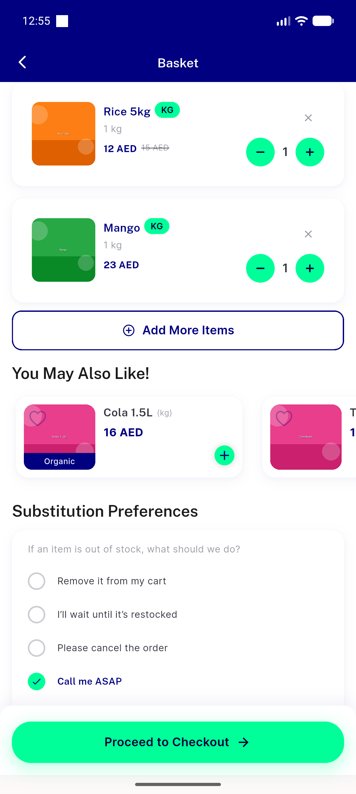</a> preexisting cart</td>
<td align="center" width="33%"><a href="01-ac1-tomatoes-added.png">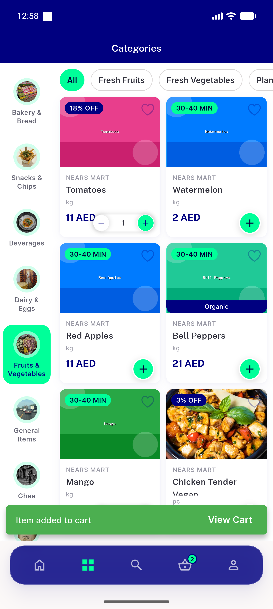</a> ac1 tomatoes added</td>
<td align="center" width="33%"><a href="02-critical1-cart-discounted-prices.png">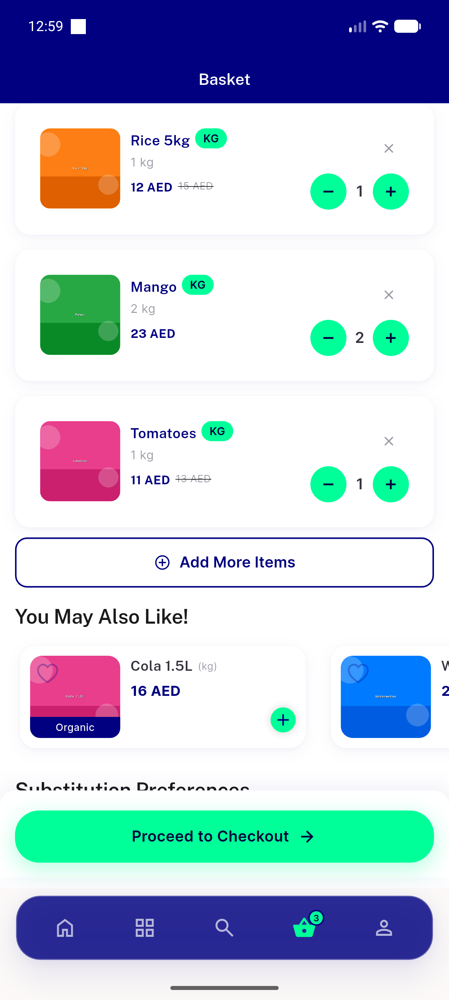</a> critical1 cart discounted prices</td>
</tr>
<tr>
<td align="center" width="33%"><a href="03-critical1-checkout-prices.png">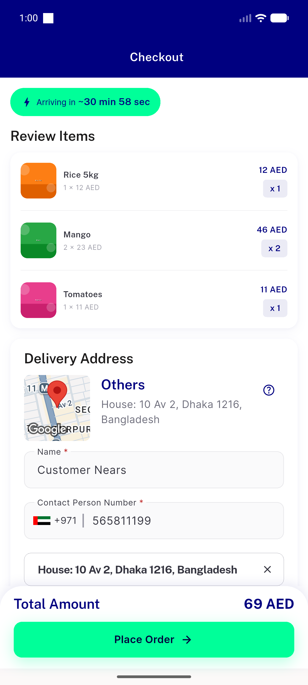</a> critical1 checkout prices</td>
<td align="center" width="33%"><a href="04-critical1-order-summary.png">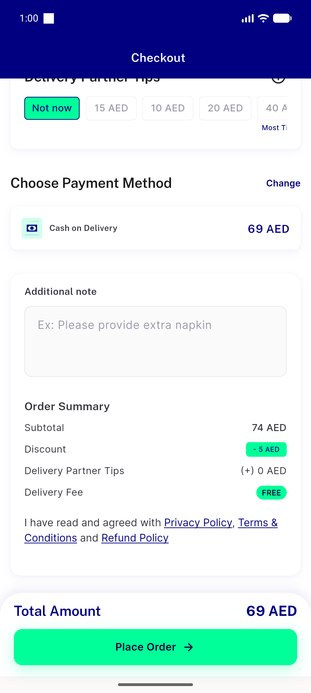</a> critical1 order summary</td>
<td align="center" width="33%"><a href="05-ac5-rapid-taps-qty5.png">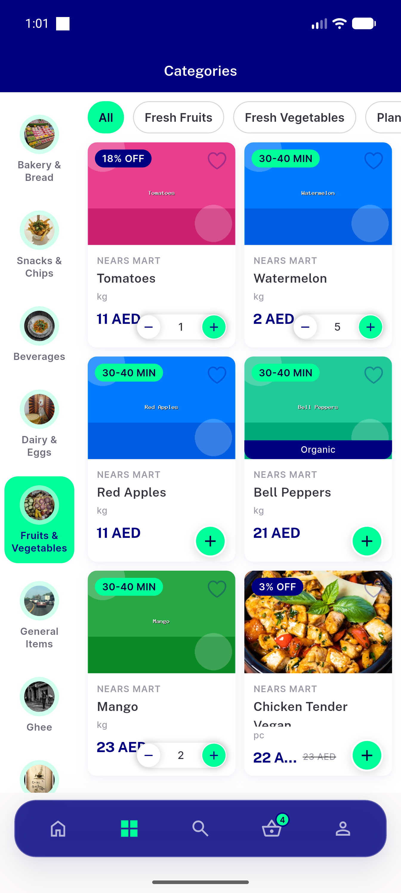</a> ac5 rapid taps qty5</td>
</tr>
<tr>
<td align="center" width="33%"> ac3 optimistic then</td>
<td align="center" width="33%"><a href="07-ac3-rollback-toast-en.png">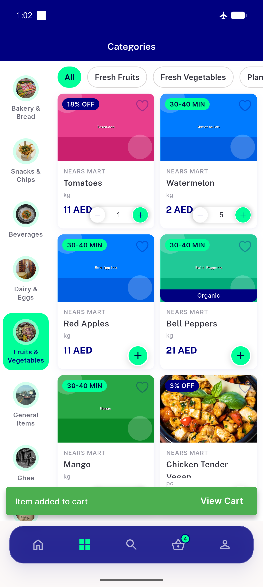</a> ac3 rollback toast en</td>
<td align="center" width="33%"> ac3 rollback toast ar</td>
</tr>
<tr>
<td align="center" width="33%"><a href="09-ac4-before-tap.png">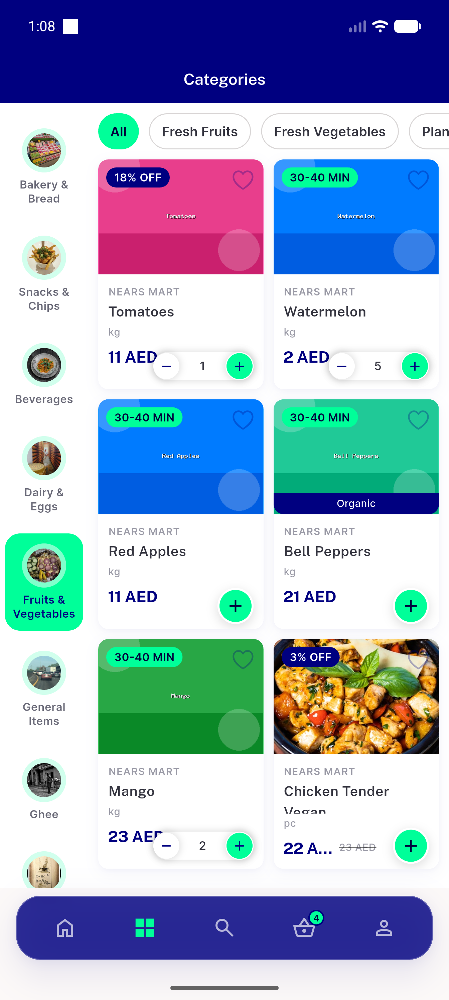</a> ac4 before tap</td>
<td align="center" width="33%"> ac4 after tap</td>
<td align="center" width="33%"><a href="11-variation-opens-modal.png">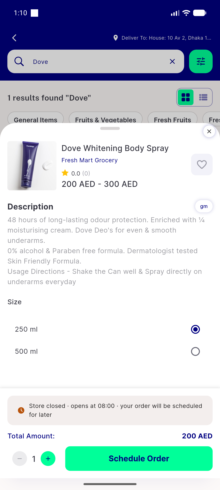</a> variation opens modal</td>
</tr>
<tr>
<td align="center" width="33%"><a href="12-oos-blocked.png">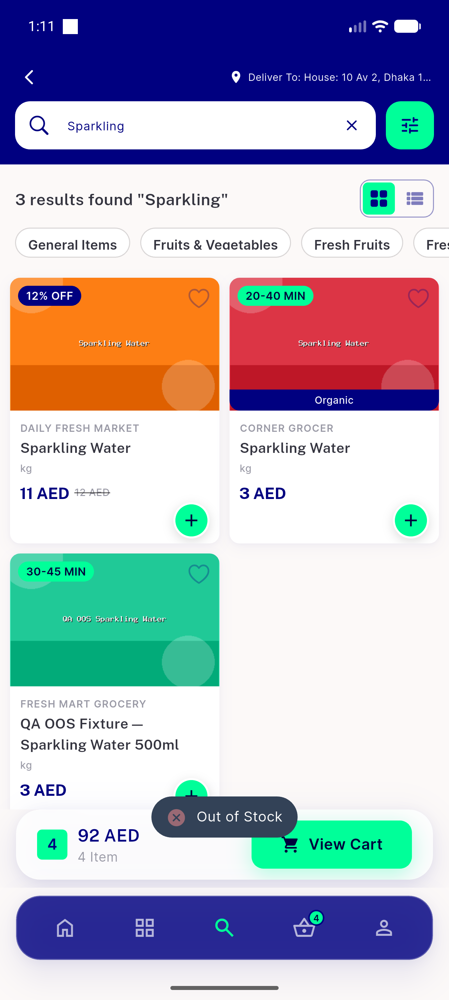</a> oos blocked</td>
<td align="center" width="33%"><a href="13-crossstore-dialog.png">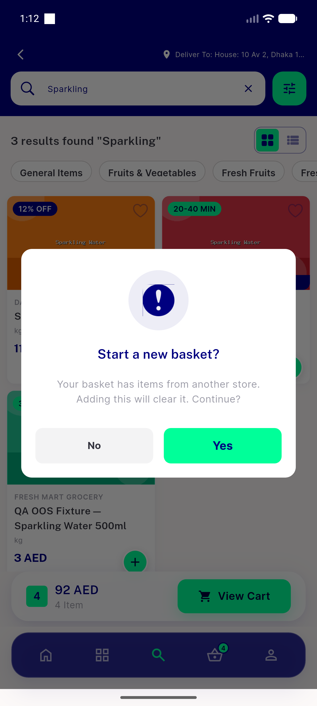</a> crossstore dialog</td>
<td align="center" width="33%"> high3 multiitem inflight</td>
</tr>
<tr>
<td align="center" width="33%"><a href="15-ac6-cart-screen.png">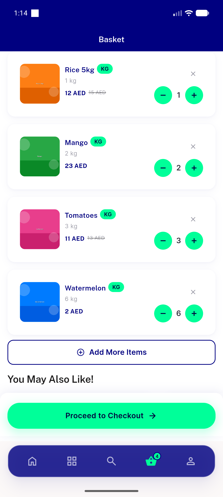</a> ac6 cart screen</td>
<td align="center" width="33%"><a href="16-ac6-subtotal-freedelivery.png">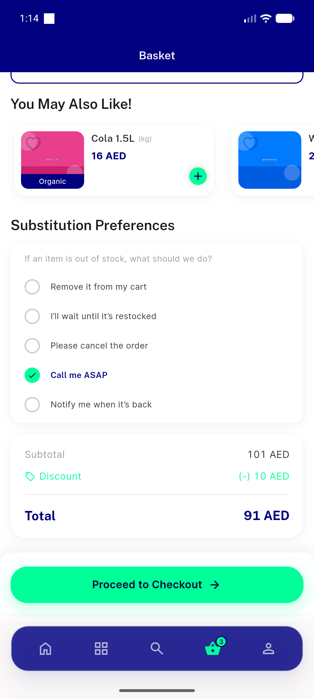</a> ac6 subtotal freedelivery</td>
<td align="center" width="33%"><a href="17-ac6-detail-sheet-qty.png">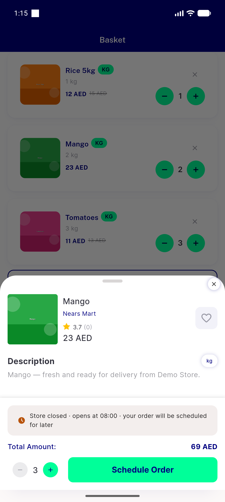</a> ac6 detail sheet qty</td>
</tr>
<tr>
<td align="center" width="33%"><a href="bug-optimistic-success-toast-on-failure.png">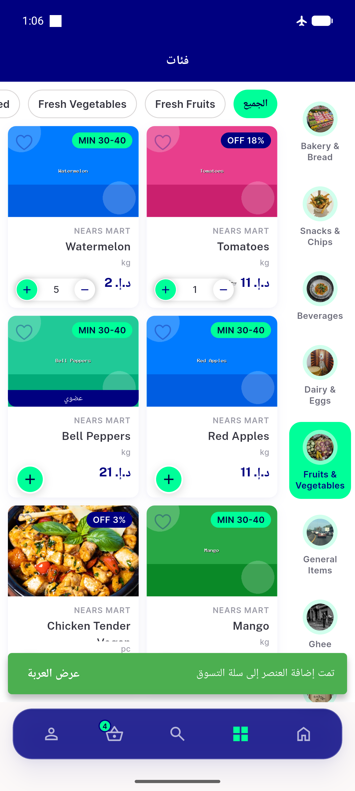</a> bug optimistic success toast on failure</td>
</tr>
</table>

### Other artifacts
- [`bug-optimistic-success-toast-on-failure.log`](bug-optimistic-success-toast-on-failure.log)
- [`progress.md`](progress.md)

---
*From `nears/docs/qa-evidence/NEARS-494/` · public-repo scrub policy (no live secrets; verified clean).*
