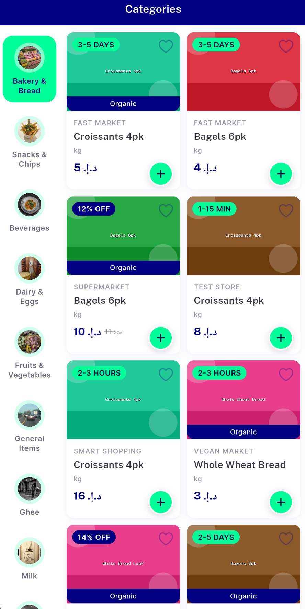
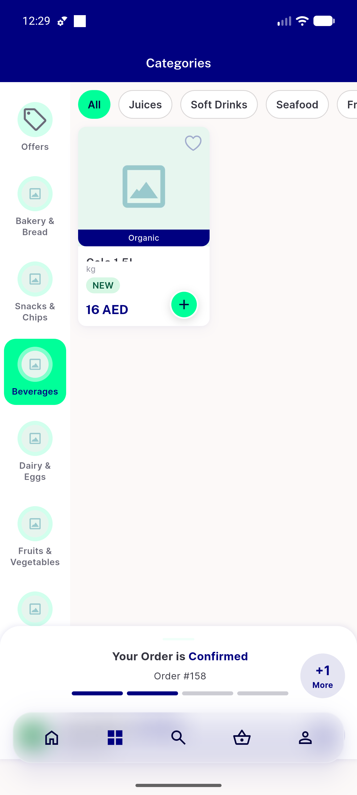
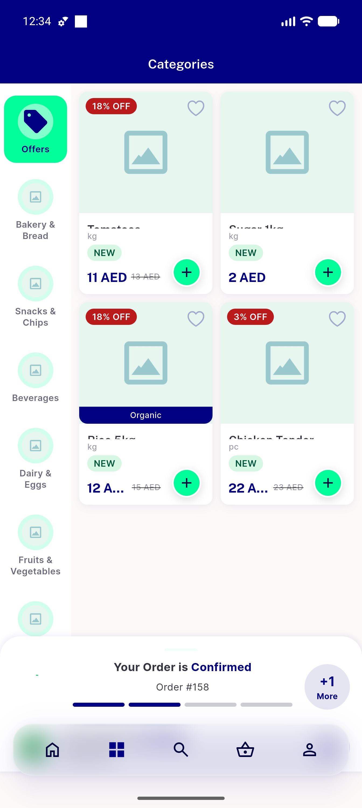
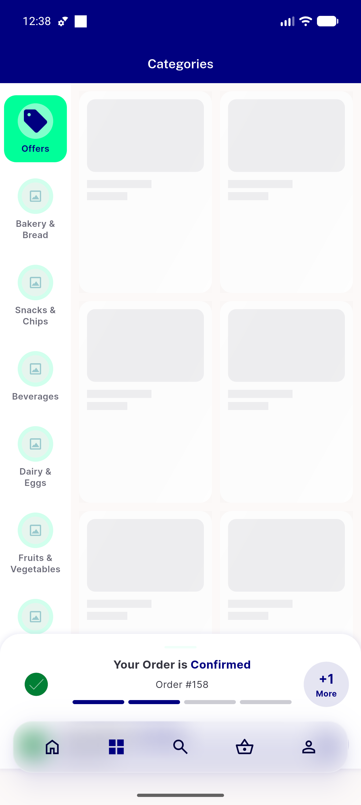
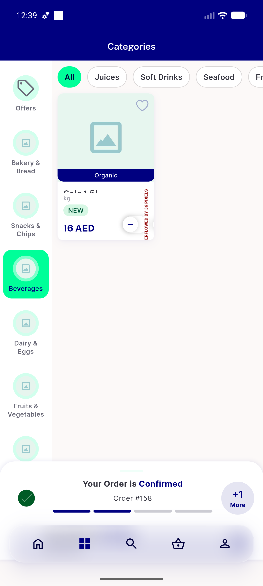

# QA Evidence — NEARS-495

**PASS (1 low analytics task-bug) — Offers virtual rail: AC1/AC2/AC4/AC5 live, AC3 backend+test-backed, index-math clean**

**5 screenshot(s).** Click any thumbnail for full resolution.

<table>
<tr>
<td align="center" width="33%"> categories page context</td>
<td align="center" width="33%"> ac1 offers tile first rail</td>
<td align="center" width="33%"> ac2 ac4 offers grid badges</td>
</tr>
<tr>
<td align="center" width="33%"> offers grid error state</td>
<td align="center" width="33%"> regression normal category browse</td>
</tr>
</table>

### Other artifacts
- [`progress.md`](progress.md)

---
*From `nears/docs/qa-evidence/NEARS-495/` · public-repo scrub policy (no live secrets; verified clean).*
