# QA Evidence — NEARS-496

**PASS — Fresh Finds section removed from grocery/food module homes (shop module not seeded -> code+test-backed); junctions clean LTR+RTL logged-in+out; AC3 grep 0 matches; GUARD1 shimmer + GUARD2 discounted path intact; 1494/1494 tests pass**

**25 screenshot(s).** Click any thumbnail for full resolution.

<table>
<tr>
<td align="center" width="33%"><a href="00-landing-home.png">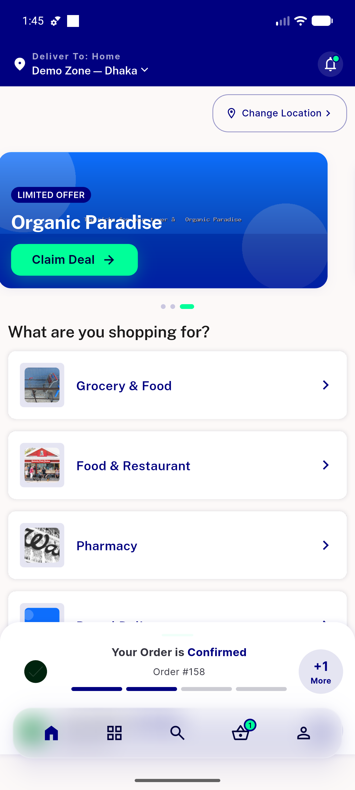</a> landing home</td>
<td align="center" width="33%"><a href="01-fresh-finds-section.png">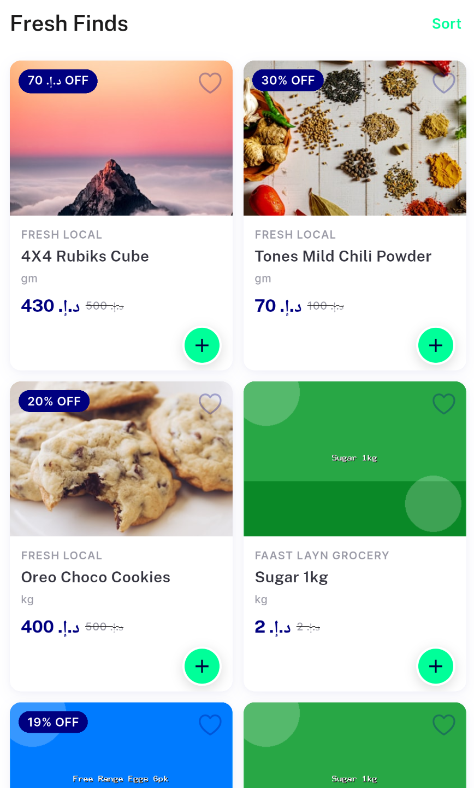</a> fresh finds section</td>
<td align="center" width="33%"><a href="01-grocery-home-top.png">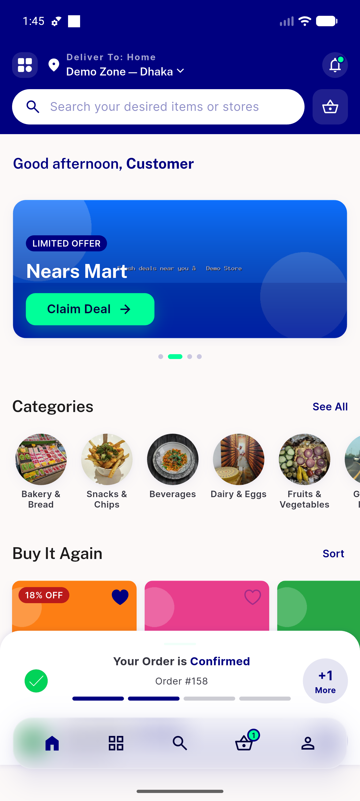</a> grocery home top</td>
</tr>
<tr>
<td align="center" width="33%"><a href="02-grocery-home-mid.png">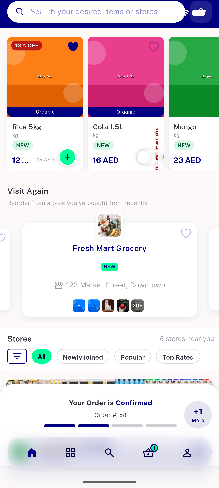</a> grocery home mid</td>
<td align="center" width="33%"><a href="03-grocery-home-bottom.png">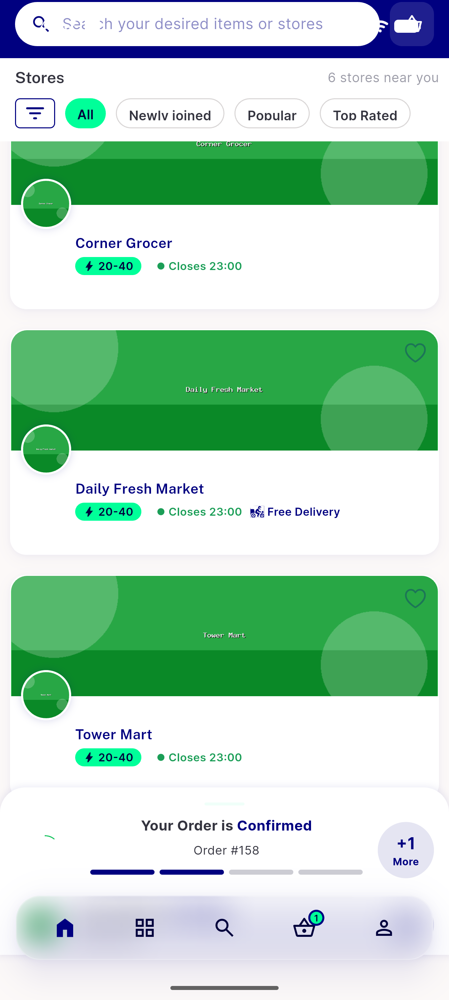</a> grocery home bottom</td>
<td align="center" width="33%"><a href="04-food-home-top.png">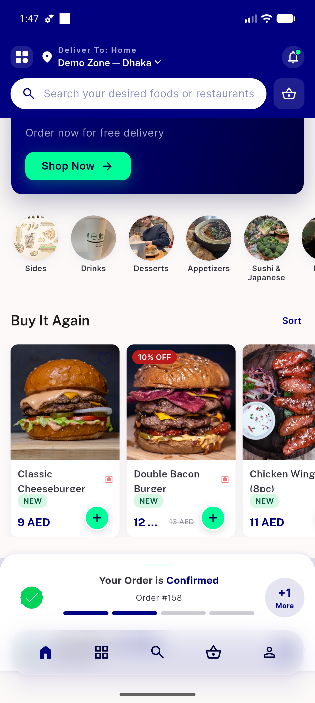</a> food home top</td>
</tr>
<tr>
<td align="center" width="33%"><a href="05-food-home-mid.png">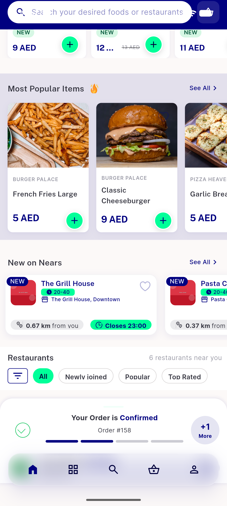</a> food home mid</td>
<td align="center" width="33%"><a href="06-food-home-bottom.png">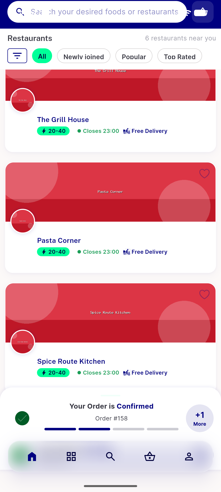</a> food home bottom</td>
<td align="center" width="33%"><a href="07-popular-items-viewall.png">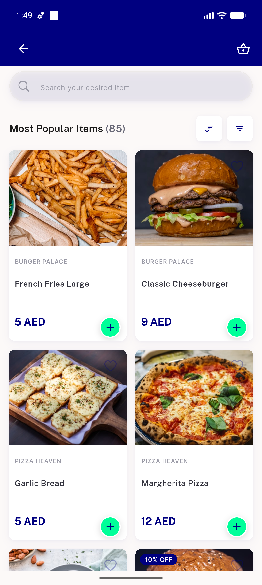</a> popular items viewall</td>
</tr>
<tr>
<td align="center" width="33%"><a href="08-categories.png">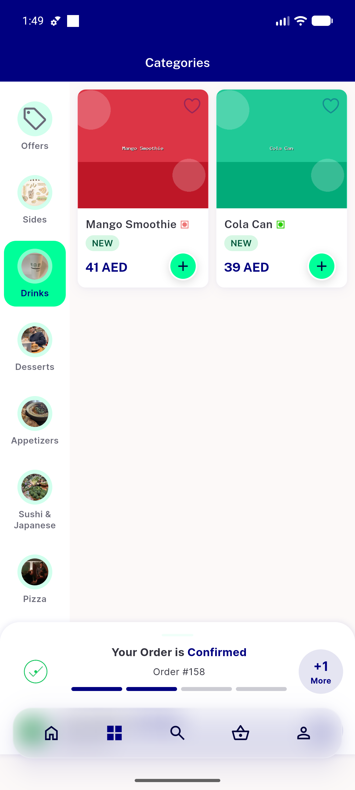</a> categories</td>
<td align="center" width="33%"><a href="09-offers-discounted-items.png">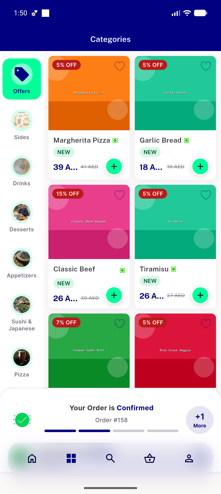</a> offers discounted items</td>
<td align="center" width="33%"><a href="10-food-coldload-1.png">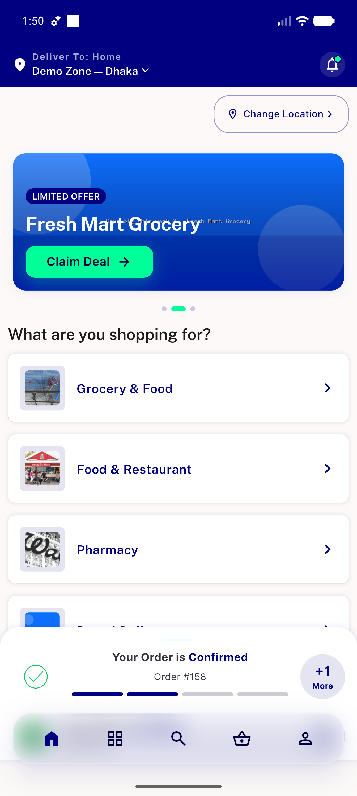</a> food coldload 1</td>
</tr>
<tr>
<td align="center" width="33%"><a href="10-food-coldload-2.png">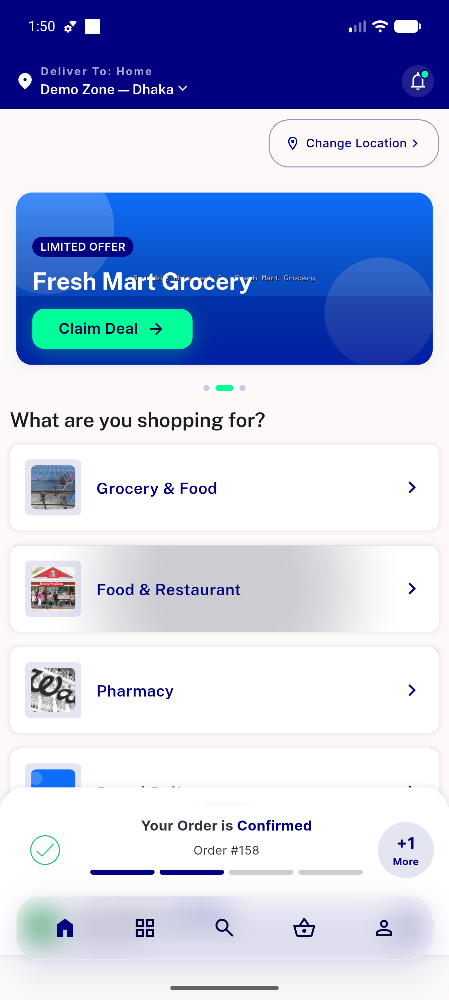</a> food coldload 2</td>
<td align="center" width="33%"><a href="10-food-coldload-3.png">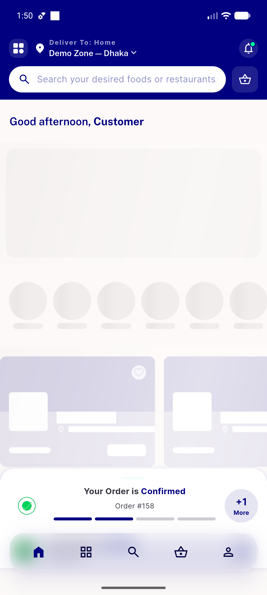</a> food coldload 3</td>
<td align="center" width="33%"><a href="10-food-coldload-4.png">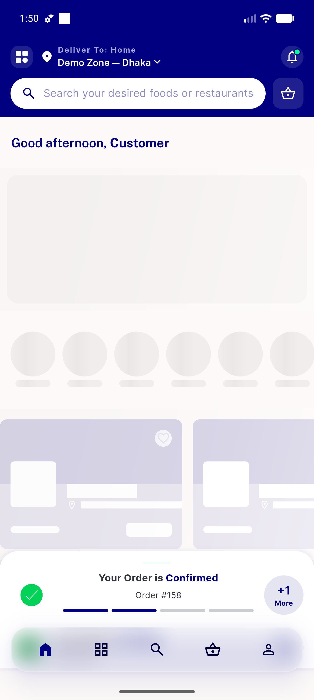</a> food coldload 4</td>
</tr>
<tr>
<td align="center" width="33%"><a href="11-food-coldload-settled.png">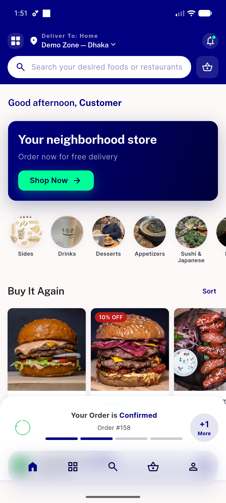</a> food coldload settled</td>
<td align="center" width="33%"><a href="12-settings.png">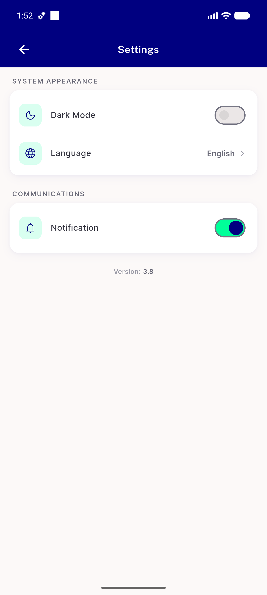</a> settings</td>
<td align="center" width="33%"><a href="13-grocery-rtl-arabic.png">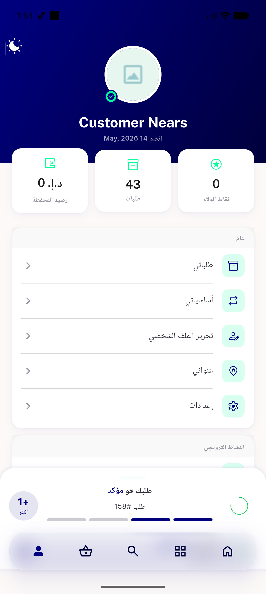</a> grocery rtl arabic</td>
</tr>
<tr>
<td align="center" width="33%"> 13b arabic menu</td>
<td align="center" width="33%"> 13c arabic dashboard</td>
<td align="center" width="33%"><a href="14-food-rtl-mid.png">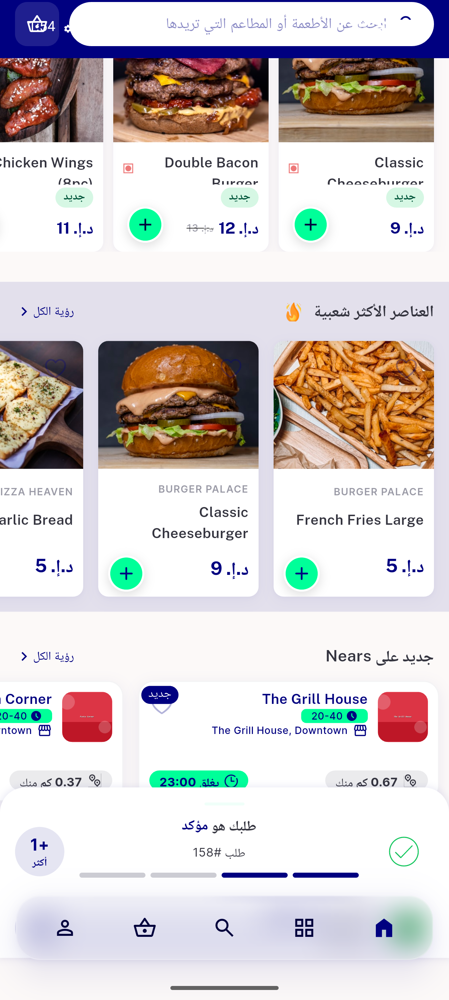</a> food rtl mid</td>
</tr>
<tr>
<td align="center" width="33%"> rtl bottomnav</td>
<td align="center" width="33%"><a href="16-profile-logout.png">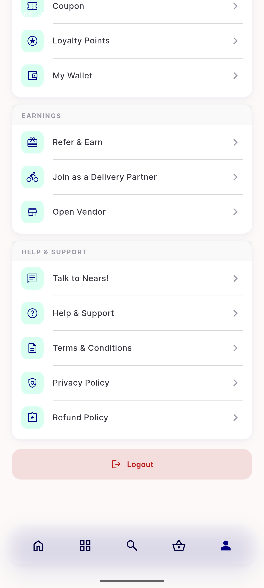</a> profile logout</td>
<td align="center" width="33%"><a href="17-grocery-loggedout-top.png">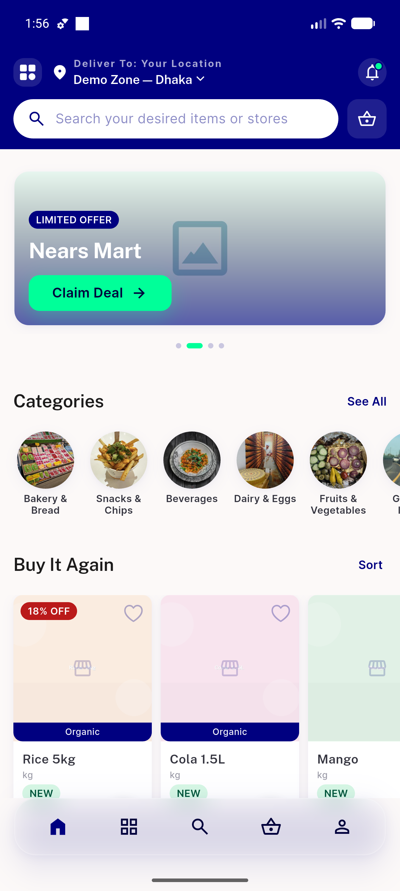</a> grocery loggedout top</td>
</tr>
<tr>
<td align="center" width="33%"><a href="18-grocery-loggedout-junction.png">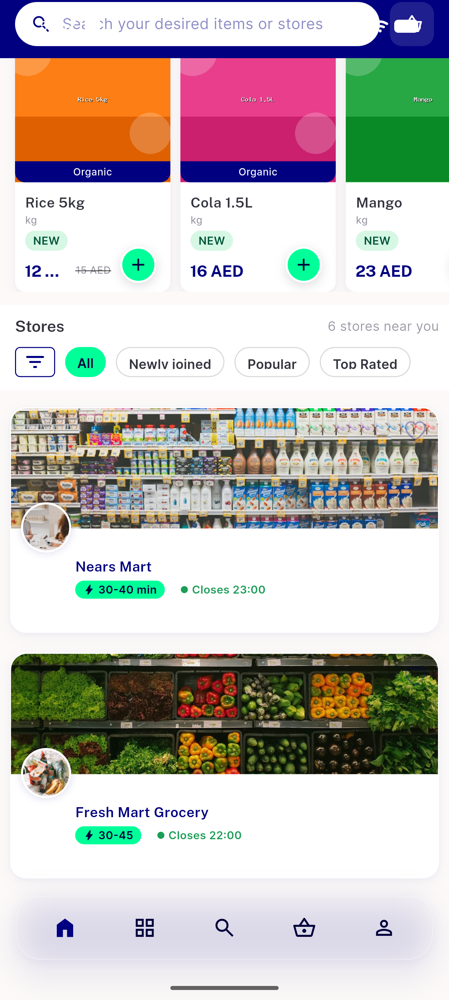</a> grocery loggedout junction</td>
</tr>
</table>

### Other artifacts
- [`bug-cartcount-overflow.log`](bug-cartcount-overflow.log)
- [`progress.md`](progress.md)

---
*From `nears/docs/qa-evidence/NEARS-496/` · public-repo scrub policy (no live secrets; verified clean).*
