# QA Evidence — NEARS-497

**PASS — Visit Again section removed from all module homes; no gap; visit_again_card.dart preserved; 1528/1528 tests green**

**13 screenshot(s).** Click any thumbnail for full resolution.

<table>
<tr>
<td align="center" width="33%"><a href="01-visit-again-section.png">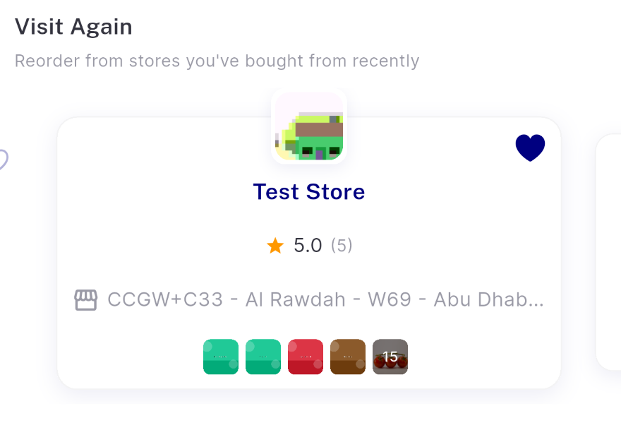</a> visit again section</td>
<td align="center" width="33%"><a href="01-zone1-sector-home.png">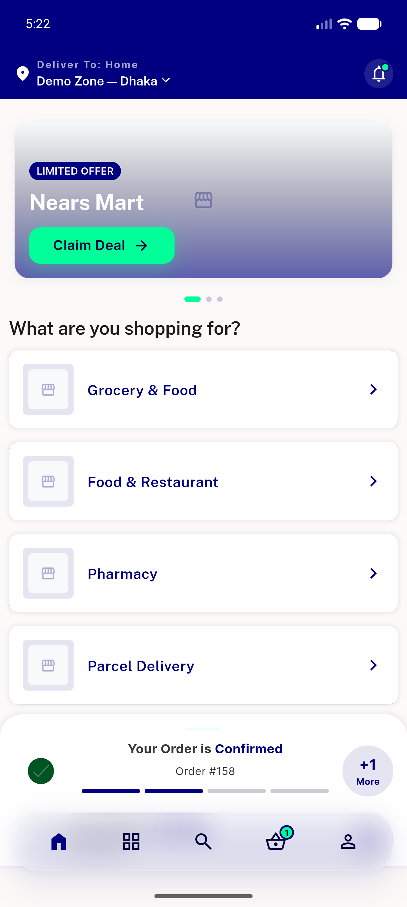</a> zone1 sector home</td>
<td align="center" width="33%"><a href="02-grocery-seam-buyitagain-to-recommended.png">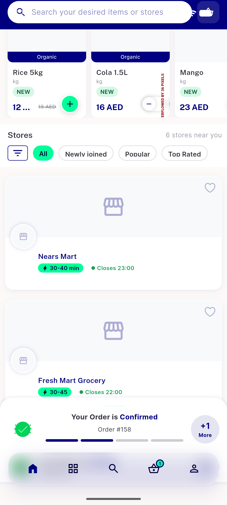</a> grocery seam buyitagain to recommended</td>
</tr>
<tr>
<td align="center" width="33%"><a href="03-grocery-recommended-stores.png">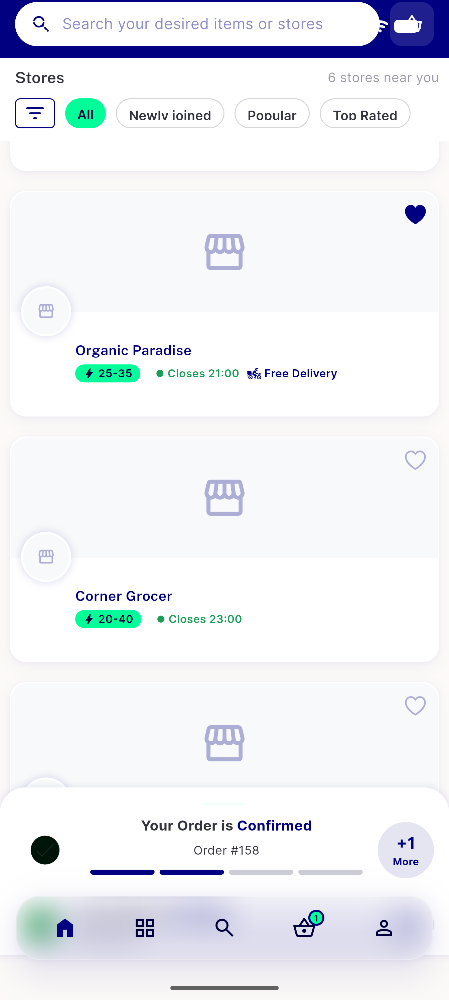</a> grocery recommended stores</td>
<td align="center" width="33%"><a href="04-grocery-buyitagain-rail.png">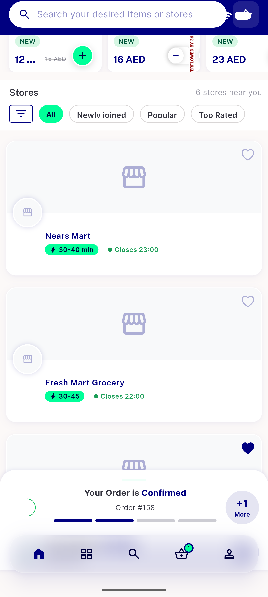</a> grocery buyitagain rail</td>
<td align="center" width="33%"><a href="05-food-seam-categories-to-restaurants.png">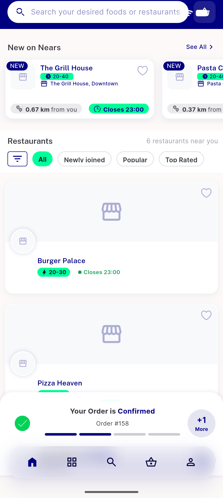</a> food seam categories to restaurants</td>
</tr>
<tr>
<td align="center" width="33%"><a href="06-pharmacy-home-seam.png">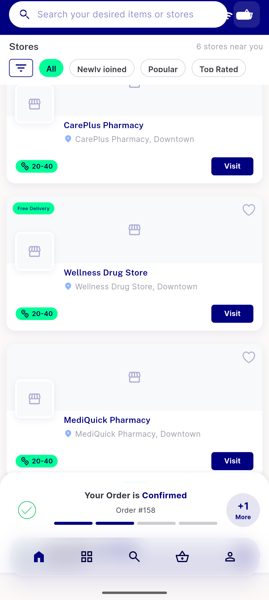</a> pharmacy home seam</td>
<td align="center" width="33%"><a href="06-pharmacy-home.png">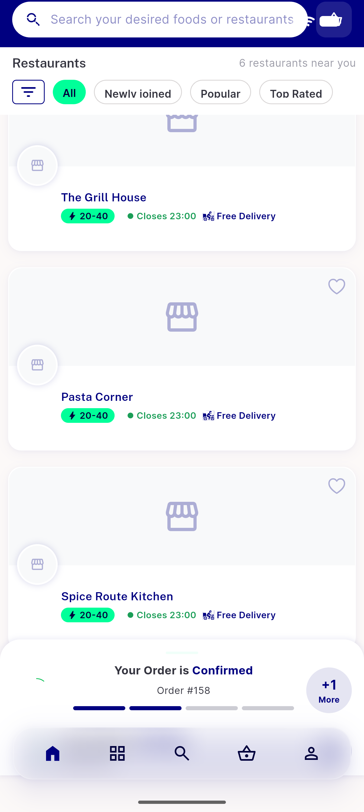</a> pharmacy home</td>
<td align="center" width="33%"><a href="07-zone2-grocery-seam.png">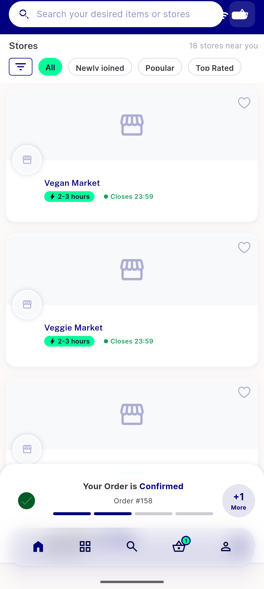</a> zone2 grocery seam</td>
</tr>
<tr>
<td align="center" width="33%"><a href="08-guest-grocery-seam.png">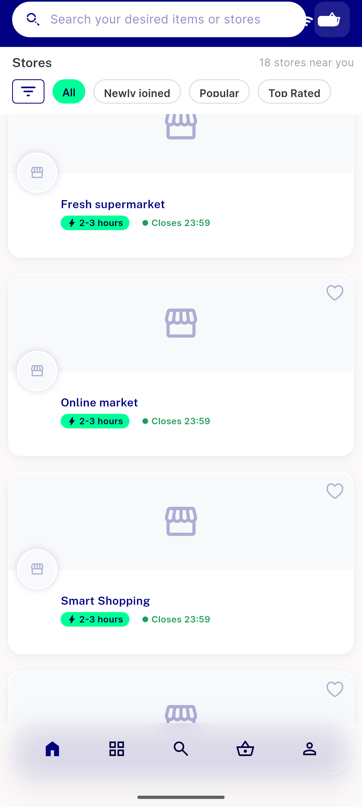</a> guest grocery seam</td>
<td align="center" width="33%"><a href="09-rtl-arabic-grocery-seam.png">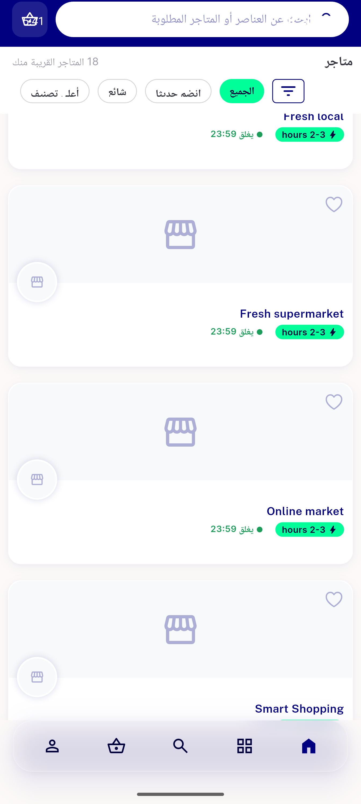</a> rtl arabic grocery seam</td>
<td align="center" width="33%"><a href="10-zone3-singlestore-seam.png">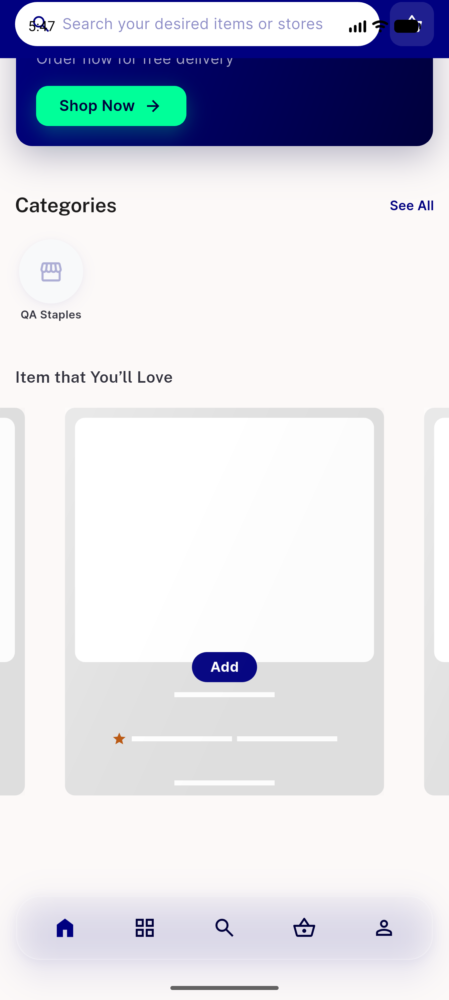</a> zone3 singlestore seam</td>
</tr>
<tr>
<td align="center" width="33%"><a href="bug-buyitagain-card-overflow.png">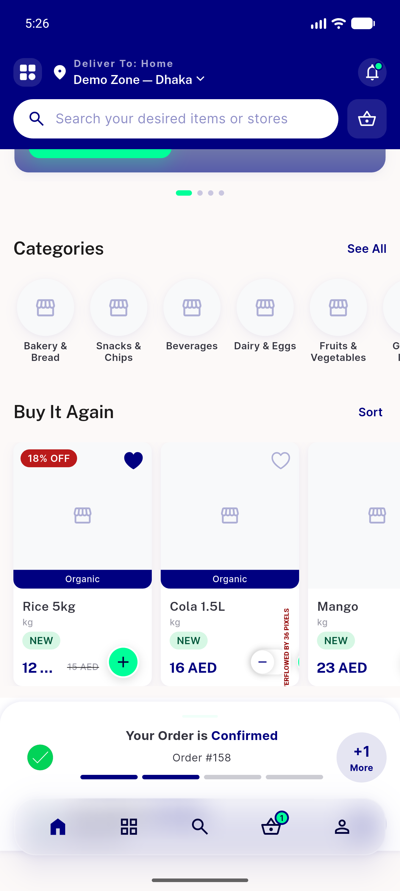</a> bug buyitagain card overflow</td>
</tr>
</table>

---
*From `nears/docs/qa-evidence/NEARS-497/` · public-repo scrub policy (no live secrets; verified clean).*
