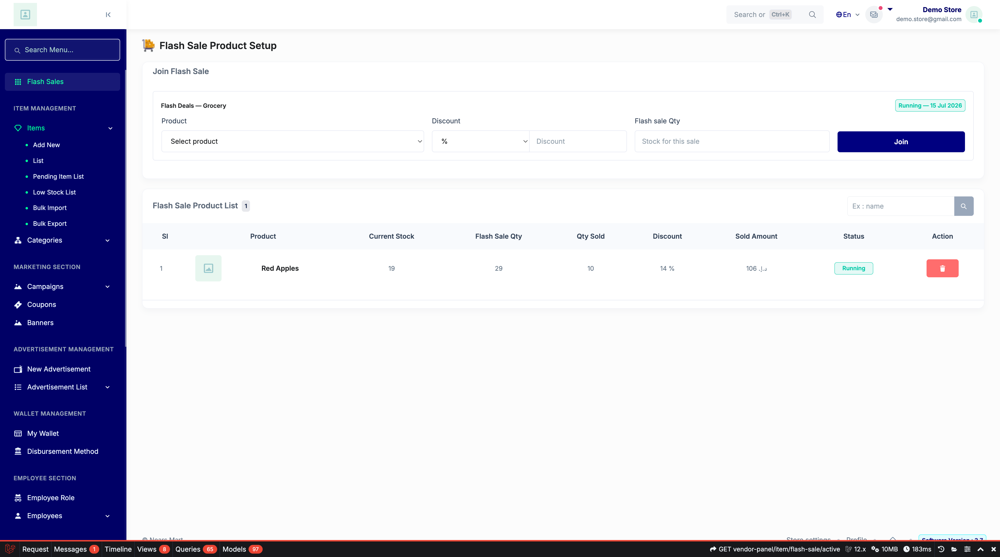
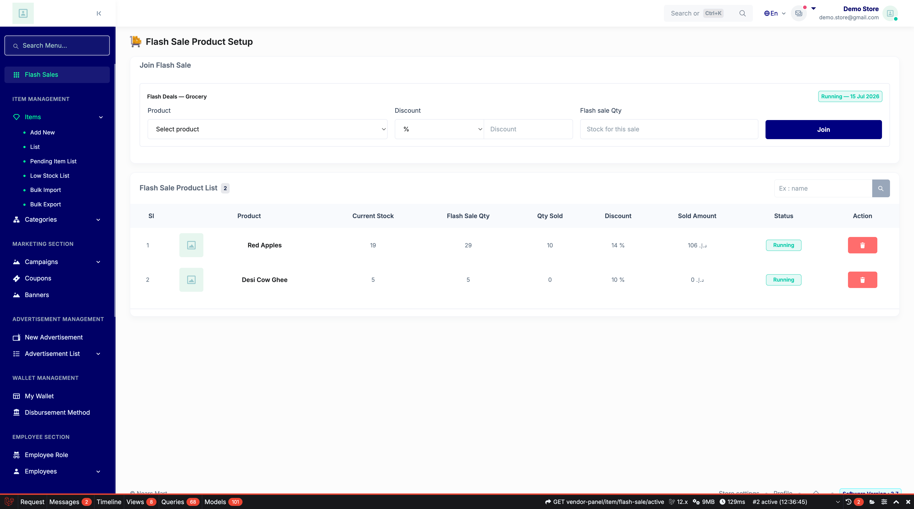
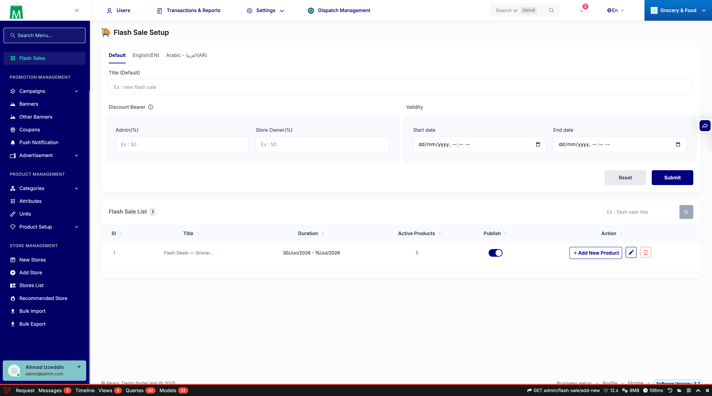

# QA Evidence — NEARS-498

**PASS — vendor flash-sale Model A: AC1-4/7 + F1 cross-module + IDOR (403+[SECURITY]) all live-verified; phpunit 7/7**

**6 screenshot(s).** Click any thumbnail for full resolution.

<table>
<tr>
<td align="center" width="33%"> ac1 active view vendorA</td>
<td align="center" width="33%"> ac2 join success item41</td>
<td align="center" width="33%"> ac3 own remove deleted</td>
</tr>
<tr>
<td align="center" width="33%"> ac7 unauth redirect</td>
<td align="center" width="33%"> flash sale section</td>
<td align="center" width="33%"> regression admin flash sale</td>
</tr>
</table>

### Other artifacts
- [`ac4-route-list.log`](ac4-route-list.log)
- [`progress.md`](progress.md)
- [`security-log-idor.log`](security-log-idor.log)

---
*From `nears/docs/qa-evidence/NEARS-498/` · public-repo scrub policy (no live secrets; verified clean).*
