# QA Evidence — NEARS-499

**PASS — Best Stores Nearby removed (food/grocery/pharmacy/shop); Top offers gated >kZoneMultiStoreThreshold(10) per-module; z1 hidden+Stores shown, z2 grocery shown asc-distance; no-loc graceful; RTL+dark clean; suite +1245**

**23 screenshot(s).** Click any thumbnail for full resolution.

<table>
<tr>
<td align="center" width="33%"><a href="01-store-sections.png">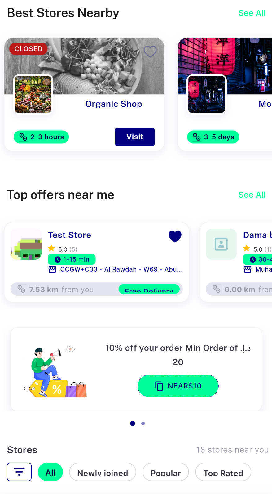</a> store sections</td>
<td align="center" width="33%"><a href="ac1-food-z1-top.png">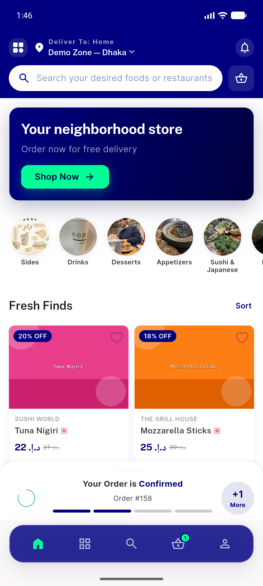</a> ac1 food z1 top</td>
<td align="center" width="33%"><a href="ac1-food-z2-hidden-topoffers.png">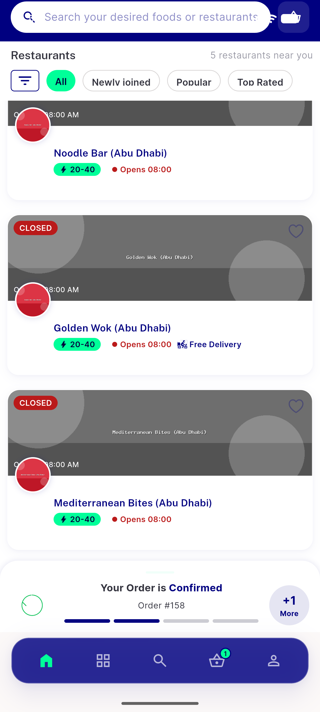</a> ac1 food z2 hidden topoffers</td>
</tr>
<tr>
<td align="center" width="33%"><a href="ac1-grocery-z1-top.png">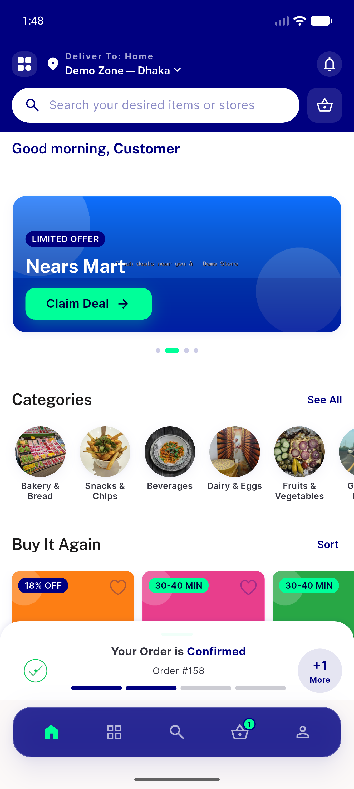</a> ac1 grocery z1 top</td>
<td align="center" width="33%"><a href="ac1-pharmacy-z1-top.png">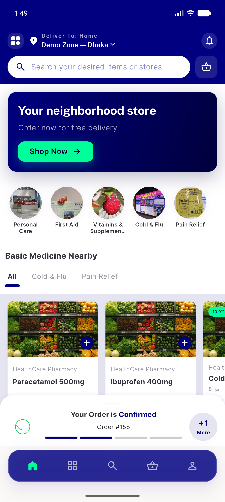</a> ac1 pharmacy z1 top</td>
<td align="center" width="33%"><a href="ac2-food-z1-stores-list.png">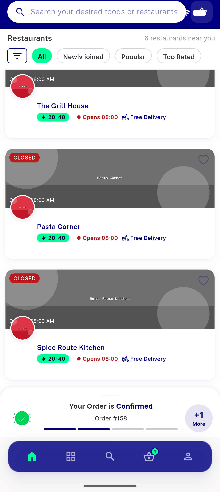</a> ac2 food z1 stores list</td>
</tr>
<tr>
<td align="center" width="33%"><a href="ac2-grocery-z1-stores-list.png">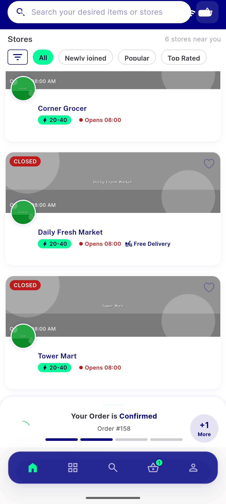</a> ac2 grocery z1 stores list</td>
<td align="center" width="33%"><a href="ac2-pharmacy-z1-stores-list.png">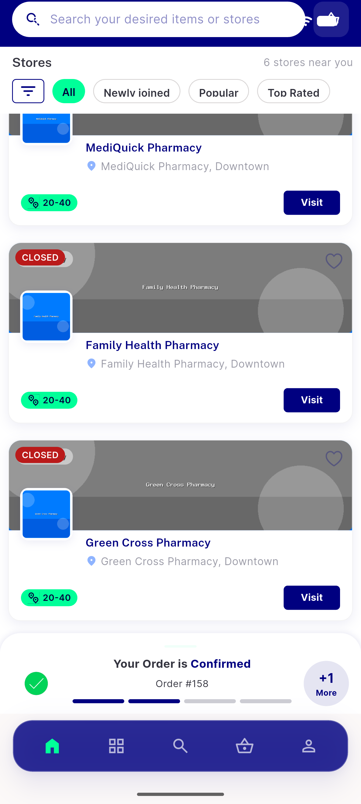</a> ac2 pharmacy z1 stores list</td>
<td align="center" width="33%"><a href="ac3-grocery-z2-rail-scroll1.png">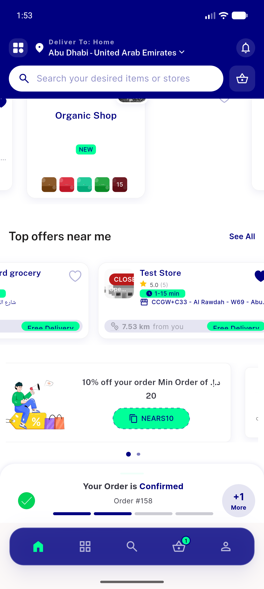</a> ac3 grocery z2 rail scroll1</td>
</tr>
<tr>
<td align="center" width="33%"><a href="ac3-grocery-z2-top-offers-final.png">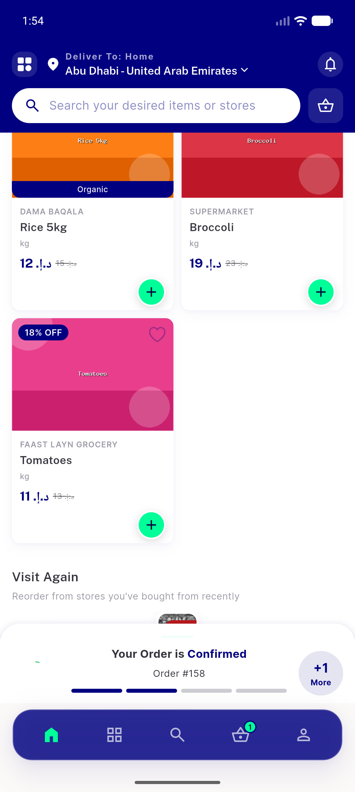</a> ac3 grocery z2 top offers final</td>
<td align="center" width="33%"><a href="ac3-grocery-z2-top-offers-rail.png">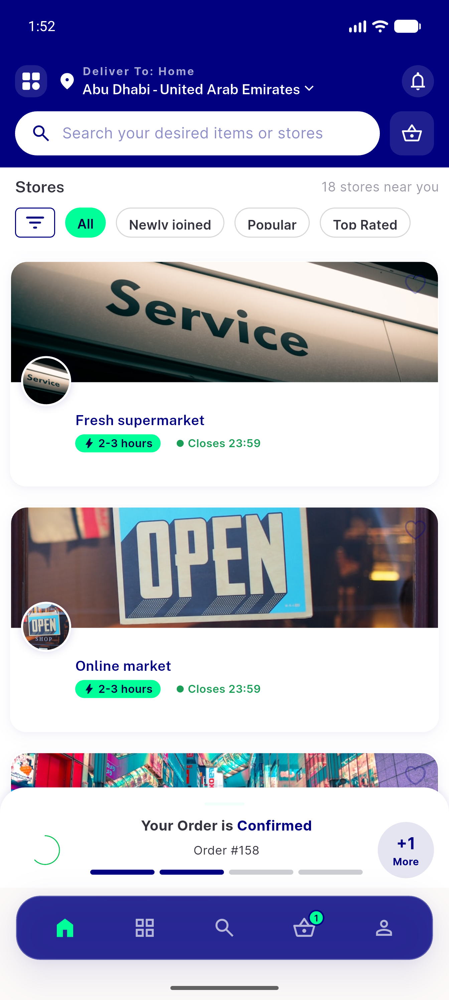</a> ac3 grocery z2 top offers rail</td>
<td align="center" width="33%"><a href="ac3-grocery-z2-top-offers-rail2.png">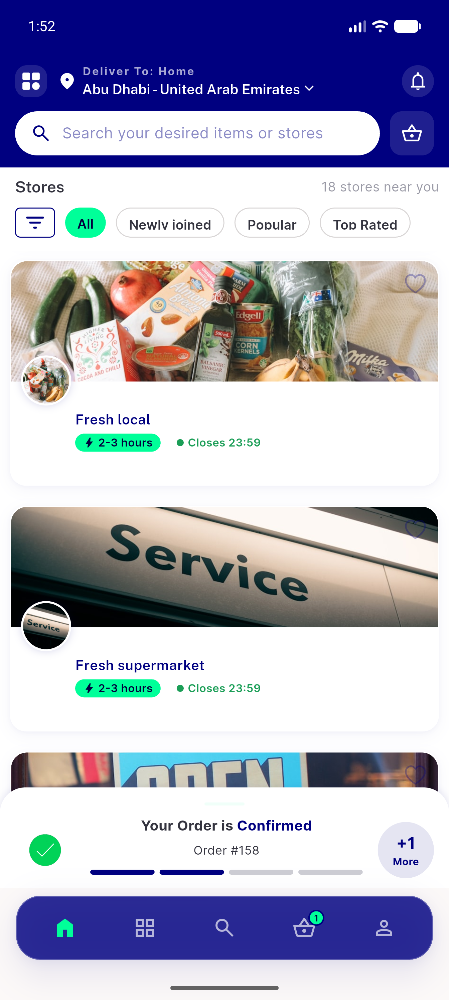</a> ac3 grocery z2 top offers rail2</td>
</tr>
<tr>
<td align="center" width="33%"><a href="ac3-grocery-z2-top-offers-rail3.png">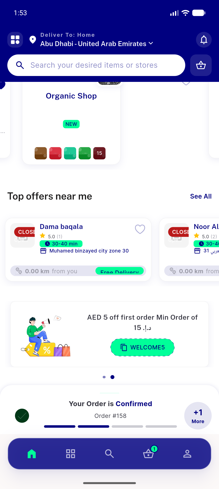</a> ac3 grocery z2 top offers rail3</td>
<td align="center" width="33%"><a href="ac3-grocery-z2-top.png">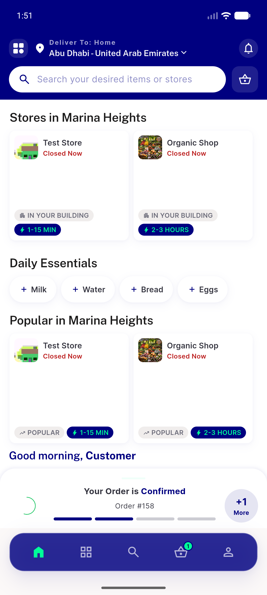</a> ac3 grocery z2 top</td>
<td align="center" width="33%"><a href="dark-grocery-z2-topoffers-rail.png">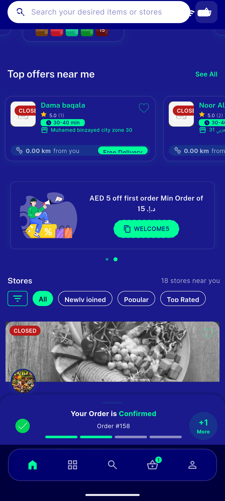</a> dark grocery z2 topoffers rail</td>
</tr>
<tr>
<td align="center" width="33%"><a href="dark-grocery-z2-topoffers.png">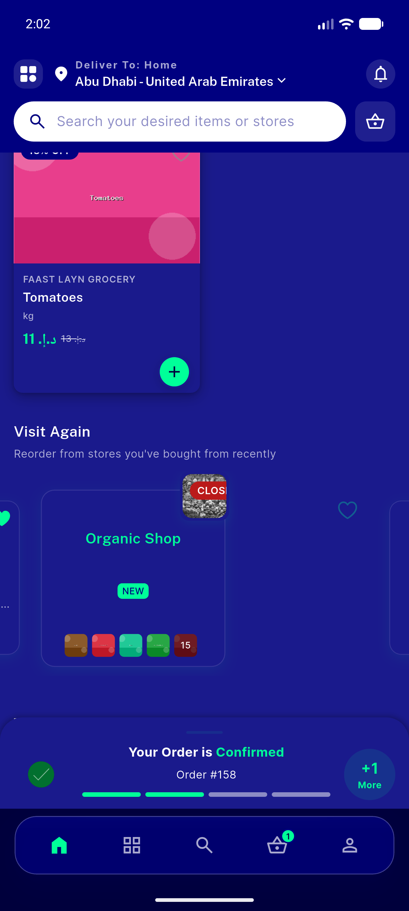</a> dark grocery z2 topoffers</td>
<td align="center" width="33%"><a href="dark-settings.png">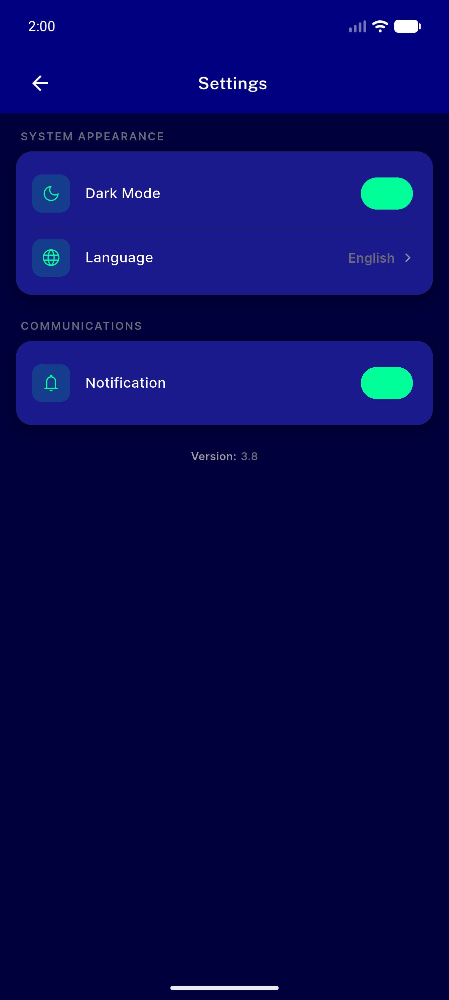</a> dark settings</td>
<td align="center" width="33%"><a href="regr-pharmacy-z2-hidden.png">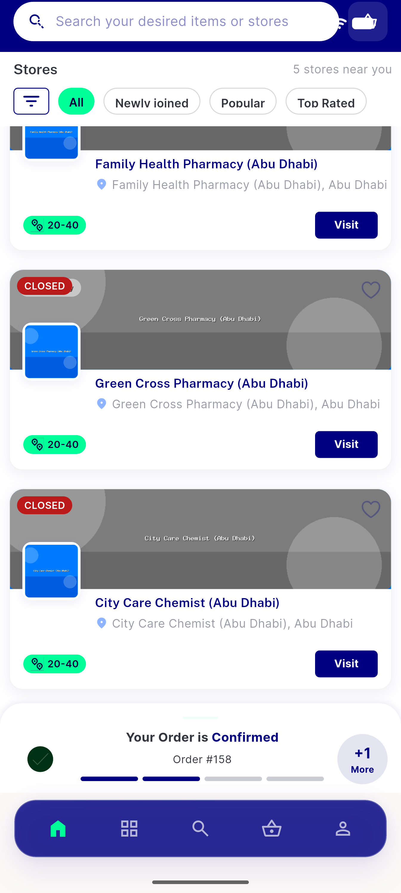</a> regr pharmacy z2 hidden</td>
</tr>
<tr>
<td align="center" width="33%"><a href="regr-zoneflip-grocery-z1-hidden.png">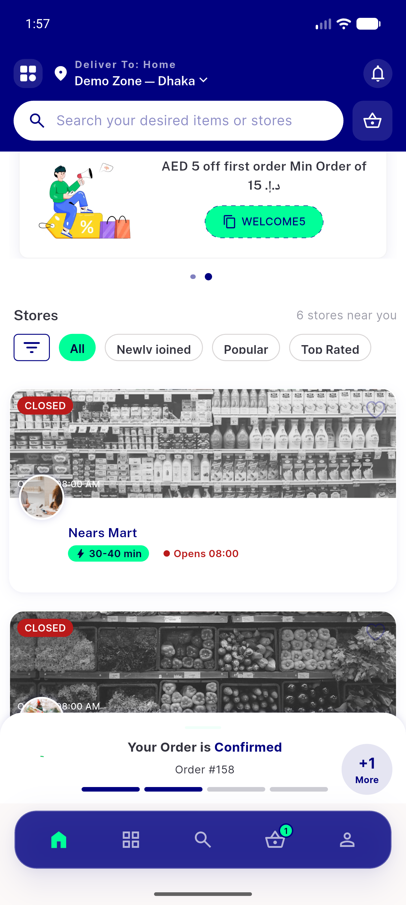</a> regr zoneflip grocery z1 hidden</td>
<td align="center" width="33%"><a href="restored-light-english.png">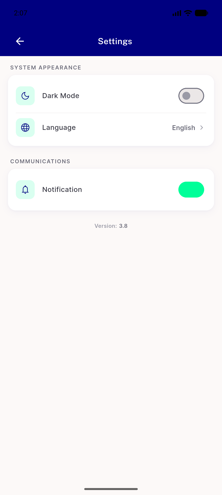</a> restored light english</td>
<td align="center" width="33%"><a href="rtl-after-switch.png">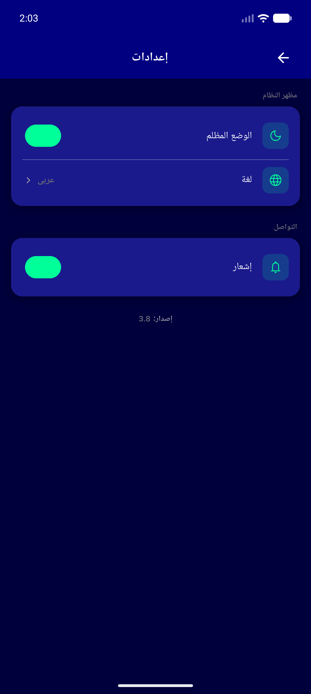</a> rtl after switch</td>
</tr>
<tr>
<td align="center" width="33%"><a href="rtl-grocery-z1-hidden.png">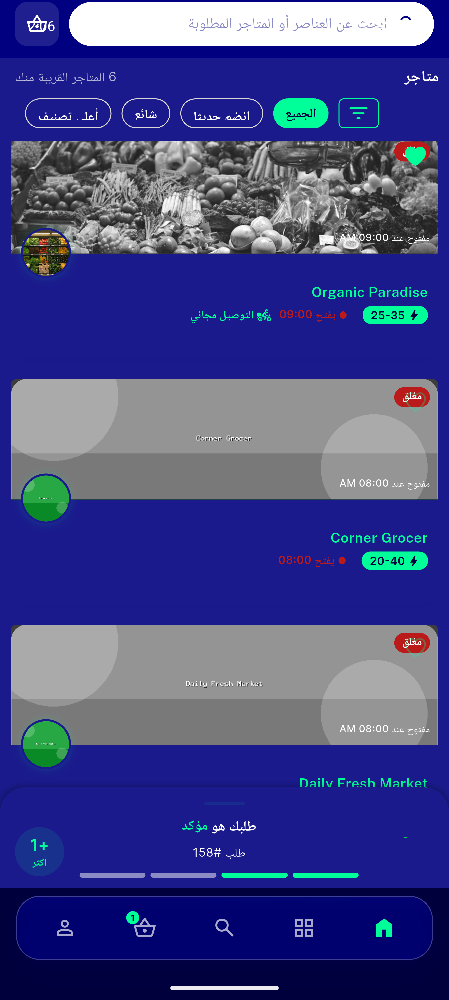</a> rtl grocery z1 hidden</td>
<td align="center" width="33%"> rtl grocery z2 topoffers</td>
</tr>
</table>

### Other artifacts
- [`progress.md`](progress.md)

---
*From `nears/docs/qa-evidence/NEARS-499/` · public-repo scrub policy (no live secrets; verified clean).*
