# QA Evidence — NEARS-501

**PASS — floating glassy icon-only bottom nav, all 8 ACs live on emulator-5554**

**17 screenshot(s).** Click any thumbnail for full resolution.

<table>
<tr>
<td align="center" width="33%"> bottom nav current</td>
<td align="center" width="33%"><a href="02-bottom-nav-target-design.png">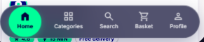</a> bottom nav target design</td>
<td align="center" width="33%"><a href="ac1-ac16-home-nav-with-running-order-banner.png">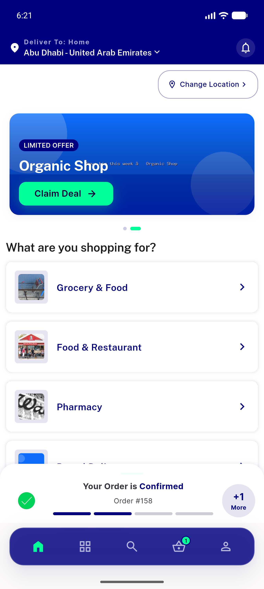</a> ac1 ac16 home nav with running order banner</td>
</tr>
<tr>
<td align="center" width="33%"><a href="ac1-home-final-english.png">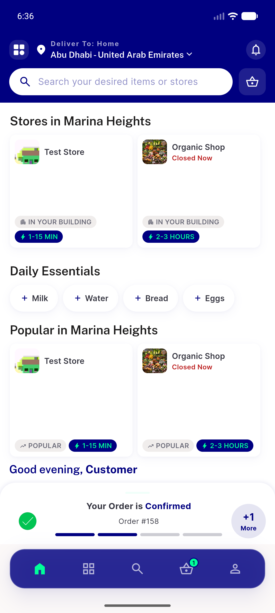</a> ac1 home final english</td>
<td align="center" width="33%"><a href="ac2-blur-categories-behind-bar.png">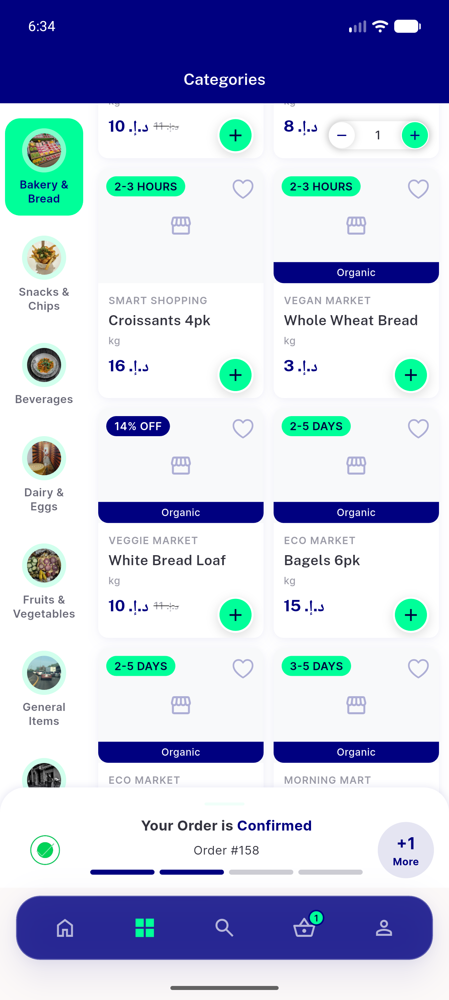</a> ac2 blur categories behind bar</td>
<td align="center" width="33%"><a href="ac7-backpress-returns-home.png">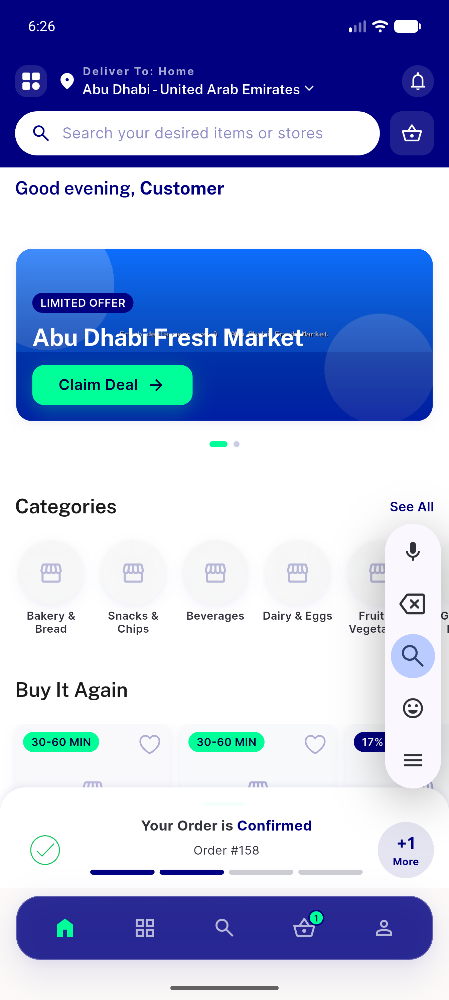</a> ac7 backpress returns home</td>
</tr>
<tr>
<td align="center" width="33%"><a href="ac7-tab-basket.png">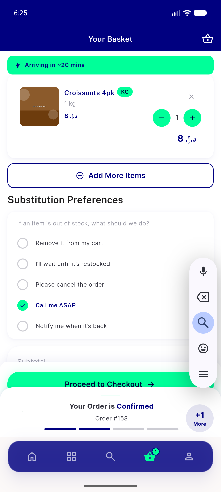</a> ac7 tab basket</td>
<td align="center" width="33%"><a href="ac7-tab-categories.png">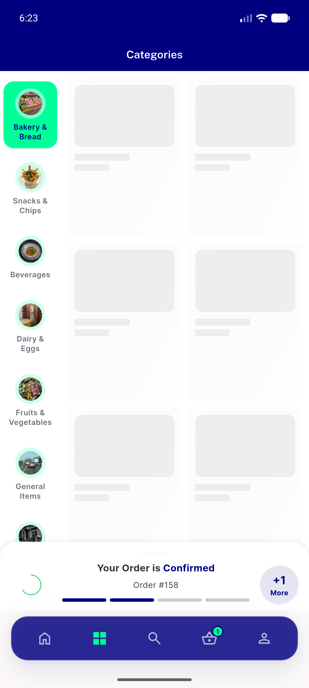</a> ac7 tab categories</td>
<td align="center" width="33%"><a href="ac7-tab-profile.png">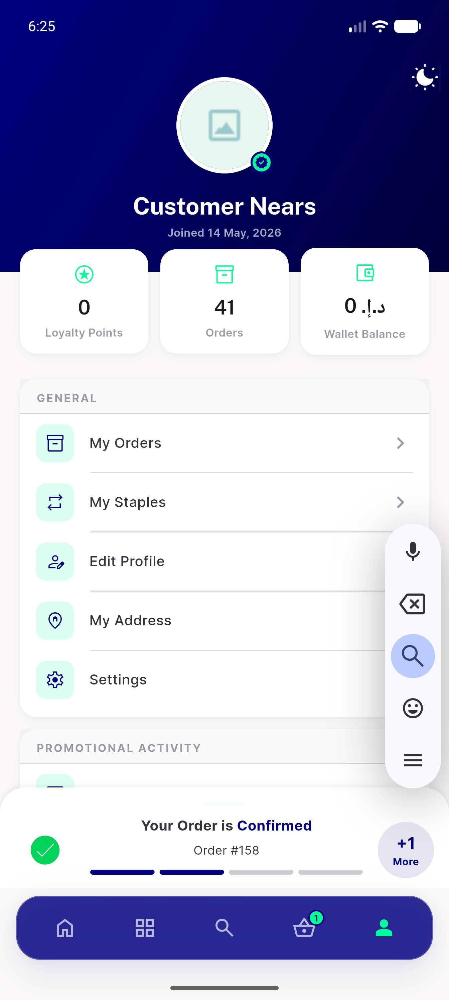</a> ac7 tab profile</td>
</tr>
<tr>
<td align="center" width="33%"><a href="ac7-tab-search.png">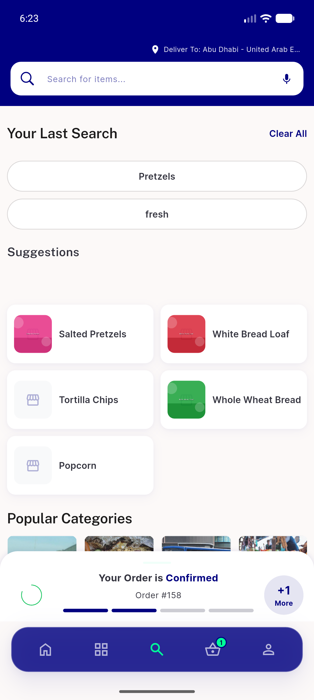</a> ac7 tab search</td>
<td align="center" width="33%"><a href="ac8-dark-mode-home.png">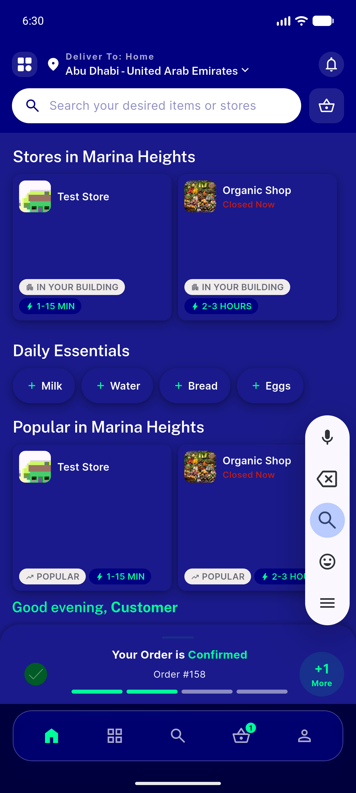</a> ac8 dark mode home</td>
<td align="center" width="33%"><a href="ac8-dark-mode-profile.png">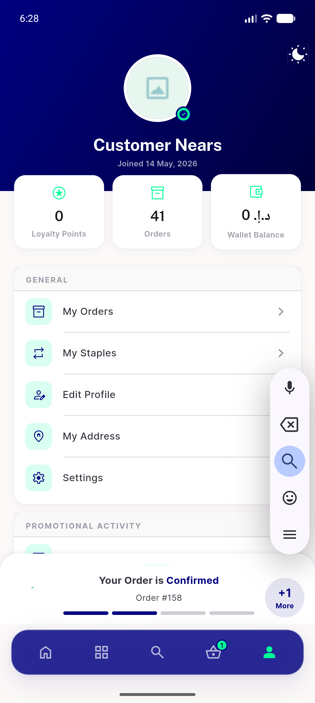</a> ac8 dark mode profile</td>
</tr>
<tr>
<td align="center" width="33%"><a href="ac8-rtl-arabic-after-update.png">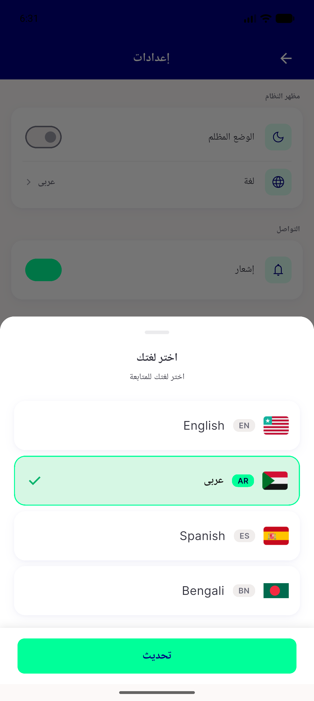</a> ac8 rtl arabic after update</td>
<td align="center" width="33%"><a href="ac8-rtl-arabic-home.png">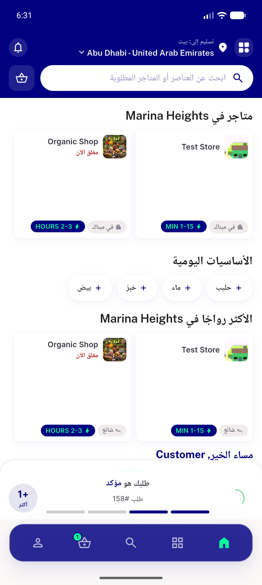</a> ac8 rtl arabic home</td>
<td align="center" width="33%"><a href="note-nav-absent-on-pushed-store-route.png">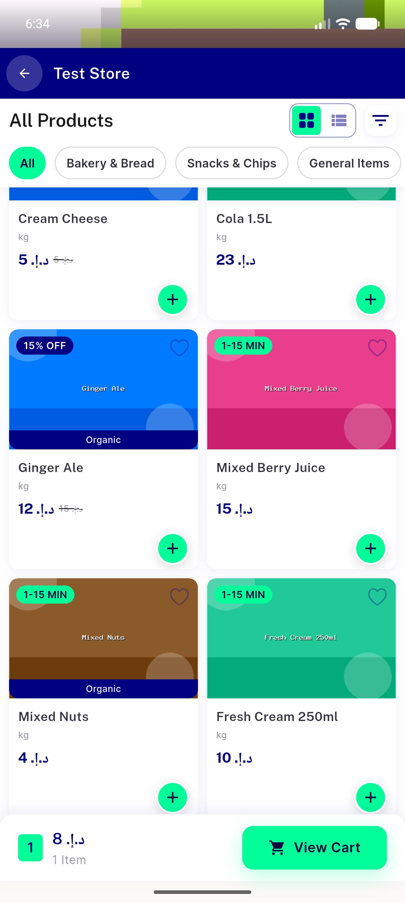</a> note nav absent on pushed store route</td>
</tr>
<tr>
<td align="center" width="33%"><a href="regression-keyboard-emulator-ime-no-inset.png">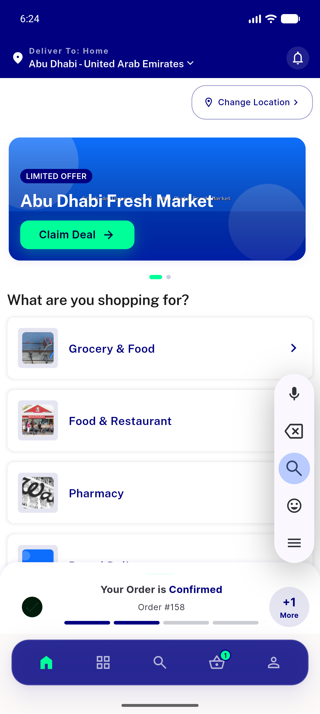</a> regression keyboard emulator ime no inset</td>
<td align="center" width="33%"><a href="regression-location-suggestion-nav-hidden.png">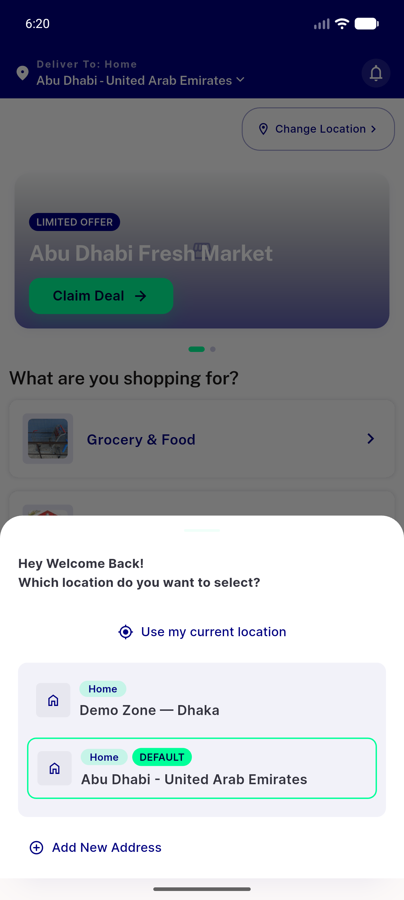</a> regression location suggestion nav hidden</td>
</tr>
</table>

### Other artifacts
- [`progress.md`](progress.md)

---
*From `nears/docs/qa-evidence/NEARS-501/` · public-repo scrub policy (no live secrets; verified clean).*
