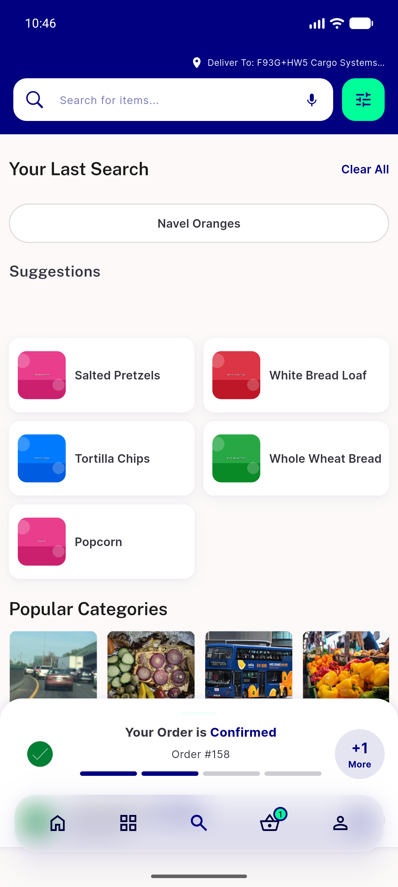
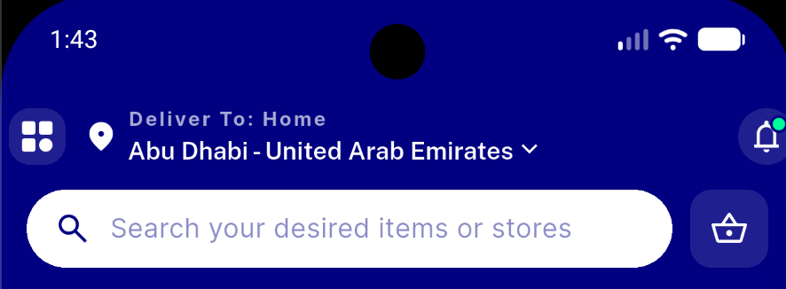
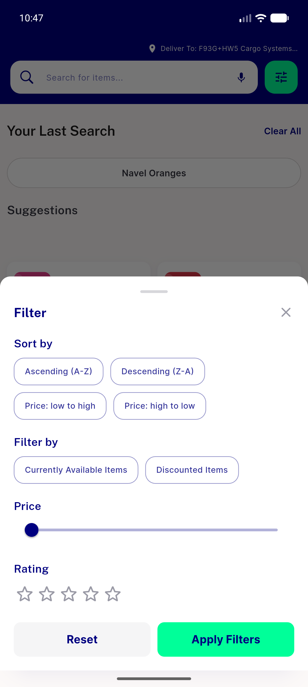
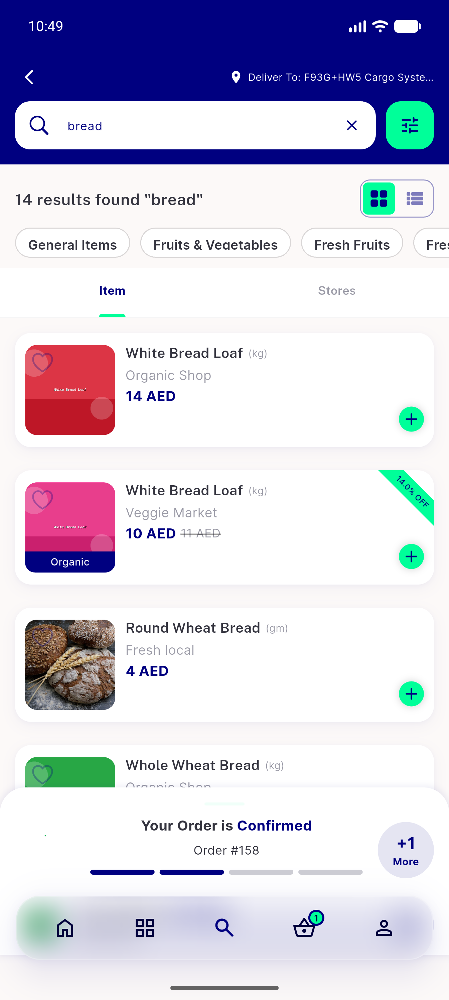
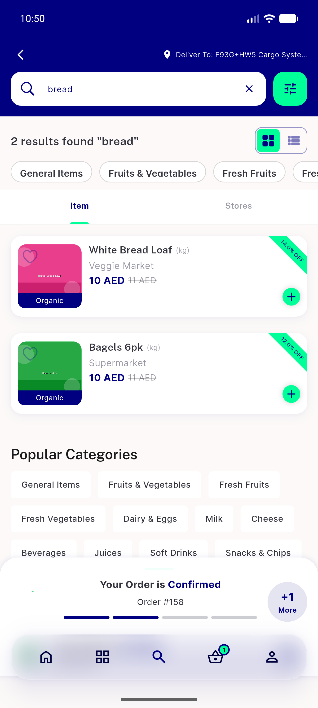
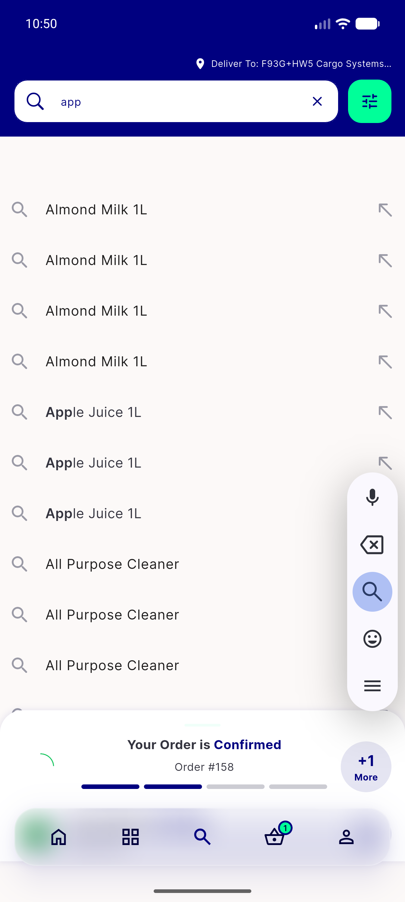
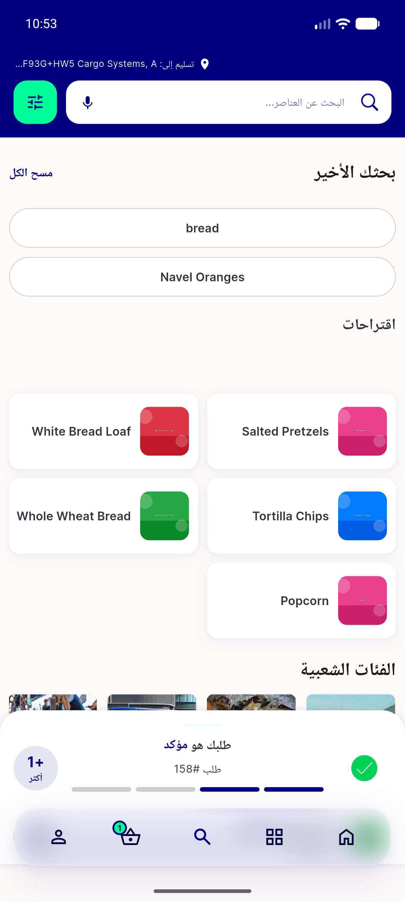
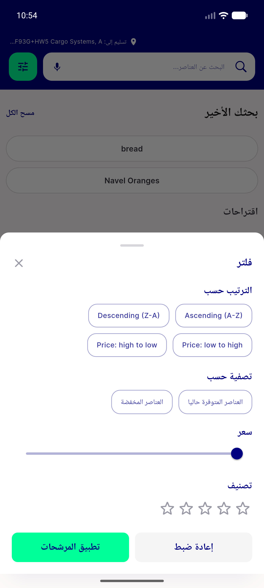

# QA Evidence — NEARS-503

**PASS — Search filter icon in idle+results, CR-1 idle Apply no-crash, RTL OK (emulator-5554)**

**8 screenshot(s).** Click any thumbnail for full resolution.

<table>
<tr>
<td align="center" width="33%"> idle filter icon</td>
<td align="center" width="33%"> search 20</td>
<td align="center" width="33%"> idle filter sheet open</td>
</tr>
<tr>
<td align="center" width="33%"> results state</td>
<td align="center" width="33%"> results filtered discounted</td>
<td align="center" width="33%"> idle typing suggestions</td>
</tr>
<tr>
<td align="center" width="33%"> rtl arabic idle</td>
<td align="center" width="33%"> rtl filter sheet</td>
</tr>
</table>

### Other artifacts
- [`progress.md`](progress.md)

---
*From `nears/docs/qa-evidence/NEARS-503/` · public-repo scrub policy (no live secrets; verified clean).*
