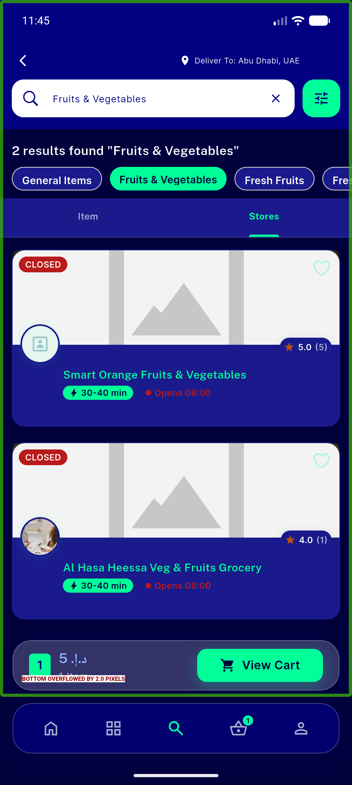
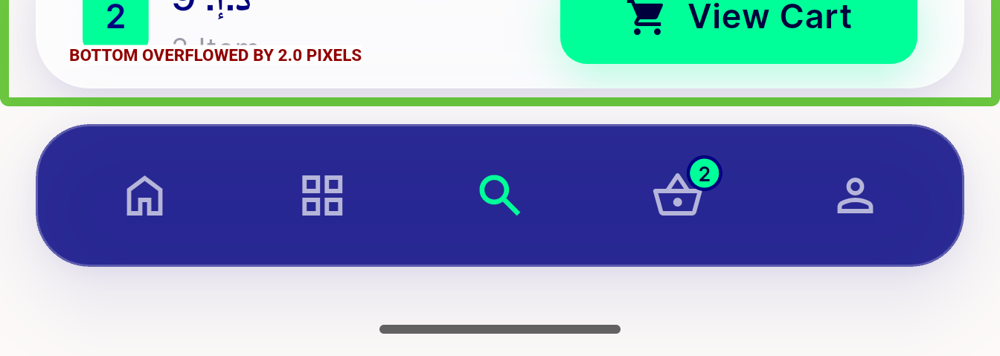
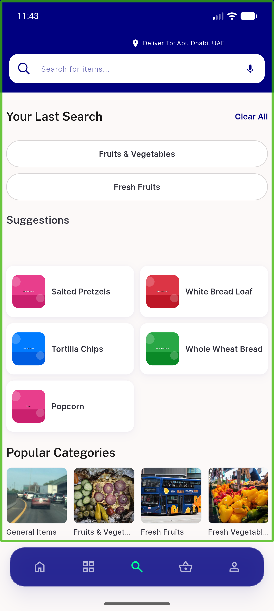
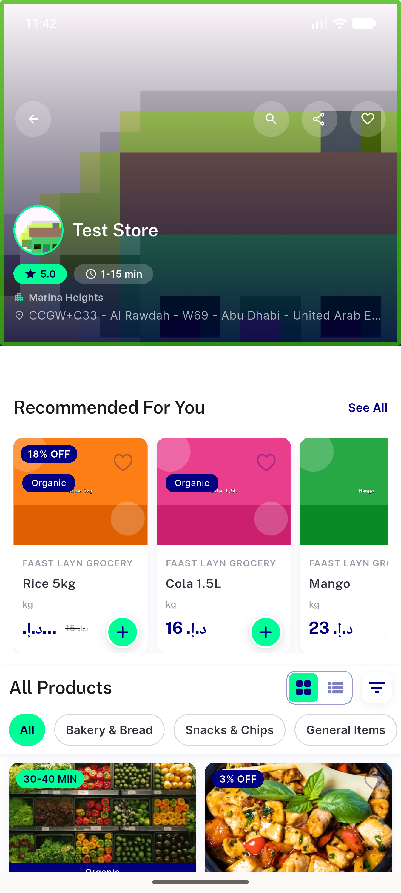
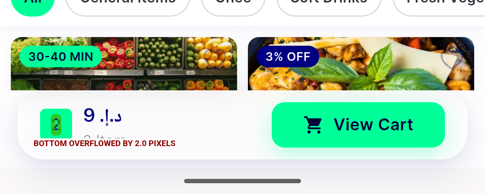
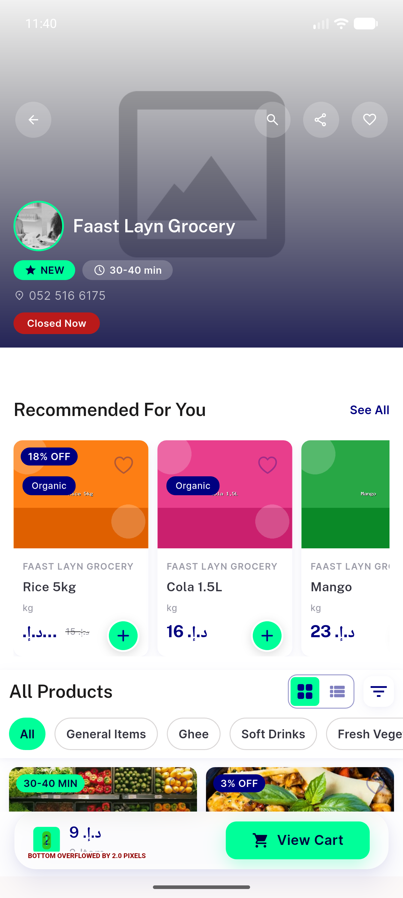
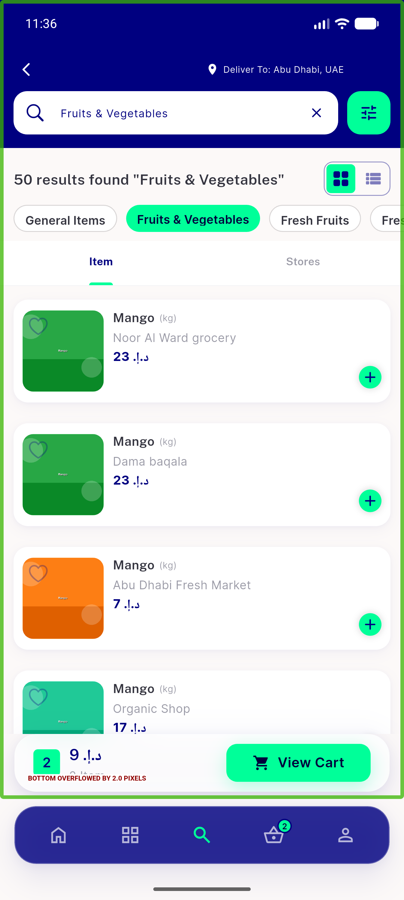
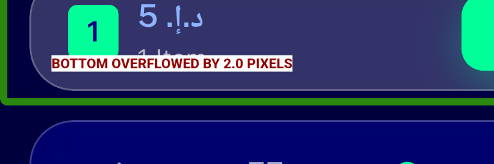

# QA Evidence — NEARS-504

**FAIL — BottomCartWidget overflows 2px on all 3 render sites (light+dark); dark price=sky OK; empty-state hidden OK**

**12 screenshot(s).** Click any thumbnail for full resolution.

<table>
<tr>
<td align="center" width="33%"> ac darkmode cartbar price sky OVERFLOW</td>
<td align="center" width="33%"> ac1 search cartbar above nav OVERFLOW</td>
<td align="center" width="33%"> ac2 cartbar nav closeup</td>
</tr>
<tr>
<td align="center" width="33%"> ac3 search EMPTY no bar</td>
<td align="center" width="33%"> ac3 storedetail EMPTY no bar</td>
<td align="center" width="33%"> ac3 storedetail bar closeup</td>
</tr>
<tr>
<td align="center" width="33%"> ac3 storedetail cartbar OVERFLOW</td>
<td align="center" width="33%"> ac3 storeitemsearch cartbar OVERFLOW 2px</td>
<td align="center" width="33%"> bug cartbar bottom overflow 2px</td>
</tr>
<tr>
<td align="center" width="33%"> cart emptied</td>
<td align="center" width="33%"> darkmode bar price zoom</td>
<td align="center" width="33%"> darkmode cartbar OVERFLOW</td>
</tr>
</table>

### Other artifacts
- [`bug-cartbar-bottom-overflow-2px.log`](bug-cartbar-bottom-overflow-2px.log)
- [`progress.md`](progress.md)

---
*From `nears/docs/qa-evidence/NEARS-504/` · public-repo scrub policy (no live secrets; verified clean).*
