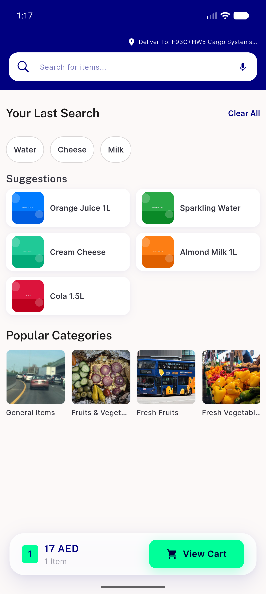
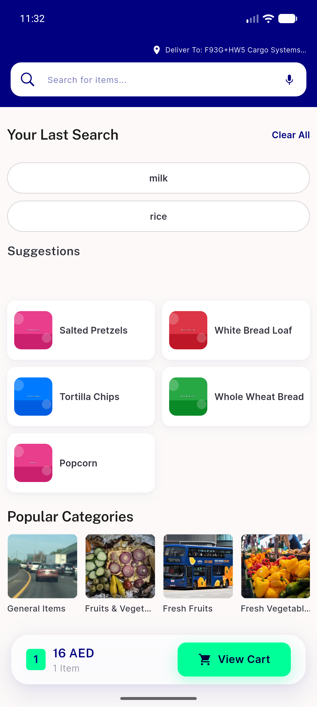
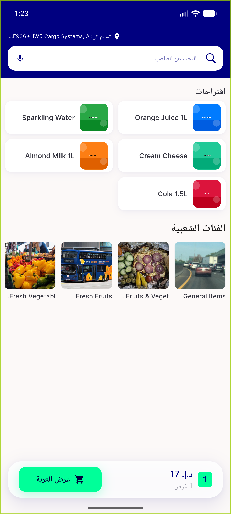
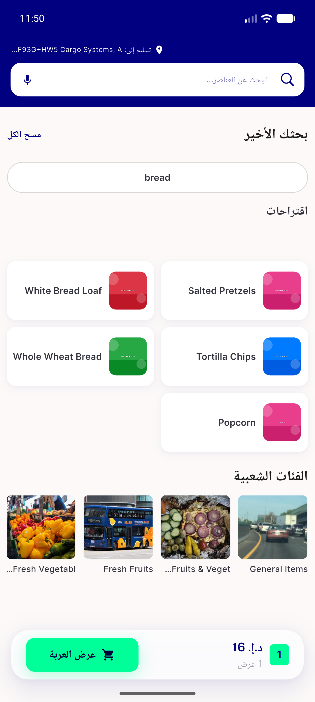
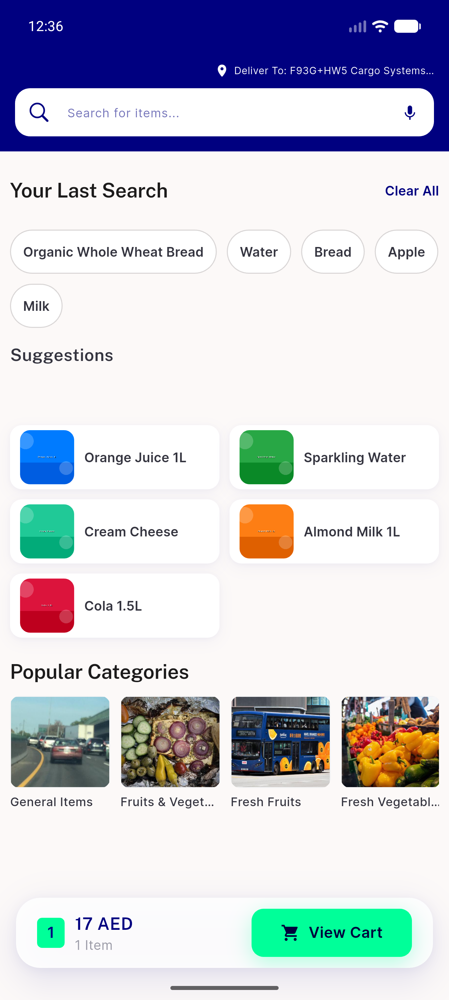

# QA Evidence — NEARS-505

**PASS final cycle-3 — AC#2 Suggestions gap 5px (was ~67), Popular Categories 10px; card 64px no clip; AC#1+AC#3 reuse-PASS; 55/55 tests**

**10 screenshot(s).** Click any thumbnail for full resolution.

<table>
<tr>
<td align="center" width="33%"> ac2 suggestions tight gap</td>
<td align="center" width="33%"> idle chips suggestions</td>
<td align="center" width="33%"> ac2 rtl idle holds</td>
</tr>
<tr>
<td align="center" width="33%"> rtl arabic idle</td>
<td align="center" width="33%"> bug fullwidth chips</td>
<td align="center" width="33%"> bug suggestions gap persists</td>
</tr>
<tr>
<td align="center" width="33%"> bug suggestions gap</td>
<td align="center" width="33%"> recheck 01 compact chips</td>
<td align="center" width="33%"> recheck 02 suggestions gap STILL</td>
</tr>
<tr>
<td align="center" width="33%"> recheck 03 rtl arabic idle</td>
</tr>
</table>

### Other artifacts
- [`measurements.log`](measurements.log)
- [`progress.md`](progress.md)
- [`recheck-measurements.log`](recheck-measurements.log)

---
*From `nears/docs/qa-evidence/NEARS-505/` · public-repo scrub policy (no live secrets; verified clean).*
