# QA Evidence — NEARS-507

**verify**

**13 screenshot(s).** Click any thumbnail for full resolution.

<table>
<tr>
<td align="center" width="33%"><a href="ac1-items-tab-zone2.png">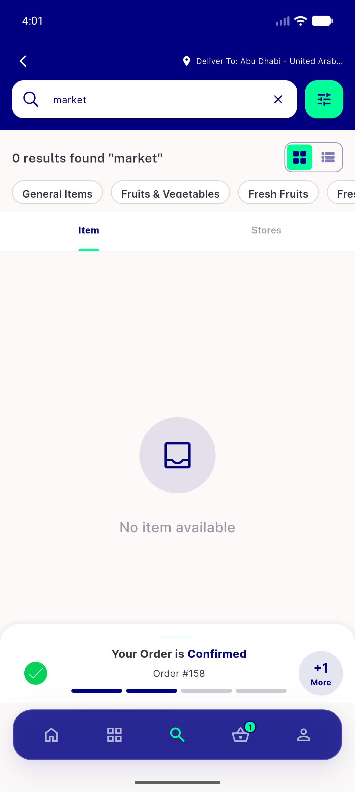</a> ac1 items tab zone2</td>
<td align="center" width="33%"><a href="ac1-stores-tab-clean.png">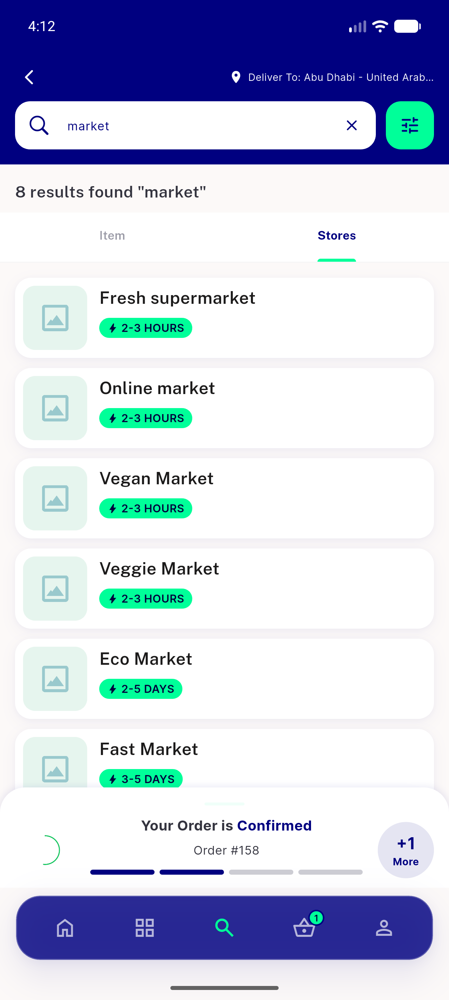</a> ac1 stores tab clean</td>
<td align="center" width="33%"><a href="ac1-stores-tab-closed-card.png">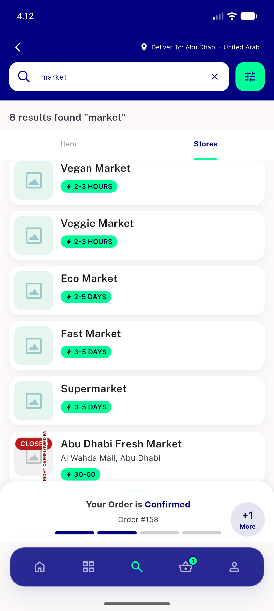</a> ac1 stores tab closed card</td>
</tr>
<tr>
<td align="center" width="33%"><a href="ac1-stores-tab-closed-state.png">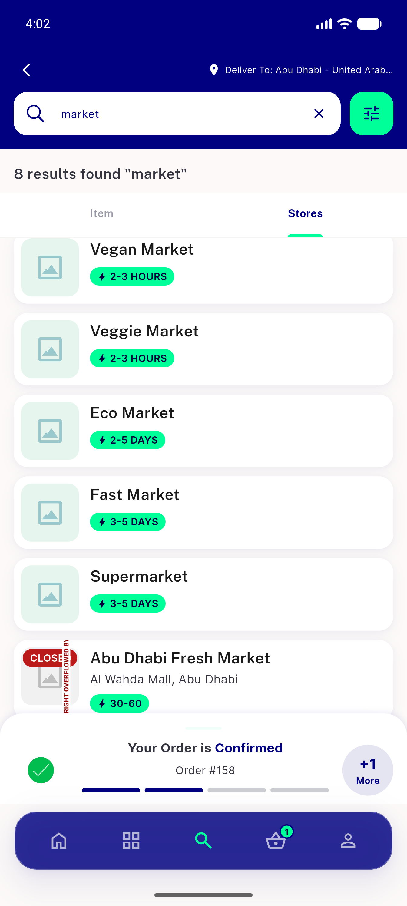</a> ac1 stores tab closed state</td>
<td align="center" width="33%"><a href="ac1-stores-tab-rows.png">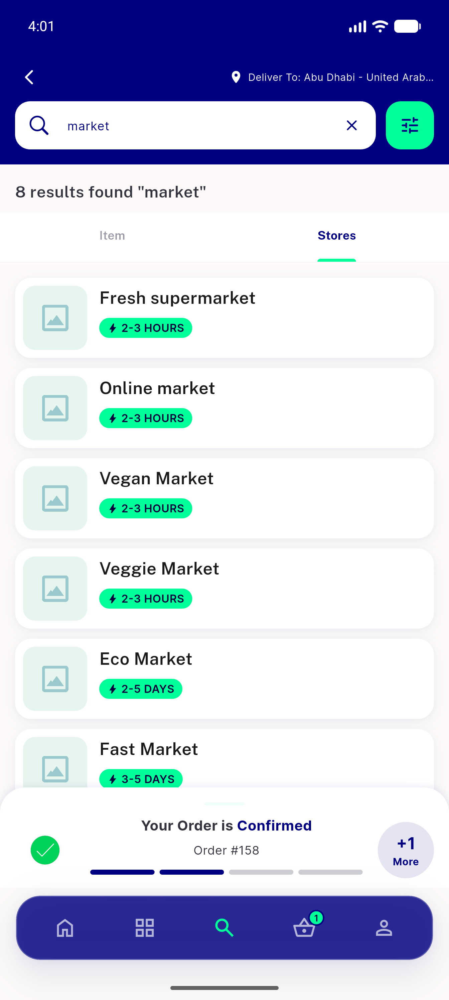</a> ac1 stores tab rows</td>
<td align="center" width="33%"><a href="ac3-items-tab-items-and-chips.png">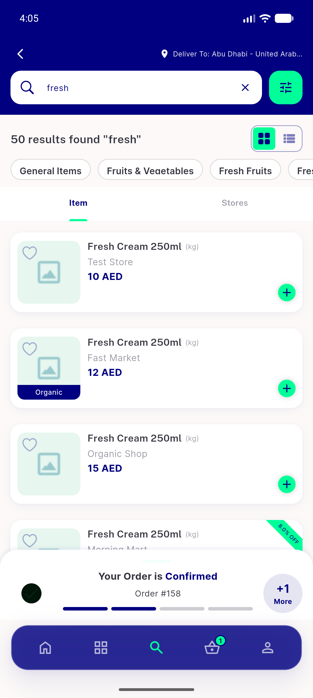</a> ac3 items tab items and chips</td>
</tr>
<tr>
<td align="center" width="33%"><a href="ac4-pharmacy-no-tabbar-items-only.png">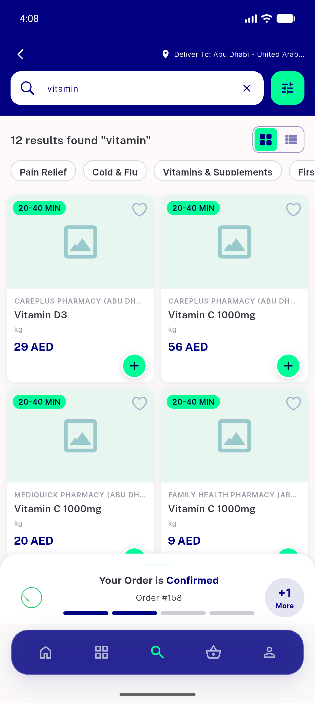</a> ac4 pharmacy no tabbar items only</td>
<td align="center" width="33%"><a href="ac4-zone1-grocery-no-tabbar.png">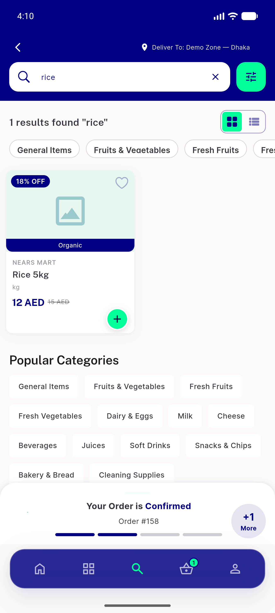</a> ac4 zone1 grocery no tabbar</td>
<td align="center" width="33%"><a href="bug-closed-chip-row-overflow.png">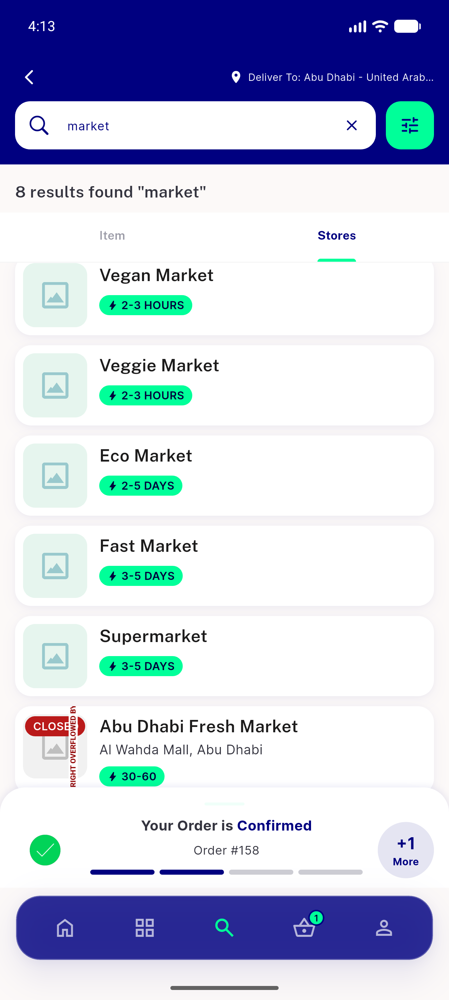</a> bug closed chip row overflow</td>
</tr>
<tr>
<td align="center" width="33%"><a href="regression-dark-mode-stores-tab.png">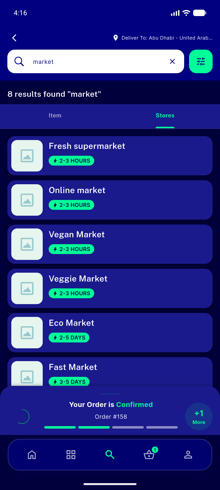</a> regression dark mode stores tab</td>
<td align="center" width="33%"> regression rtl arabic stores tab</td>
<td align="center" width="33%"><a href="regression-rtl-pharmacy-no-tabbar.png">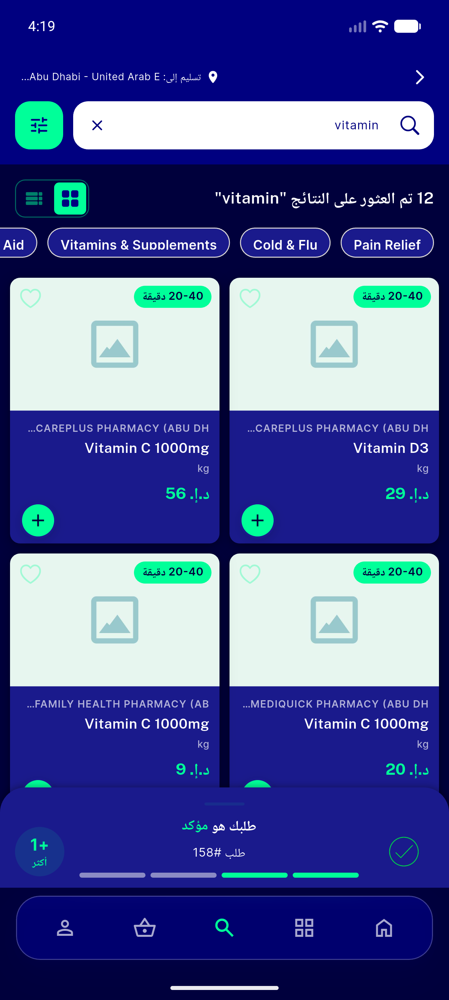</a> regression rtl pharmacy no tabbar</td>
</tr>
<tr>
<td align="center" width="33%"><a href="regression-stores-empty-state.png">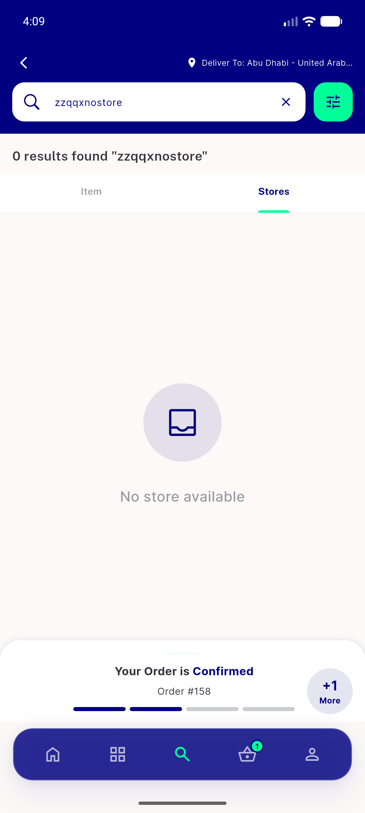</a> regression stores empty state</td>
</tr>
</table>

### Other artifacts
- [`bug-closed-chip-row-overflow.log`](bug-closed-chip-row-overflow.log)
- [`progress.md`](progress.md)

---
*From `nears/docs/qa-evidence/NEARS-507/` · public-repo scrub policy (no live secrets; verified clean).*
