# QA Evidence — NEARS-509

**PASS — 3/3 ACs met live on emulator-5556 (UserApp basket UI: appbar EN/AR/dark, no line-subtotal + aggregate summary, checkout pill flush fromNav true/false); 2 UX adjudications resolved as PASS (no awkward gap, no double-inset); 45/45 cart tests green**

**16 screenshot(s).** Click any thumbnail for full resolution.

<table>
<tr>
<td align="center" width="33%"> basket page</td>
<td align="center" width="33%"><a href="ac-empty-cart.png">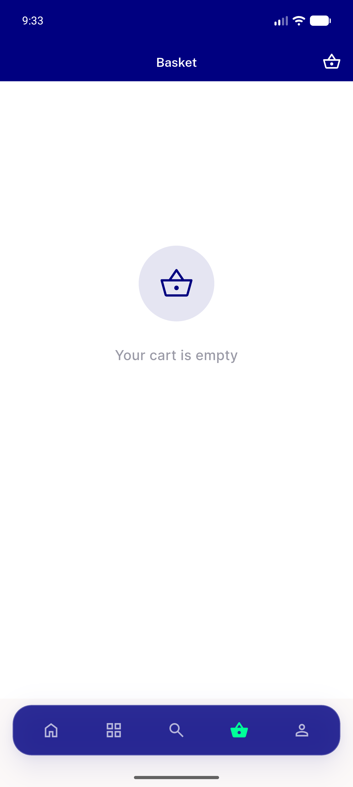</a> ac empty cart</td>
<td align="center" width="33%"> ac1 appbar ar light</td>
</tr>
<tr>
<td align="center" width="33%"><a href="ac1-appbar-dark.png">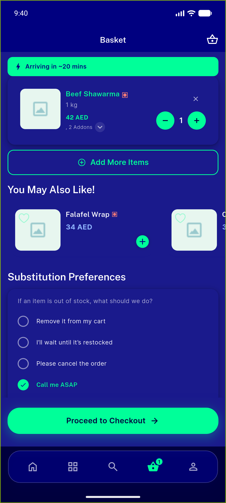</a> ac1 appbar dark</td>
<td align="center" width="33%"> ac1 appbar en light</td>
<td align="center" width="33%"><a href="ac2-addon-card-collapsed.png">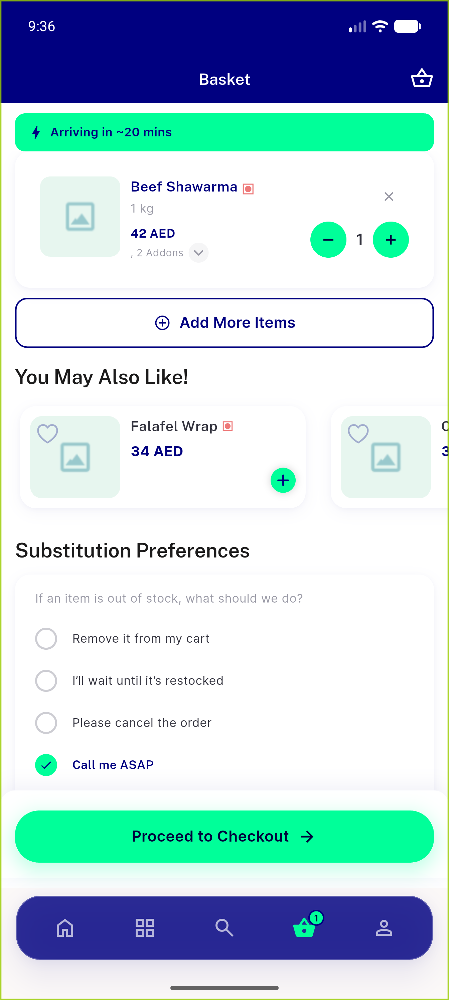</a> ac2 addon card collapsed</td>
</tr>
<tr>
<td align="center" width="33%"><a href="ac2-addon-card-expanded.png">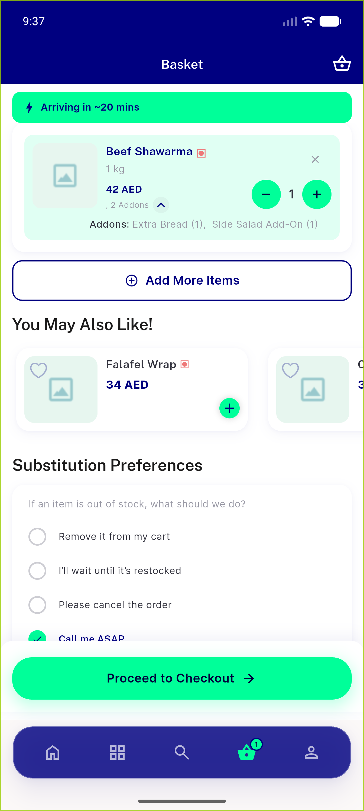</a> ac2 addon card expanded</td>
<td align="center" width="33%"><a href="ac2-card-qty2-no-subtotal.png">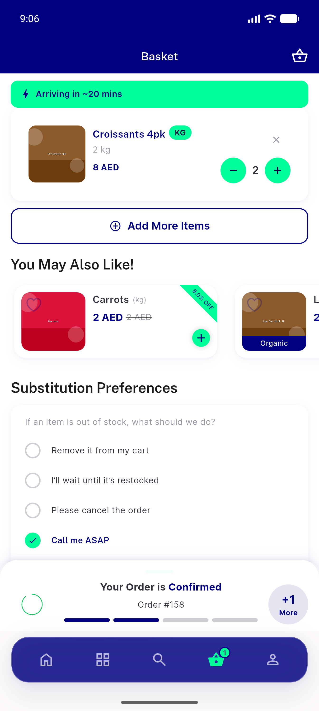</a> ac2 card qty2 no subtotal</td>
<td align="center" width="33%"><a href="ac2-discounted-card.png">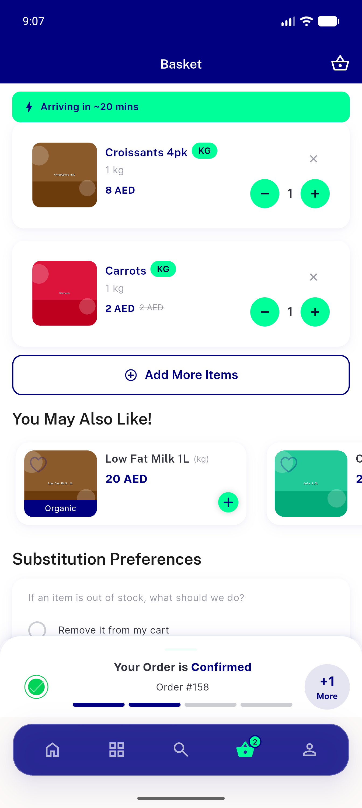</a> ac2 discounted card</td>
</tr>
<tr>
<td align="center" width="33%"><a href="ac2-order-summary-qty1.png">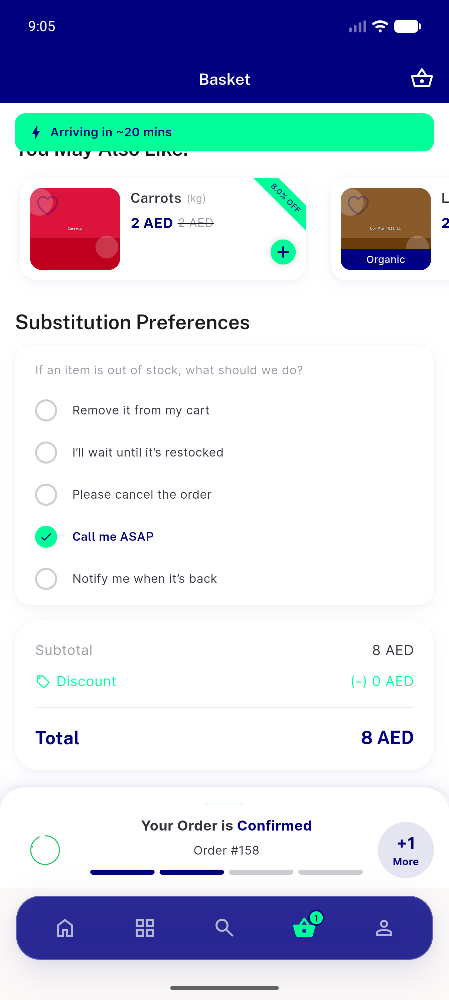</a> ac2 order summary qty1</td>
<td align="center" width="33%"><a href="ac2-order-summary-qty2.png">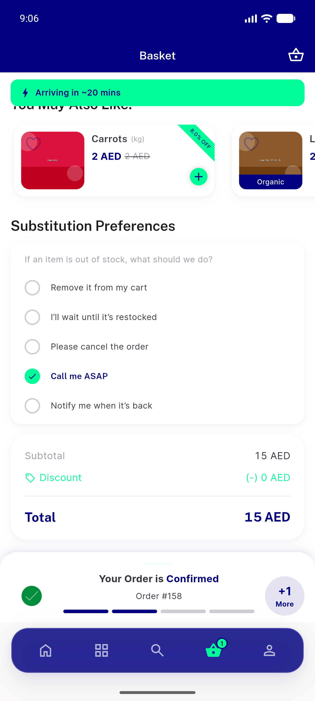</a> ac2 order summary qty2</td>
<td align="center" width="33%"> ac3 checkout gap fromnav runningorder</td>
</tr>
<tr>
<td align="center" width="33%"><a href="ac3-fromnav-false-pushed-cart.png">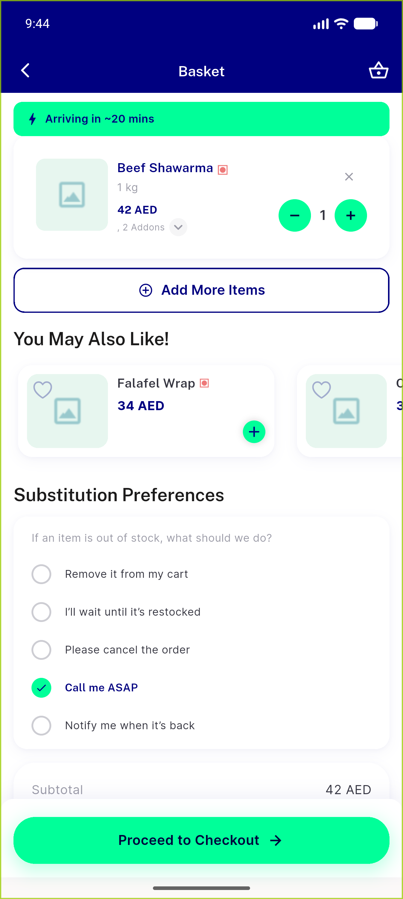</a> ac3 fromnav false pushed cart</td>
<td align="center" width="33%"><a href="ac3-pill-vs-nav-clean.png">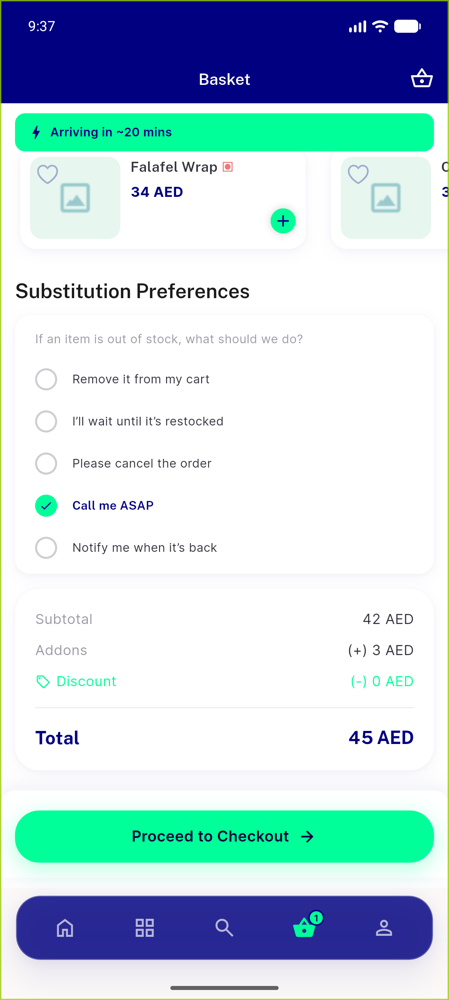</a> ac3 pill vs nav clean</td>
<td align="center" width="33%"><a href="ac3-pill-vs-nav-fromnav.png">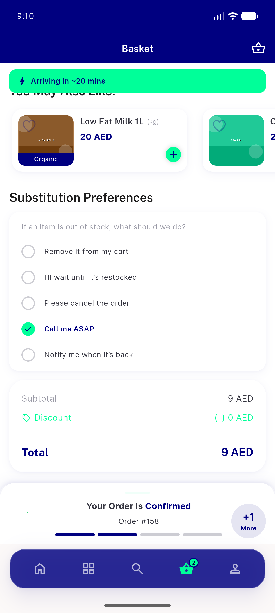</a> ac3 pill vs nav fromnav</td>
</tr>
<tr>
<td align="center" width="33%"><a href="ac5-skeleton-refresh.png">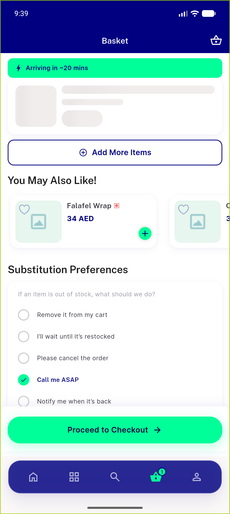</a> ac5 skeleton refresh</td>
</tr>
</table>

### Other artifacts
- [`progress.md`](progress.md)

---
*From `nears/docs/qa-evidence/NEARS-509/` · public-repo scrub policy (no live secrets; verified clean).*
