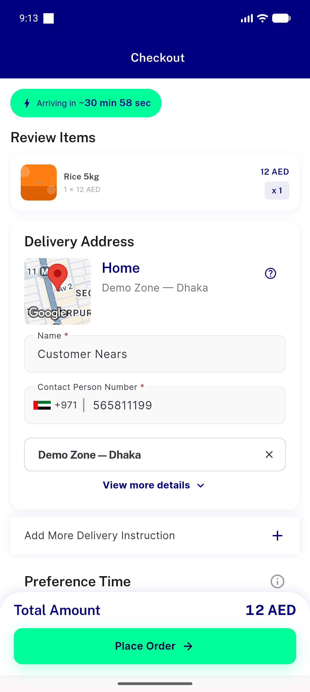
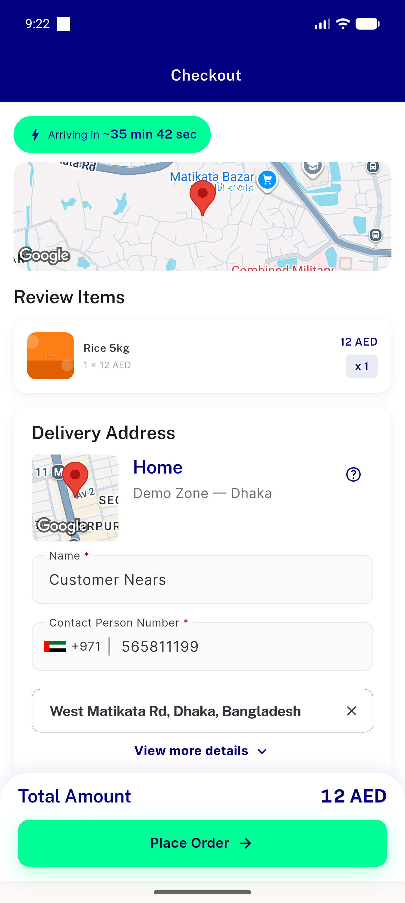
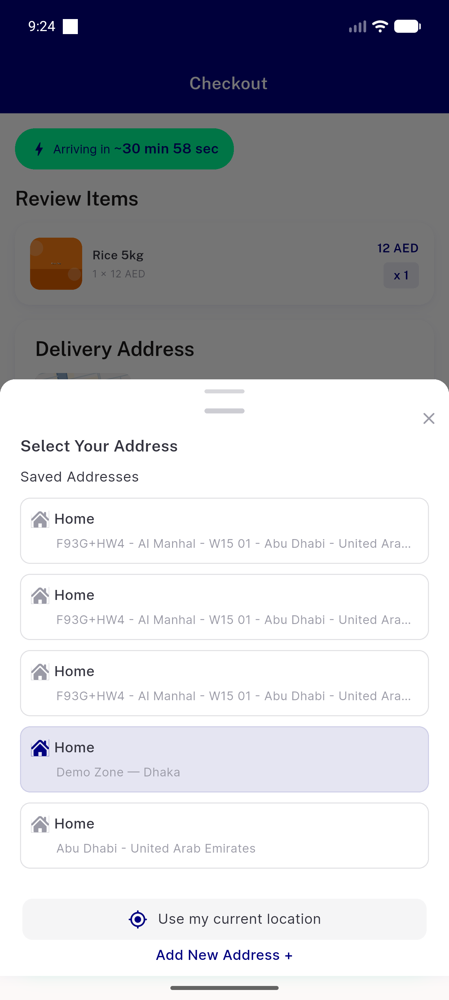
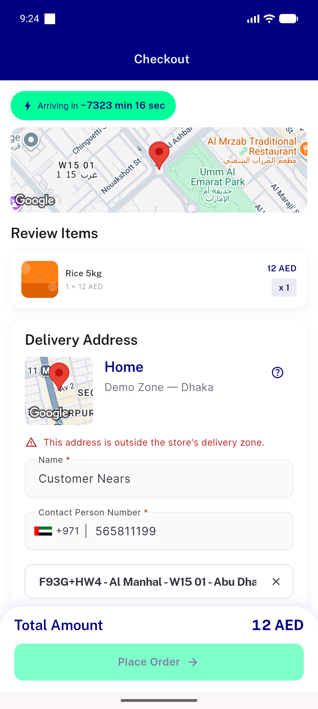
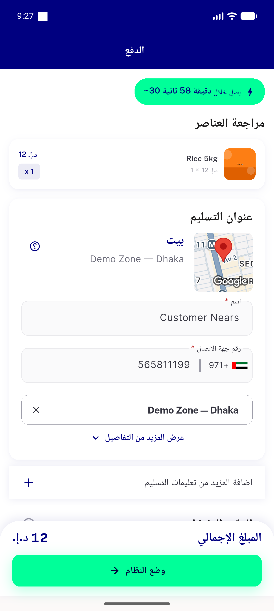
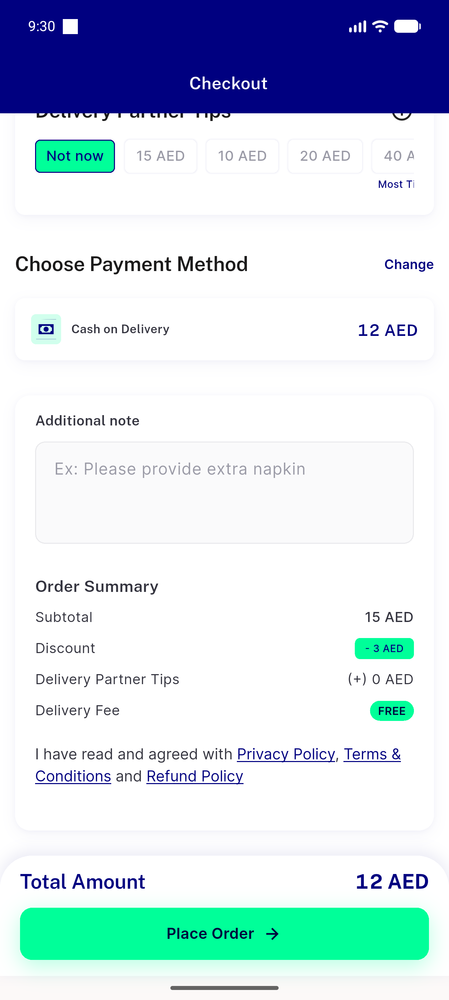

# QA Evidence — NEARS-510

**PASS — distance-based ETA (min+sec) verified live on emulator-5556; 1 medium task-bug (stale cross-zone ETA after 513 revert), AC core unaffected**

**7 screenshot(s).** Click any thumbnail for full resolution.

<table>
<tr>
<td align="center" width="33%"> checkout eta near dhaka</td>
<td align="center" width="33%"> checkout eta far inzone</td>
<td align="center" width="33%"> static fallback no tilde</td>
</tr>
<tr>
<td align="center" width="33%"> zone2 addr fallback</td>
<td align="center" width="33%"> rtl arabic banner</td>
<td align="center" width="33%"> order summary fee</td>
</tr>
<tr>
<td align="center" width="33%"> bug cross zone eta flash</td>
</tr>
</table>

### Other artifacts
- [`bug-cross-zone-eta-flash.log`](bug-cross-zone-eta-flash.log)
- [`progress.md`](progress.md)

---
*From `nears/docs/qa-evidence/NEARS-510/` · public-repo scrub policy (no live secrets; verified clean).*
