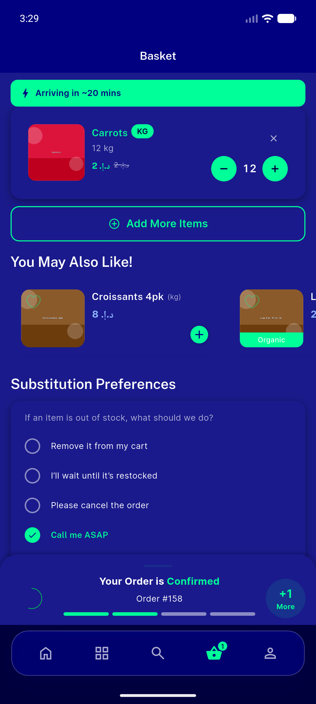
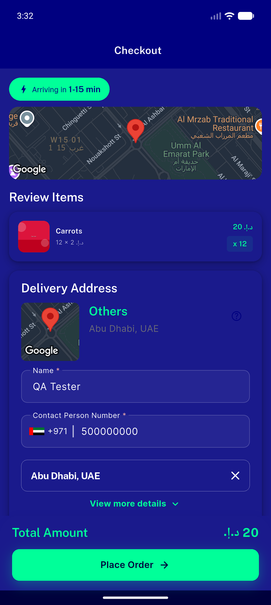
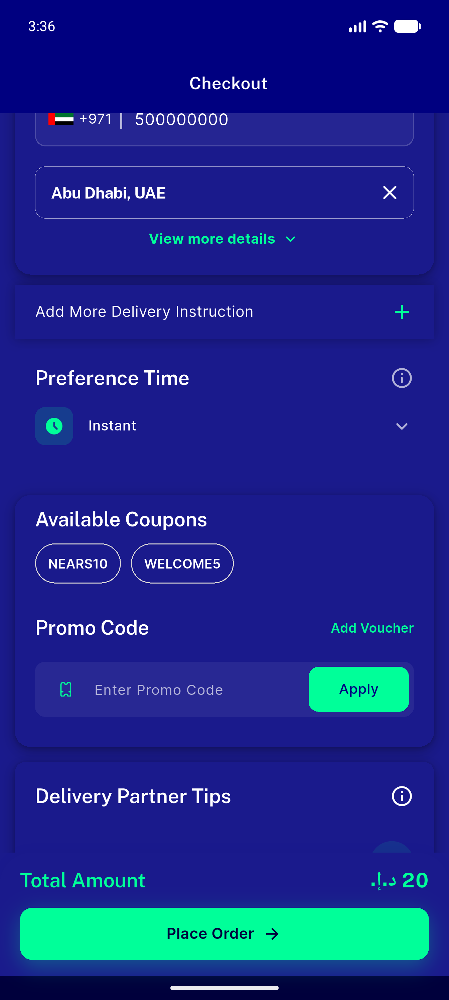
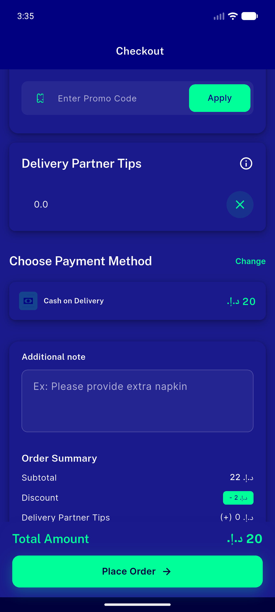
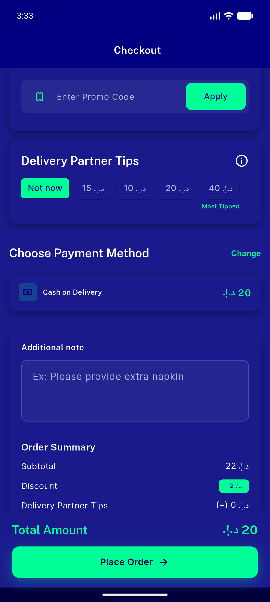
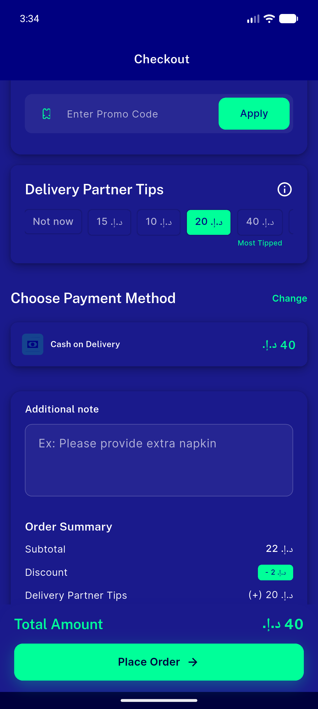
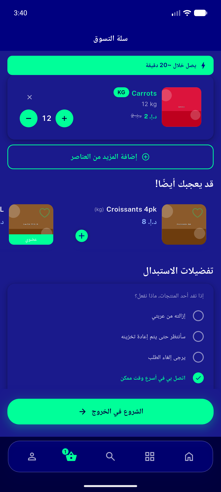
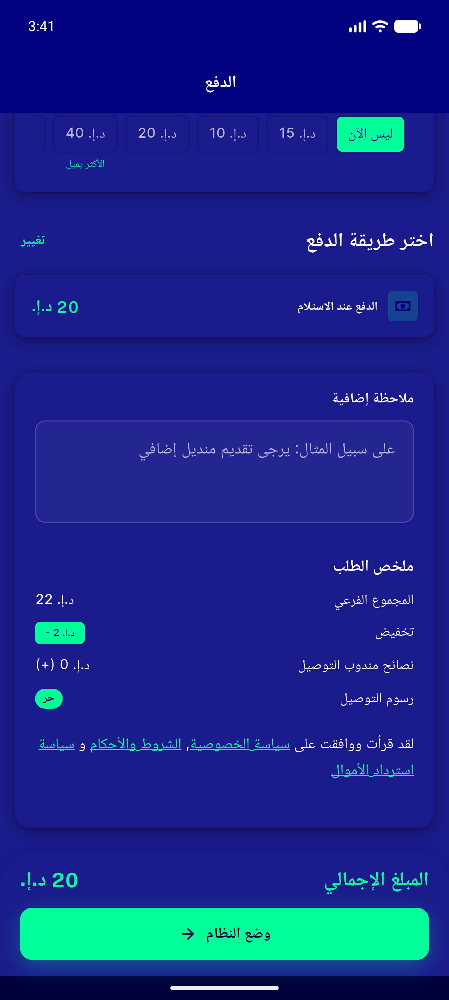

# QA Evidence — NEARS-512

**PASS — NEARS-512 checkout cleanup verified live on emulator-5556 @ c8dca855: Substitution card removed from /checkout (stays on Cart), order-type picker gone (delivery-only), save-tip checkbox gone (chips+custom intact), ETA banner stays; dark+RTL clean**

**11 screenshot(s).** Click any thumbnail for full resolution.

<table>
<tr>
<td align="center" width="33%"> checkout page</td>
<td align="center" width="33%"> ac2 cart substitution present</td>
<td align="center" width="33%"> ac3 checkout top eta delivery no picker</td>
</tr>
<tr>
<td align="center" width="33%"> ac3 delivery instruction renders no gap</td>
<td align="center" width="33%"> ac4 custom tip input no checkbox</td>
<td align="center" width="33%"> ac4 tips section no save checkbox</td>
</tr>
<tr>
<td align="center" width="33%"> ac5 tip selected reflects in total</td>
<td align="center" width="33%"> checkout post removal clean top</td>
<td align="center" width="33%"> regression cart substitution arabic rtl</td>
</tr>
<tr>
<td align="center" width="33%"> regression checkout arabic rtl tips</td>
<td align="center" width="33%"> regression checkout arabic rtl top</td>
</tr>
</table>

### Other artifacts
- [`progress.md`](progress.md)

---
*From `nears/docs/qa-evidence/NEARS-512/` · public-repo scrub policy (no live secrets; verified clean).*
