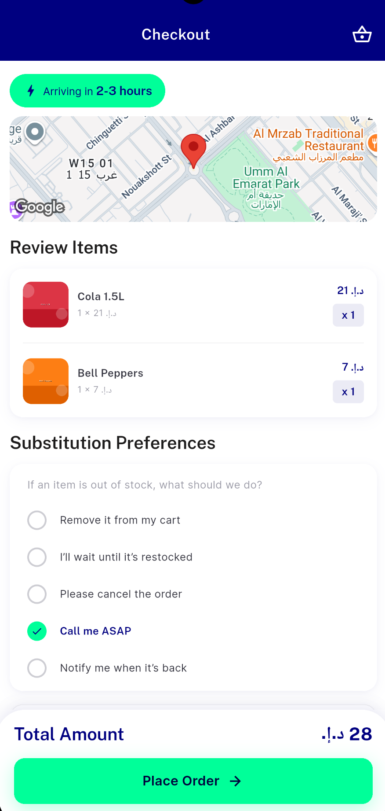
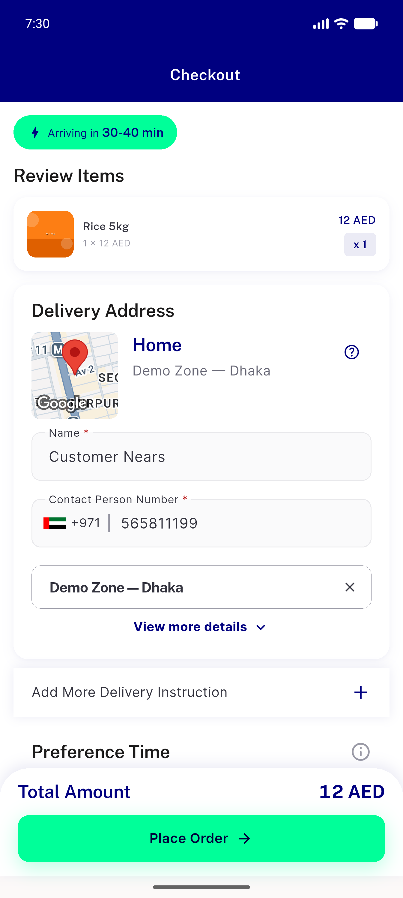
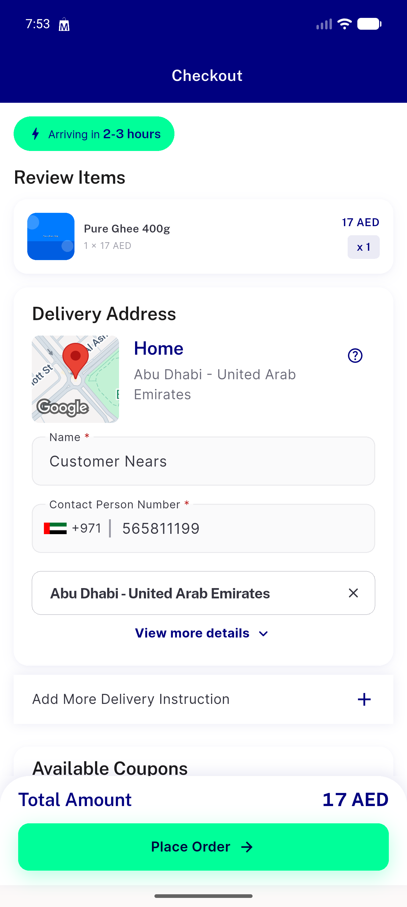
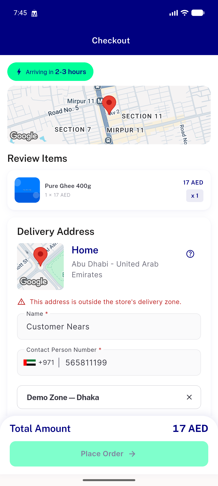
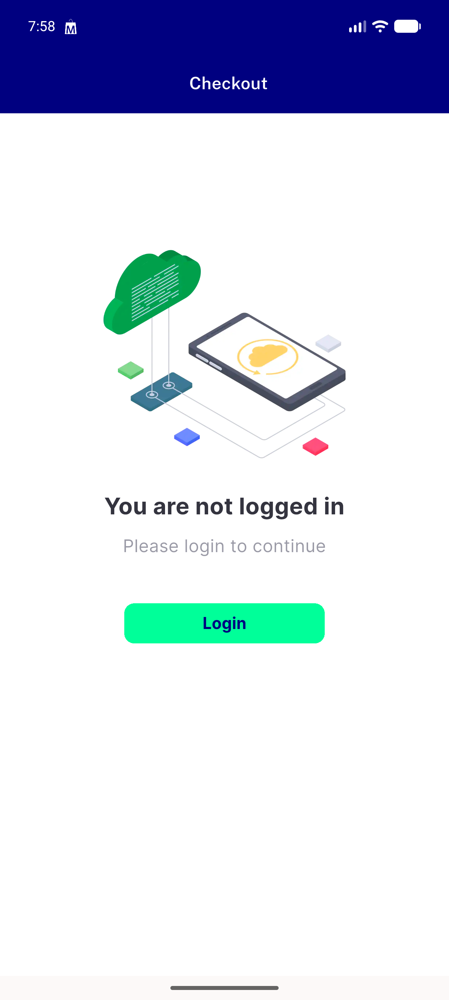
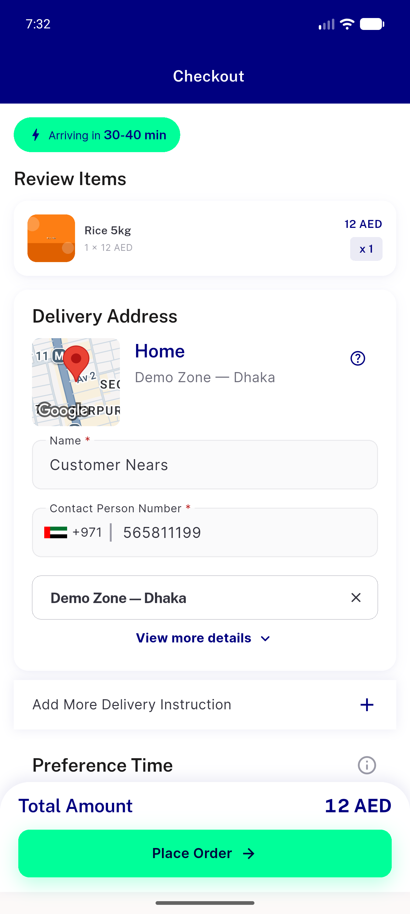
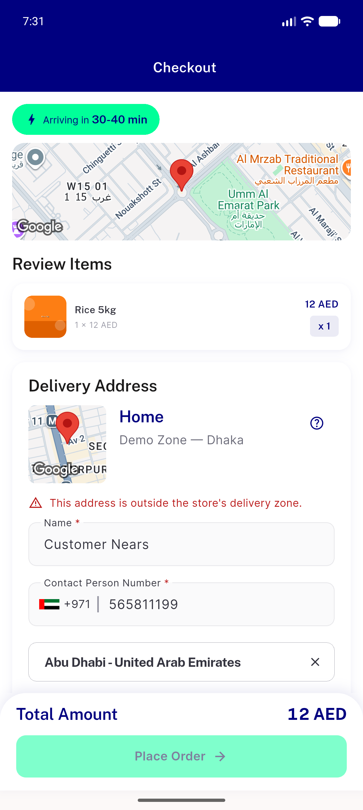
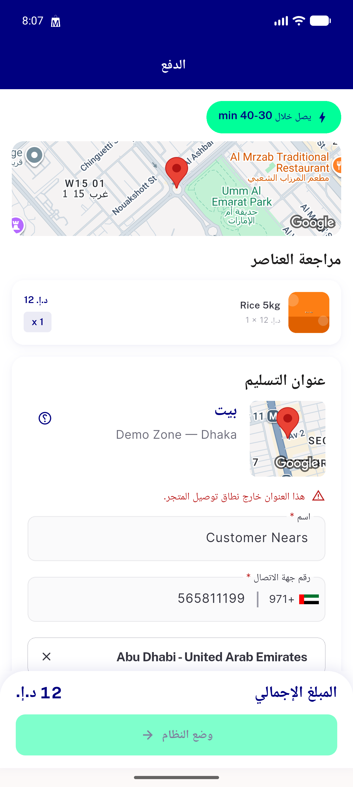
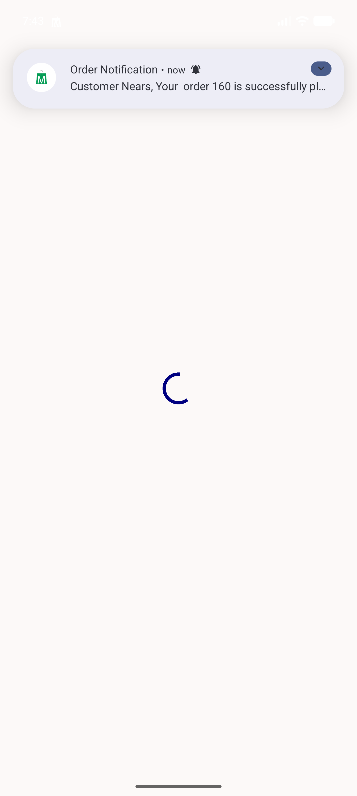
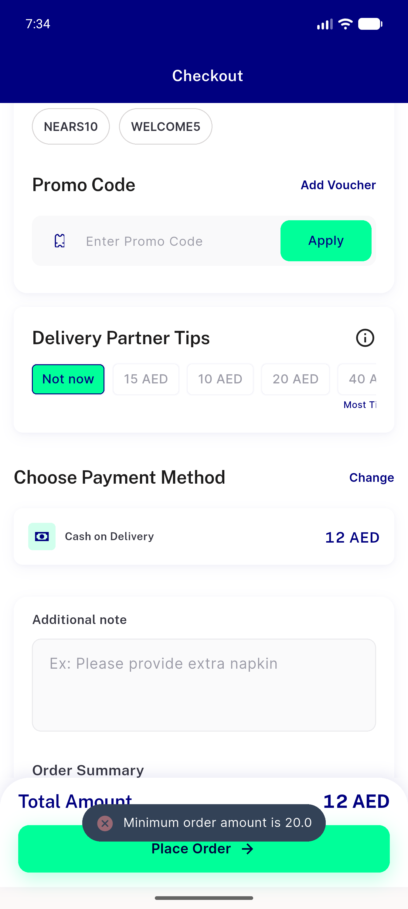

# QA Evidence — NEARS-513

**PASS — NEARS-513 checkout default address + out-of-zone block; emulator-5556, UserApp feat/NEARS-513-checkout-address-zone**

**10 screenshot(s).** Click any thumbnail for full resolution.

<table>
<tr>
<td align="center" width="33%"> checkout page</td>
<td align="center" width="33%"> ac1 checkout saved address instore1</td>
<td align="center" width="33%"> ac2 james no saved inline form</td>
</tr>
<tr>
<td align="center" width="33%"> ac3 crosscheck store12 addr46 blocked</td>
<td align="center" width="33%"> ac3 guest checkout disabled login required</td>
<td align="center" width="33%"> ac3 notice cleared back inzone</td>
</tr>
<tr>
<td align="center" width="33%"> ac3 out of zone notice store1 addr45</td>
<td align="center" width="33%"> ac3 rtl arabic out of zone notice</td>
<td align="center" width="33%"> ac4 order160 placed store12 inzone</td>
</tr>
<tr>
<td align="center" width="33%"> ac4 store1 min order preexisting</td>
</tr>
</table>

### Other artifacts
- [`progress.md`](progress.md)

---
*From `nears/docs/qa-evidence/NEARS-513/` · public-repo scrub policy (no live secrets; verified clean).*
