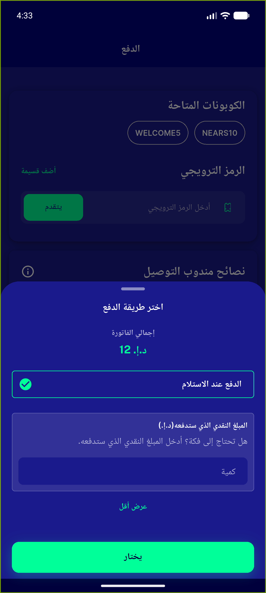
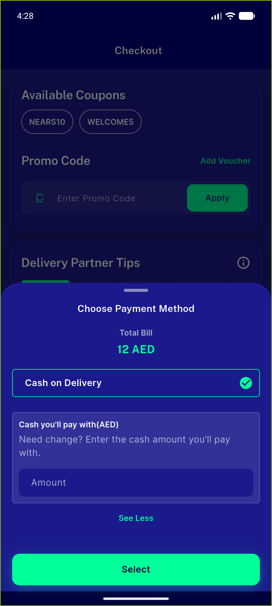
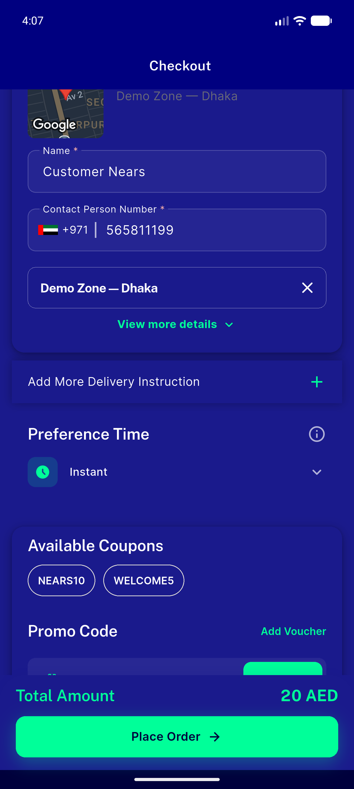

# QA Evidence — NEARS-514

**PASS — COD Change Amount field reworded (EN+AR), renders correctly, field functional, 55/55 checkout tests pass**

**6 screenshot(s).** Click any thumbnail for full resolution.

<table>
<tr>
<td align="center" width="33%"> ac2a ar sheet cod rtl</td>
<td align="center" width="33%"> ac2a en amount entered</td>
<td align="center" width="33%"> ac2a en relabel</td>
</tr>
<tr>
<td align="center" width="33%"> context 00 home</td>
<td align="center" width="33%"> context 01 zone1</td>
<td align="center" width="33%"> context 02 checkout</td>
</tr>
</table>

### Other artifacts
- [`progress.md`](progress.md)

---
*From `nears/docs/qa-evidence/NEARS-514/` · public-repo scrub policy (no live secrets; verified clean).*
