# QA Evidence — NEARS-515

**PASS — UserApp basket appbar icon removed (Basket+Checkout); functional cart entries intact; light+dark+RTL clean; no regressions**

**14 screenshot(s).** Click any thumbnail for full resolution.

<table>
<tr>
<td align="center" width="33%"><a href="01-basket-appbar-fromnav-light.png">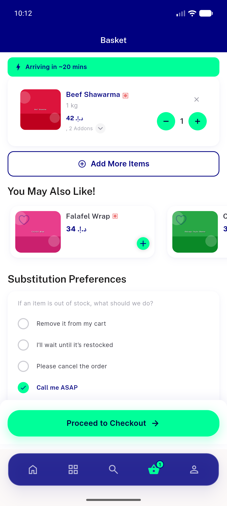</a> basket appbar fromnav light</td>
<td align="center" width="33%"> 01b basket appbar fromstore backbtn</td>
<td align="center" width="33%"><a href="02-checkout-appbar-guest.png">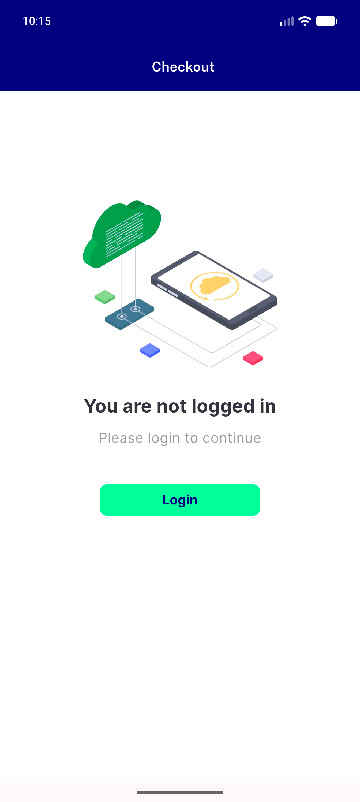</a> checkout appbar guest</td>
</tr>
<tr>
<td align="center" width="33%"><a href="02b-checkout-appbar-populated-light.png">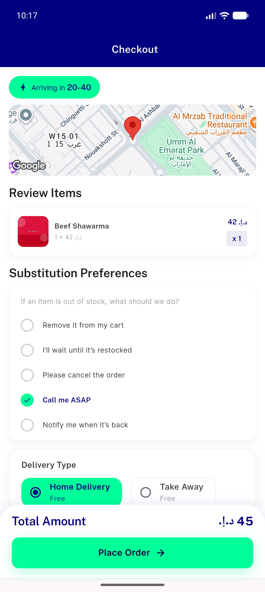</a> 02b checkout appbar populated light</td>
<td align="center" width="33%"><a href="03-home-basket-entry.png">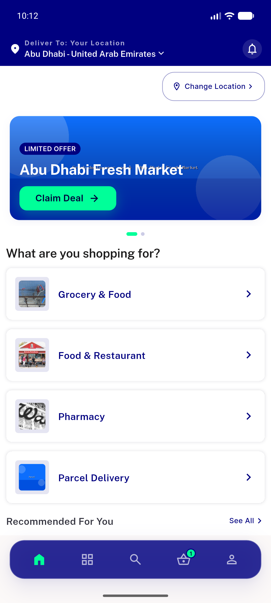</a> home basket entry</td>
<td align="center" width="33%"><a href="03b-home-appbar-cart.png">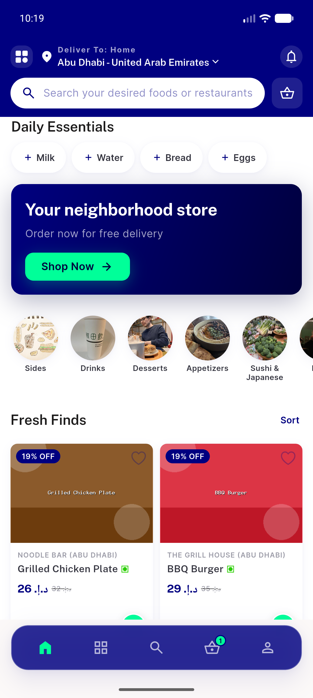</a> 03b home appbar cart</td>
</tr>
<tr>
<td align="center" width="33%"><a href="03c-home-cart-opens-basket.png">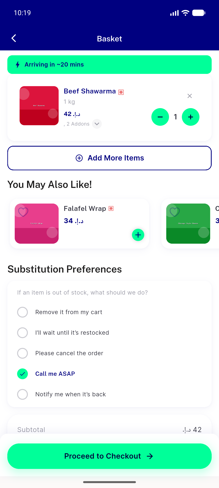</a> 03c home cart opens basket</td>
<td align="center" width="33%"><a href="04-settings-dark-on.png">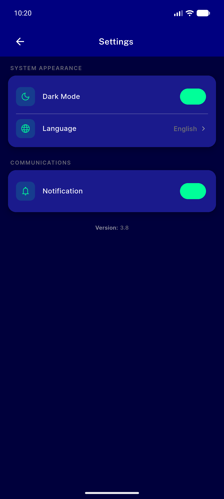</a> settings dark on</td>
<td align="center" width="33%"><a href="04a-basket-appbar-dark.png">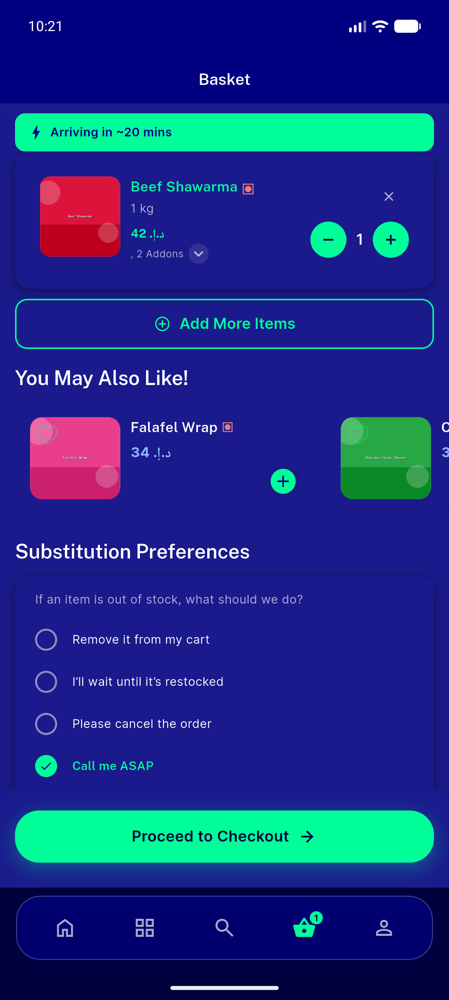</a> 04a basket appbar dark</td>
</tr>
<tr>
<td align="center" width="33%"><a href="04b-checkout-appbar-dark.png">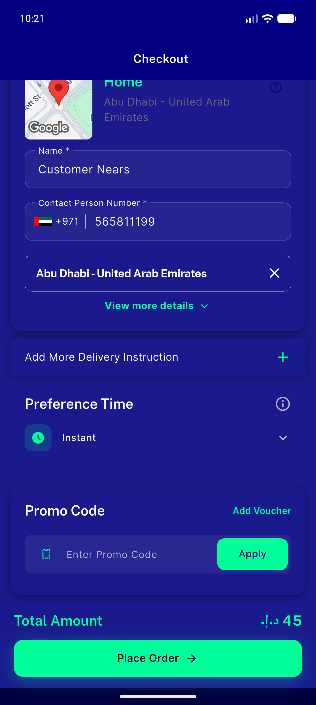</a> 04b checkout appbar dark</td>
<td align="center" width="33%"><a href="04c-basket-appbar-rtl-arabic.png">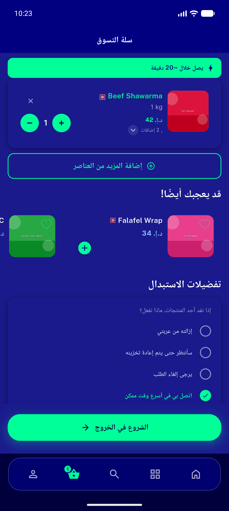</a> 04c basket appbar rtl arabic</td>
<td align="center" width="33%"><a href="04d-checkout-appbar-rtl-arabic.png">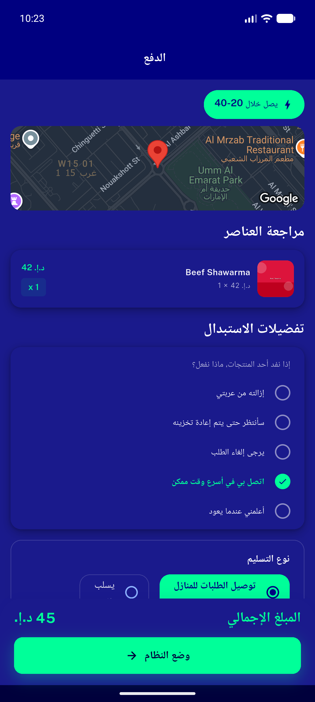</a> 04d checkout appbar rtl arabic</td>
</tr>
<tr>
<td align="center" width="33%"> back checkout to basket</td>
<td align="center" width="33%"><a href="reg-badge-qty2.png">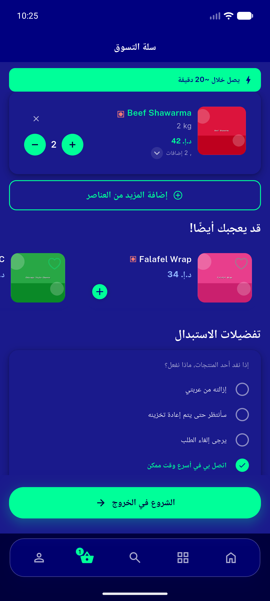</a> reg badge qty2</td>
</tr>
</table>

### Other artifacts
- [`progress.md`](progress.md)

---
*From `nears/docs/qa-evidence/NEARS-515/` · public-repo scrub policy (no live secrets; verified clean).*
