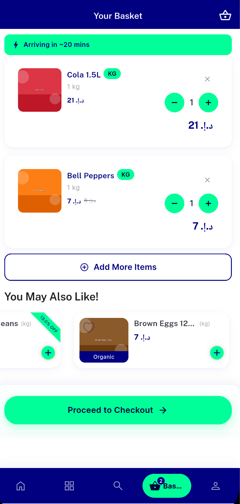
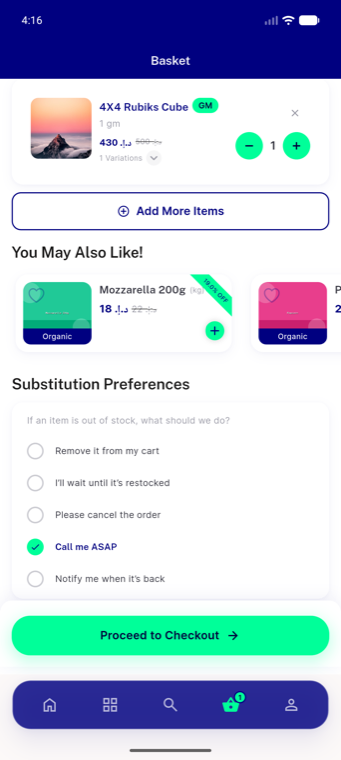
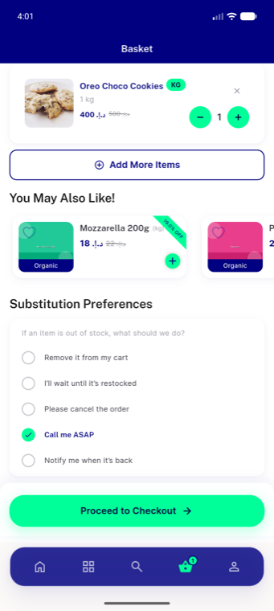
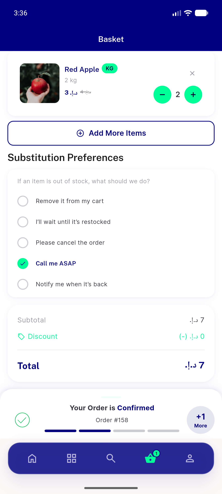
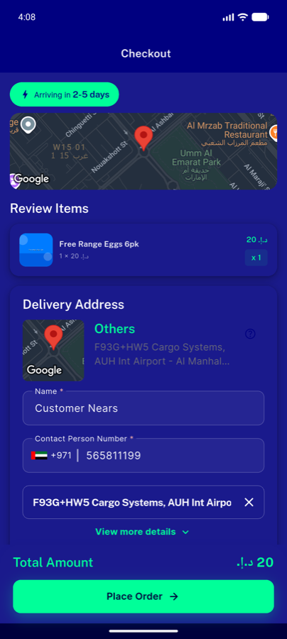
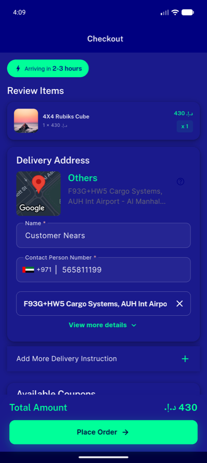
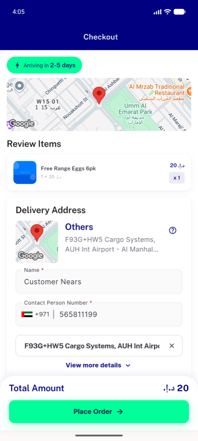
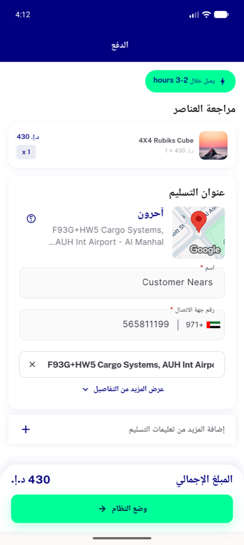
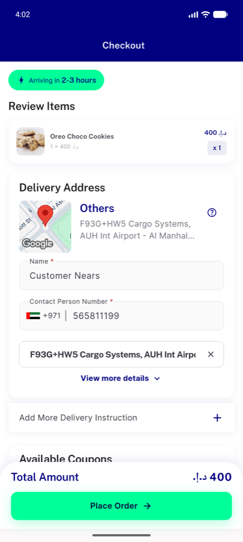

# QA Evidence — NEARS-516

**PASS — Checkout map<1km hidden / >=1km shown; Basket ETA pill removed; both bands + dark + RTL verified; 122/122 tests green**

**10 screenshot(s).** Click any thumbnail for full resolution.

<table>
<tr>
<td align="center" width="33%"> checkout map</td>
<td align="center" width="33%"> basket eta</td>
<td align="center" width="33%"> basket mobile final</td>
</tr>
<tr>
<td align="center" width="33%"> basket mobile freshlocal no pill</td>
<td align="center" width="33%"> basket mobile no pill</td>
<td align="center" width="33%"> checkout dark over1km</td>
</tr>
<tr>
<td align="center" width="33%"> checkout dark under1km</td>
<td align="center" width="33%"> checkout over1km</td>
<td align="center" width="33%"> checkout rtl under1km</td>
</tr>
<tr>
<td align="center" width="33%"> checkout under1km</td>
</tr>
</table>

### Other artifacts
- [`progress.md`](progress.md)

---
*From `nears/docs/qa-evidence/NEARS-516/` · public-repo scrub policy (no live secrets; verified clean).*
