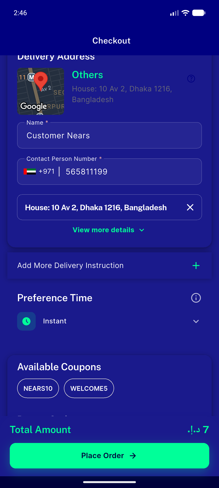
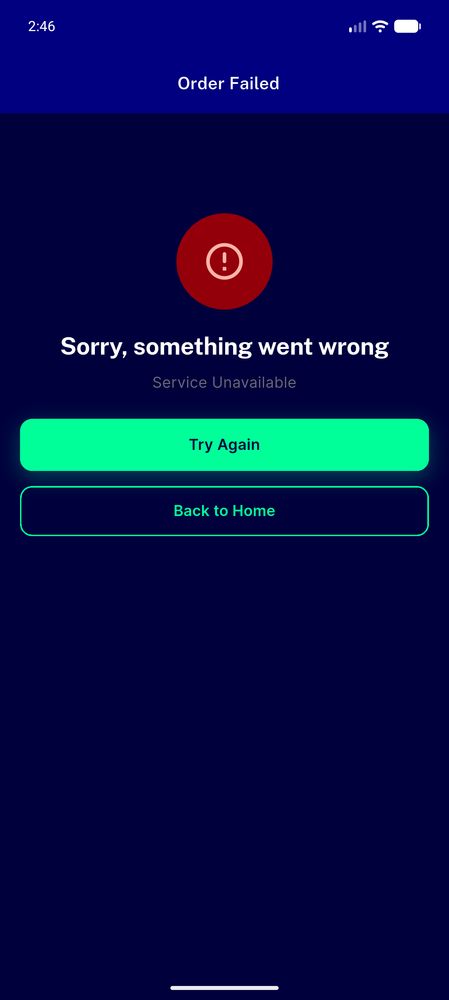
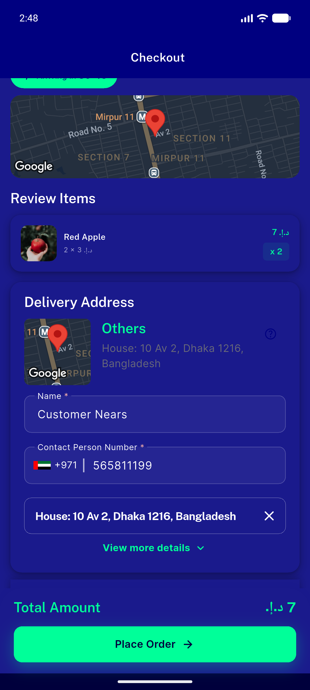
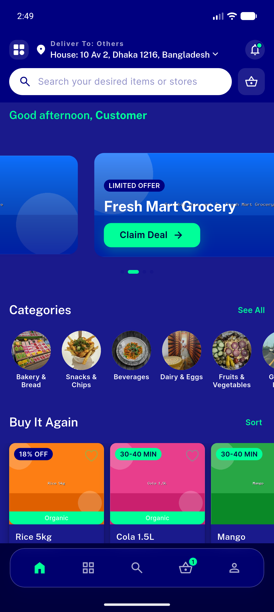
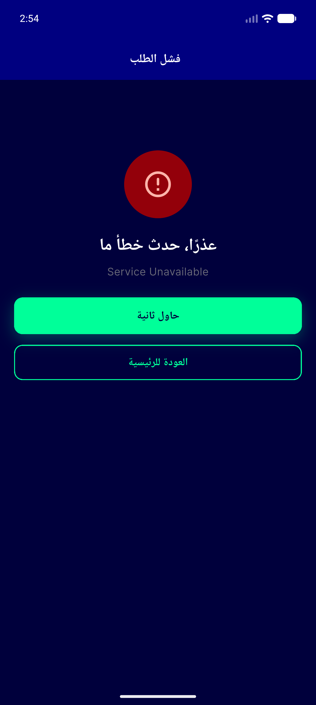
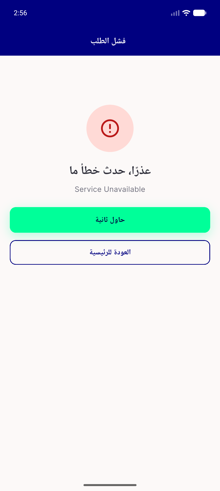

# QA Evidence — NEARS-517

**PASS — UserApp post-order flow reroute: error result screen pushes on checkout, Retry preserves cart, Back to Home returns to dashboard; success→Track Order test-verified; 71/71 unit tests green**

**6 screenshot(s).** Click any thumbnail for full resolution.

<table>
<tr>
<td align="center" width="33%"> checkout before failure cod</td>
<td align="center" width="33%"> error result screen dark</td>
<td align="center" width="33%"> retry returns checkout cart preserved</td>
</tr>
<tr>
<td align="center" width="33%"> back to home dashboard</td>
<td align="center" width="33%"> error screen rtl arabic dark</td>
<td align="center" width="33%"> error screen rtl arabic light</td>
</tr>
</table>

---
*From `nears/docs/qa-evidence/NEARS-517/` · public-repo scrub policy (no live secrets; verified clean).*
