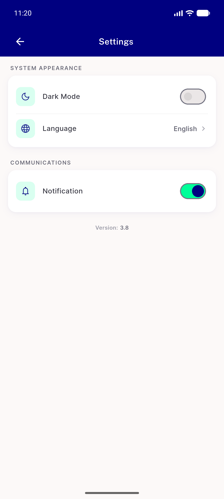
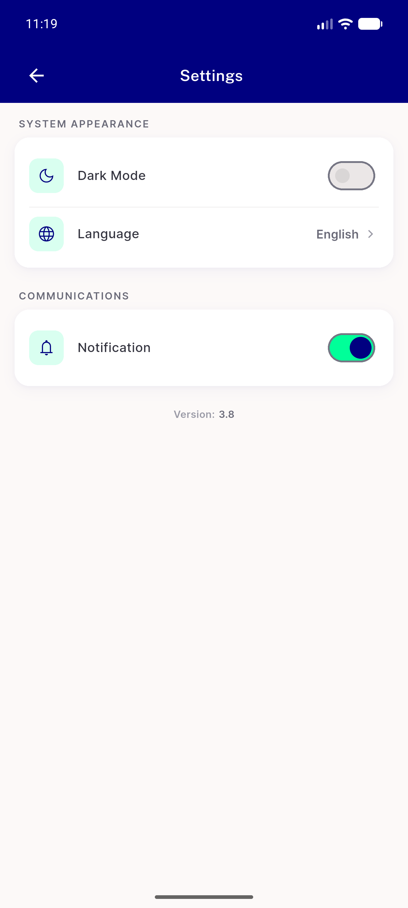

# QA Evidence — NEARS-518

**PASS — toggle three-way contrast confirmed in light mode: OFF light-grey track + light-gray thumb + gray border; ON mint track + navy thumb + gray border present**

**4 screenshot(s).** Click any thumbnail for full resolution.

<table>
<tr>
<td align="center" width="33%"> off state</td>
<td align="center" width="33%"> on state</td>
<td align="center" width="33%"> settings final light</td>
</tr>
<tr>
<td align="center" width="33%"> settings full state1</td>
</tr>
</table>

### Other artifacts
- [`progress.md`](progress.md)

---
*From `nears/docs/qa-evidence/NEARS-518/` · public-repo scrub policy (no live secrets; verified clean).*
