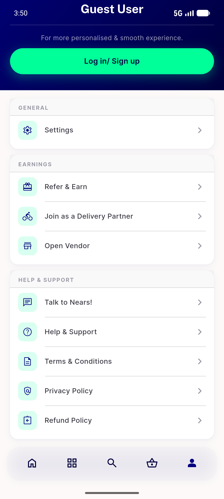
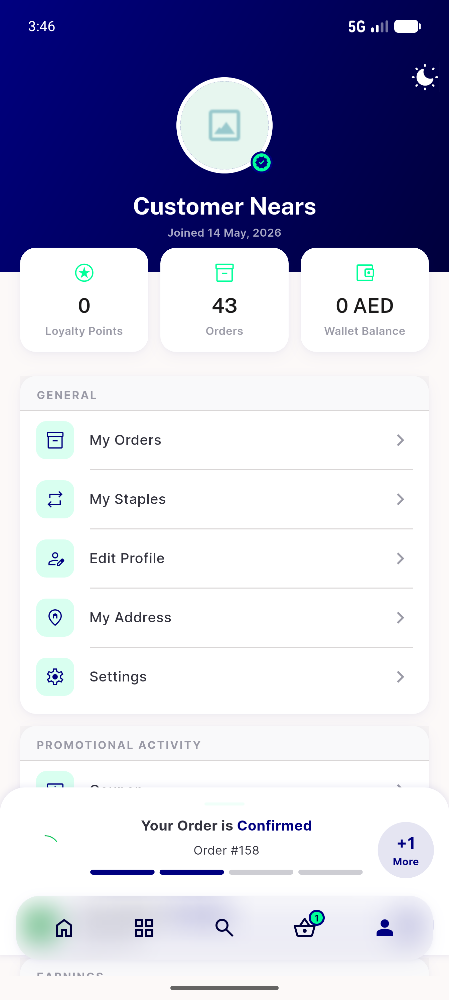
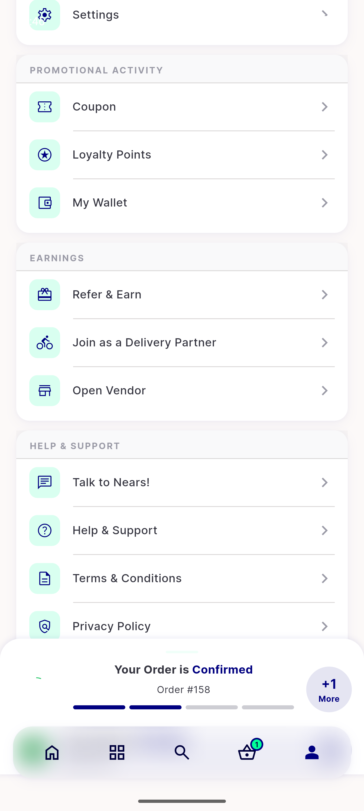
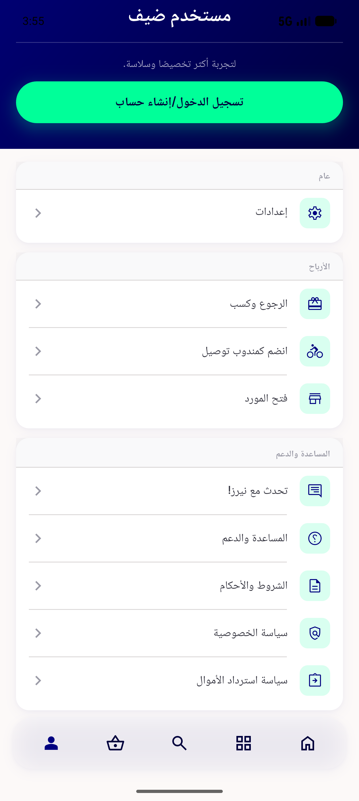

# QA Evidence — NEARS-519

**PASS — guest General = Settings-only (clean single-row card); logged-in = all 5; RTL/Arabic clean; 13/13 tests green; light-mode only (dark deferred)**

**4 screenshot(s).** Click any thumbnail for full resolution.

<table>
<tr>
<td align="center" width="33%"> guest general settings only</td>
<td align="center" width="33%"> loggedin general all5</td>
<td align="center" width="33%"> 04b loggedin support logout</td>
</tr>
<tr>
<td align="center" width="33%"> guest general rtl arabic</td>
</tr>
</table>

---
*From `nears/docs/qa-evidence/NEARS-519/` · public-repo scrub policy (no live secrets; verified clean).*
