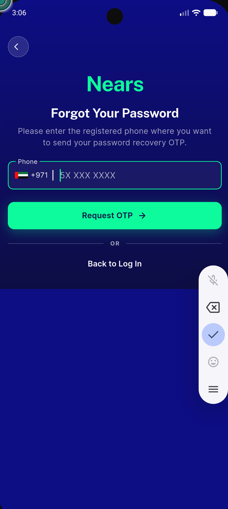
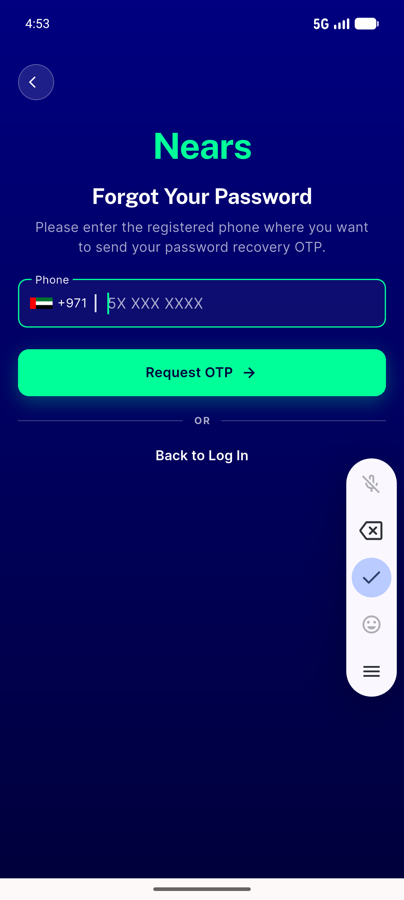
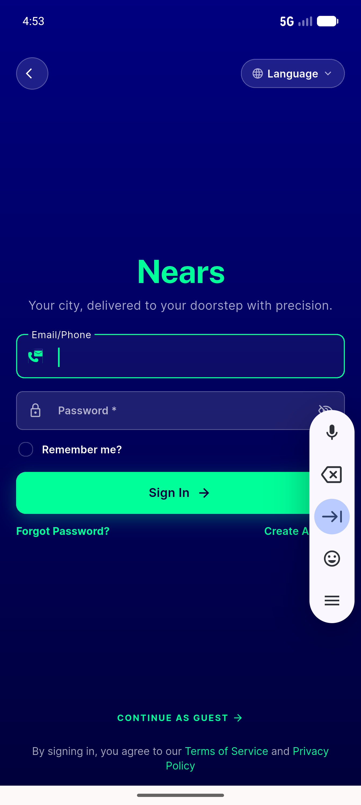
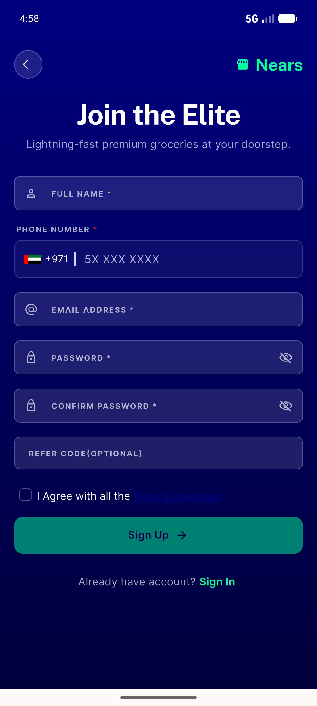
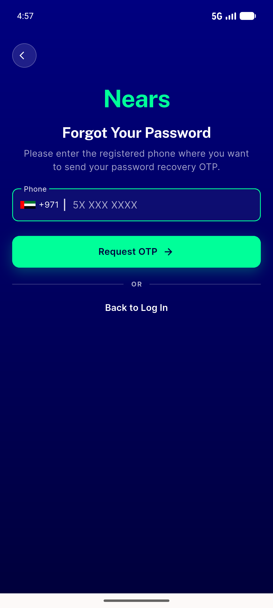
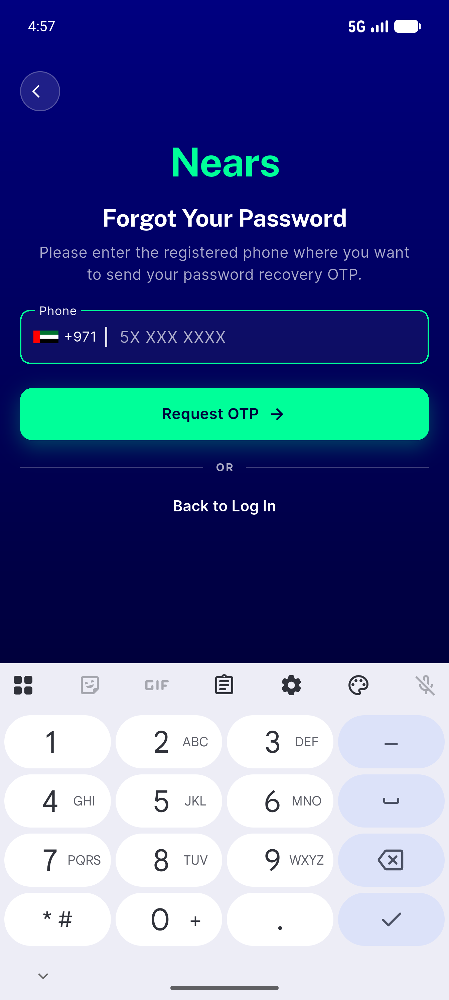
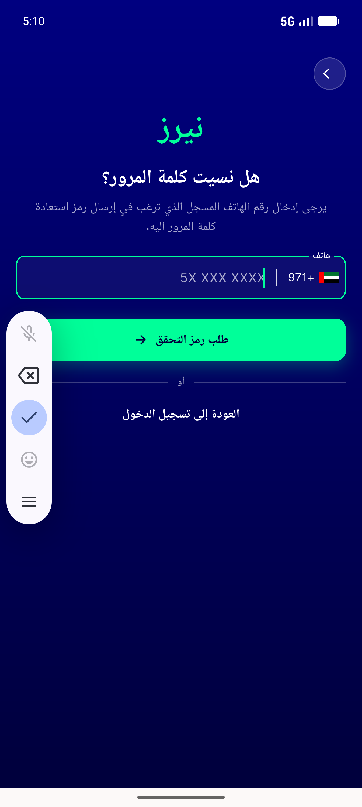

# QA Evidence — NEARS-520

**PASS — Forgot Password navy gradient fills full viewport (no flat-navy seam), keyboard closed+open; siblings + RTL clean; emulator-5556**

**7 screenshot(s).** Click any thumbnail for full resolution.

<table>
<tr>
<td align="center" width="33%"> forgot password gradient</td>
<td align="center" width="33%"> ac1 forgotpass fullheight</td>
<td align="center" width="33%"> ac2 login hero</td>
</tr>
<tr>
<td align="center" width="33%"> ac2 signup hero</td>
<td align="center" width="33%"> ac3 forgotpass keyboard dismissed</td>
<td align="center" width="33%"> ac3 forgotpass keyboard open</td>
</tr>
<tr>
<td align="center" width="33%"> rtl forgotpass arabic</td>
</tr>
</table>

### Other artifacts
- [`progress.md`](progress.md)

---
*From `nears/docs/qa-evidence/NEARS-520/` · public-repo scrub policy (no live secrets; verified clean).*
