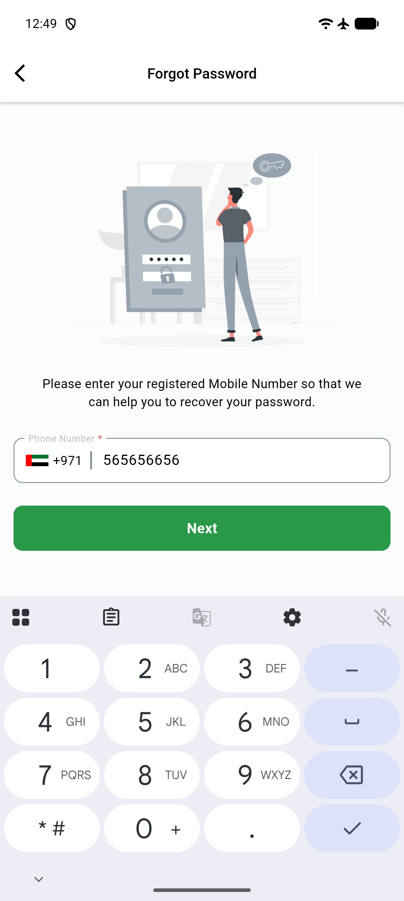
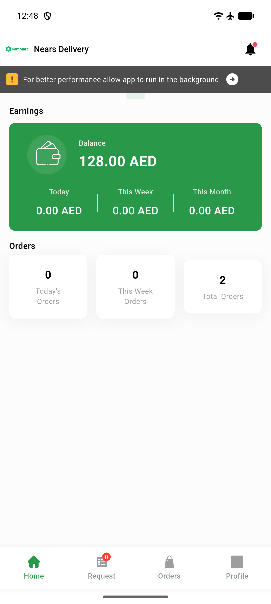
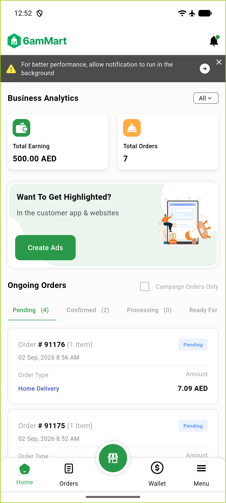

# QA Evidence — NEARS-523

**PASS -- FCM device token cleartext logging removed, verified live on DeliveryApp + VendorApp login/forgot-password flows, 0 leaks, backend token-update confirmed via DB**

**3 screenshot(s).** Click any thumbnail for full resolution.

<table>
<tr>
<td align="center" width="33%"> deliveryapp forgotpw</td>
<td align="center" width="33%"> deliveryapp home</td>
<td align="center" width="33%"> vendorapp home</td>
</tr>
</table>

### Other artifacts
- [`deliveryapp-forgotpw-logcat-excerpt.txt`](deliveryapp-forgotpw-logcat-excerpt.txt)
- [`deliveryapp-login-logcat-excerpt.txt`](deliveryapp-login-logcat-excerpt.txt)
- [`vendorapp-login-logcat-excerpt.txt`](vendorapp-login-logcat-excerpt.txt)

---
*From `nears/docs/qa-evidence/NEARS-523/` · public-repo scrub policy (no live secrets; verified clean).*
