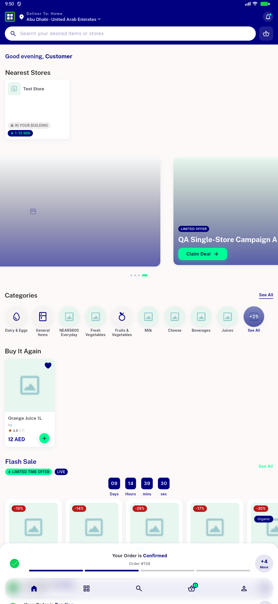
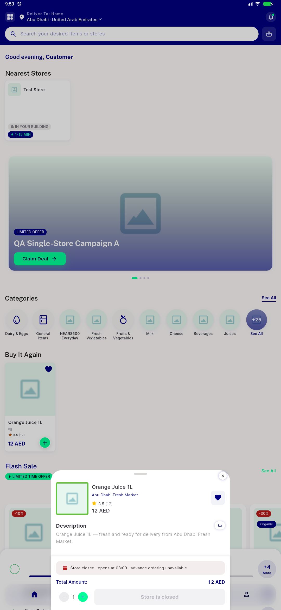

# QA Evidence — NEARS-524

**PASS (fix-cycle 2) — AC1 nearest-store fix verified: with a valid zone-2 delivery location the rail resolves store 8 'Abu Dhabi Fresh Market' (Orange Juice 1L), not store 9**

**9 screenshot(s).** Click any thumbnail for full resolution.

<table>
<tr>
<td align="center" width="33%"> grocery home guest norail</td>
<td align="center" width="33%"> store details recommended rail unchanged</td>
<td align="center" width="33%"> buyitagain rail populated store9</td>
</tr>
<tr>
<td align="center" width="33%"> BIA rail populated clean</td>
<td align="center" width="33%"> BIA plus pill qty stepper</td>
<td align="center" width="33%"> BIA rail arabic RTL</td>
</tr>
<tr>
<td align="center" width="33%"> grocery home loggedin BIA mounted</td>
<td align="center" width="33%"> BIA store8 orangejuice populated</td>
<td align="center" width="33%"> item detail store8 abudhabi fresh market</td>
</tr>
</table>

### Other artifacts
- [`bug-nearest-store-mismatch.log`](bug-nearest-store-mismatch.log)
- [`cycle1-populated-rail-evidence.log`](cycle1-populated-rail-evidence.log)
- [`cycle2-ac1-fix-verified.log`](cycle2-ac1-fix-verified.log)
- [`progress.md`](progress.md)

---
*From `nears/docs/qa-evidence/NEARS-524/` · public-repo scrub policy (no live secrets; verified clean).*
