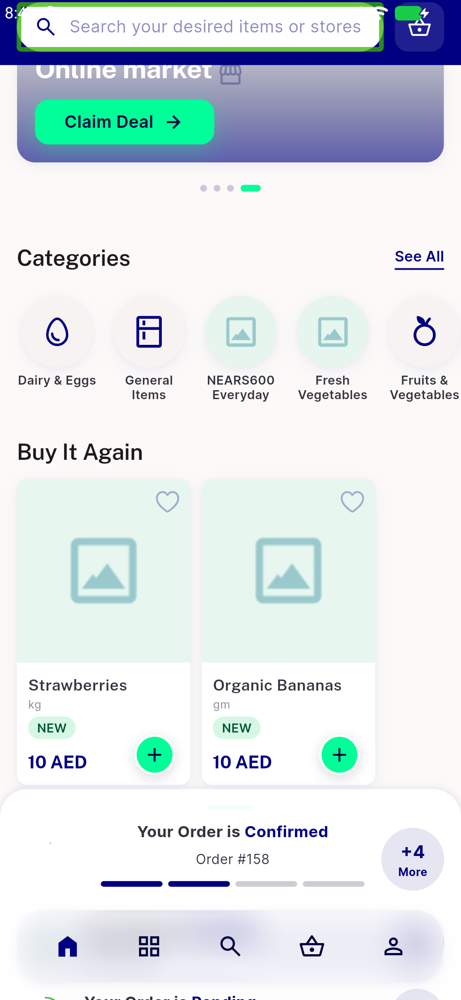
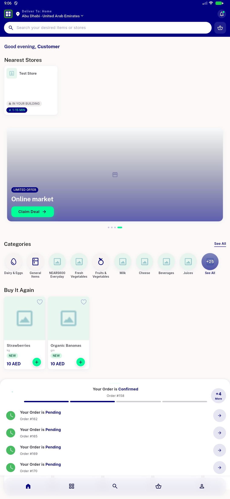
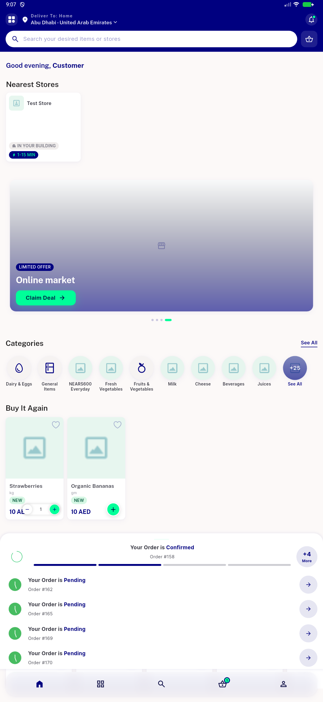
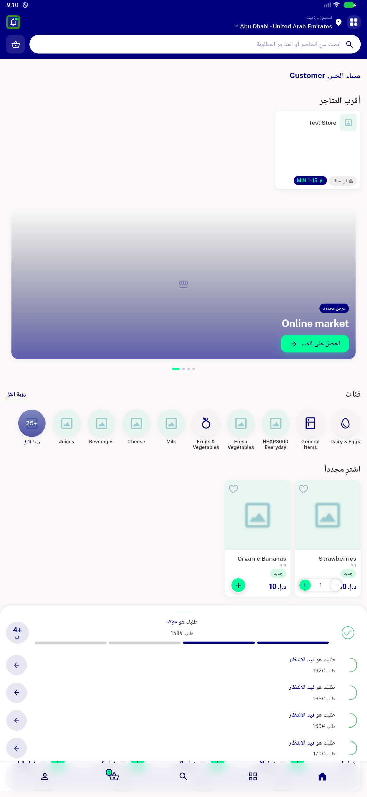
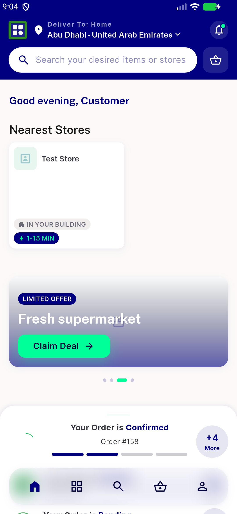

# QA Evidence — NEARS-524

**FAIL (fix-cycle 1) — populate/taps/RTL/CR-2/CR-3 all PASS; blocker: nearest-store resolves store 9 not the actual nearest store 8 (AC1 nearest-store)**

**7 screenshot(s).** Click any thumbnail for full resolution.

<table>
<tr>
<td align="center" width="33%"> grocery home guest norail</td>
<td align="center" width="33%"> store details recommended rail unchanged</td>
<td align="center" width="33%"> buyitagain rail populated store9</td>
</tr>
<tr>
<td align="center" width="33%"> BIA rail populated clean</td>
<td align="center" width="33%"> BIA plus pill qty stepper</td>
<td align="center" width="33%"> BIA rail arabic RTL</td>
</tr>
<tr>
<td align="center" width="33%"> grocery home loggedin BIA mounted</td>
</tr>
</table>

### Other artifacts
- [`bug-nearest-store-mismatch.log`](bug-nearest-store-mismatch.log)
- [`cycle1-populated-rail-evidence.log`](cycle1-populated-rail-evidence.log)
- [`progress.md`](progress.md)

---
*From `nears/docs/qa-evidence/NEARS-524/` · public-repo scrub policy (no live secrets; verified clean).*
