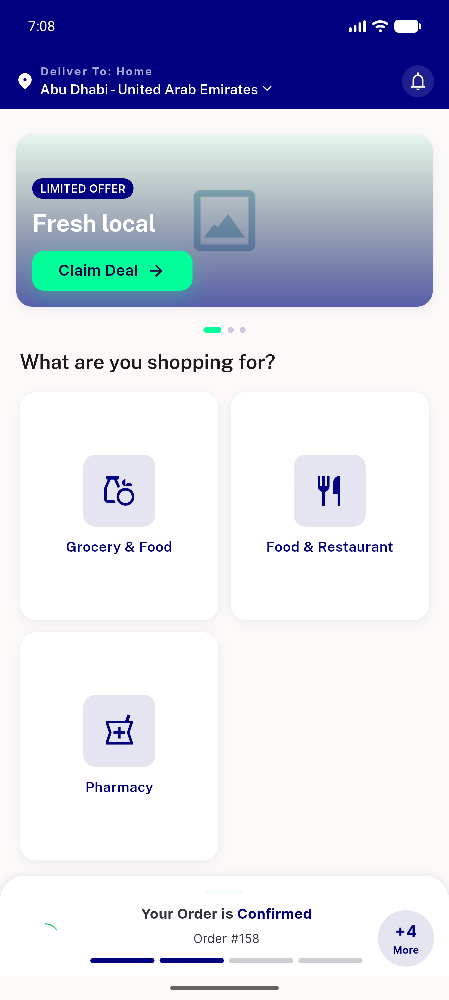
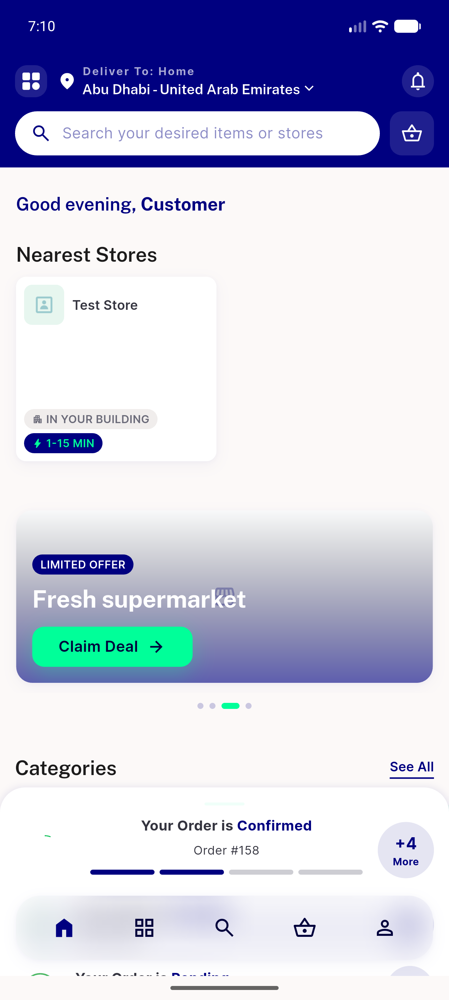
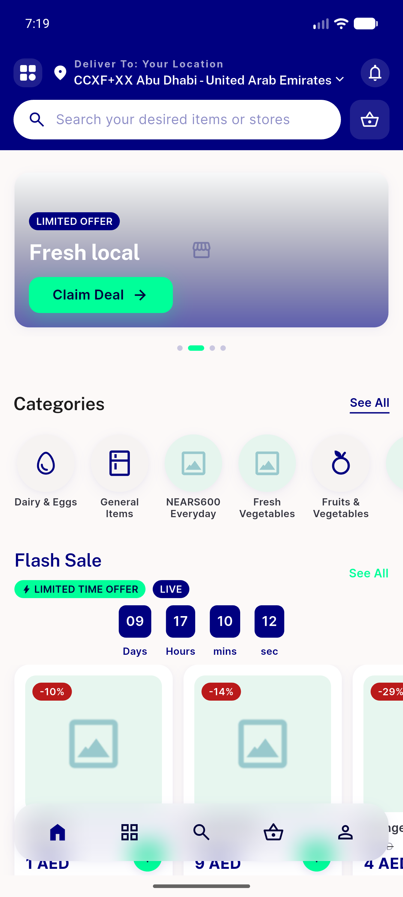
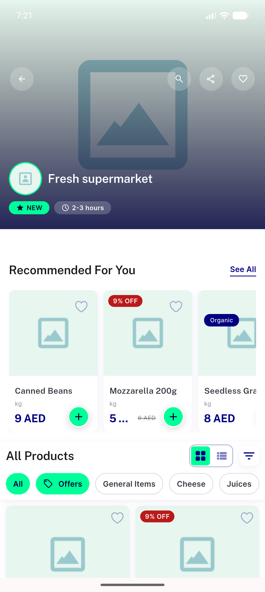

# QA Evidence — NEARS-524

**BLOCKED — backend+gating live-proven; AC1/AC2/AC4 populated-rail UI blocked on Data DoR gap (no reachable single-store-with-history context)**

**4 screenshot(s).** Click any thumbnail for full resolution.

<table>
<tr>
<td align="center" width="33%"> current state</td>
<td align="center" width="33%"> grocery home multistore loggedin norail</td>
<td align="center" width="33%"> grocery home guest norail</td>
</tr>
<tr>
<td align="center" width="33%"> store details recommended rail unchanged</td>
</tr>
</table>

### Other artifacts
- [`ac1-ac5-api-proof.log`](ac1-ac5-api-proof.log)
- [`bug-precondition-single-store-none.log`](bug-precondition-single-store-none.log)
- [`progress.md`](progress.md)

---
*From `nears/docs/qa-evidence/NEARS-524/` · public-repo scrub policy (no live secrets; verified clean).*
