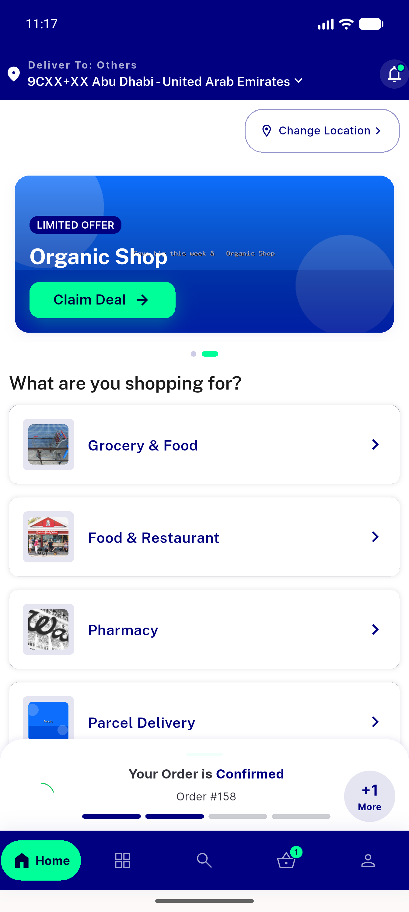
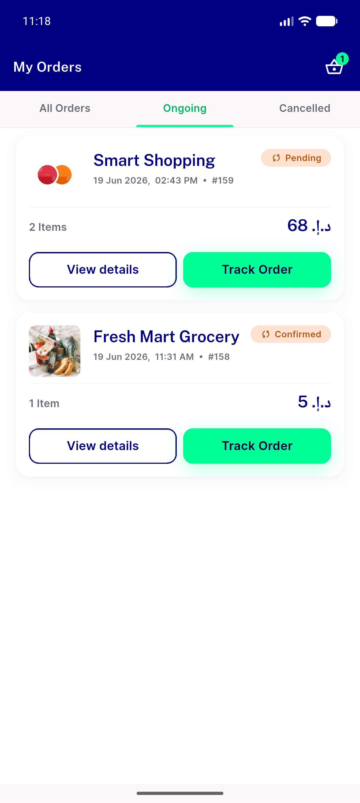
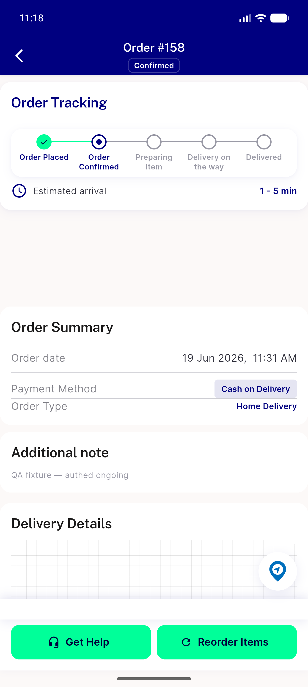
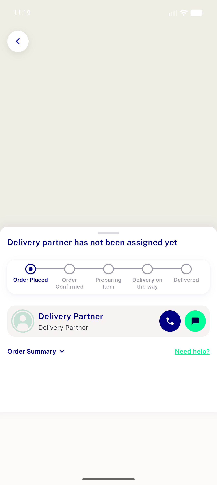
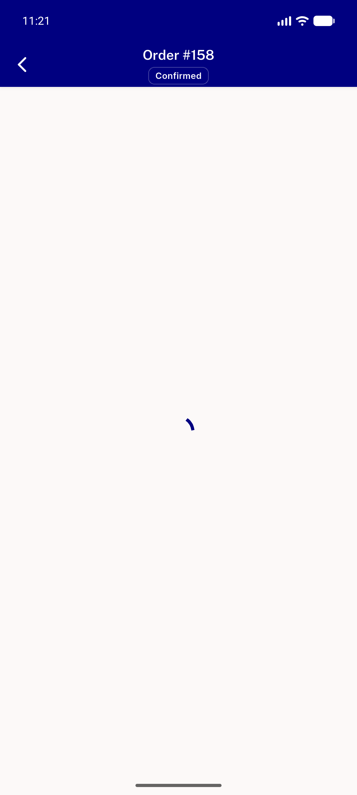
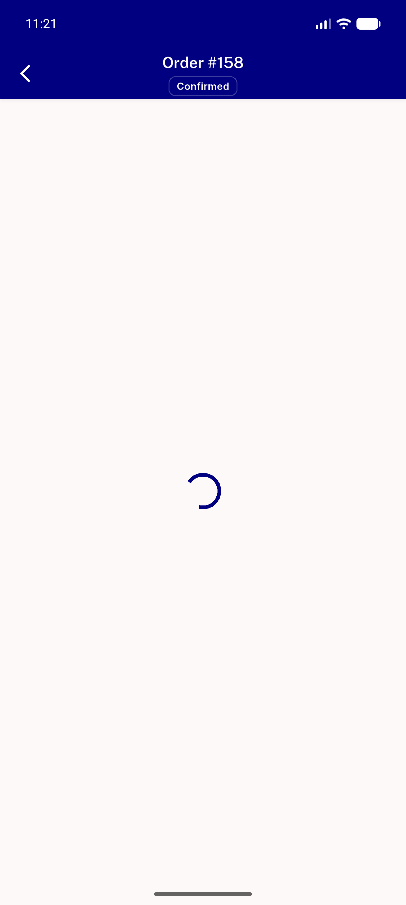
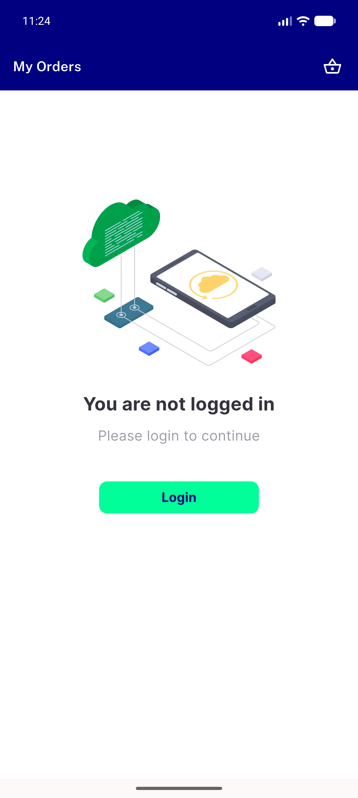
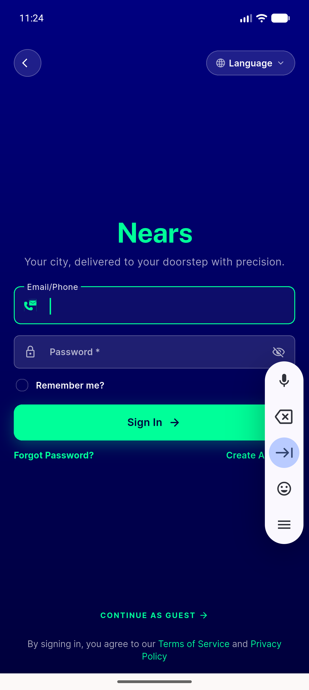
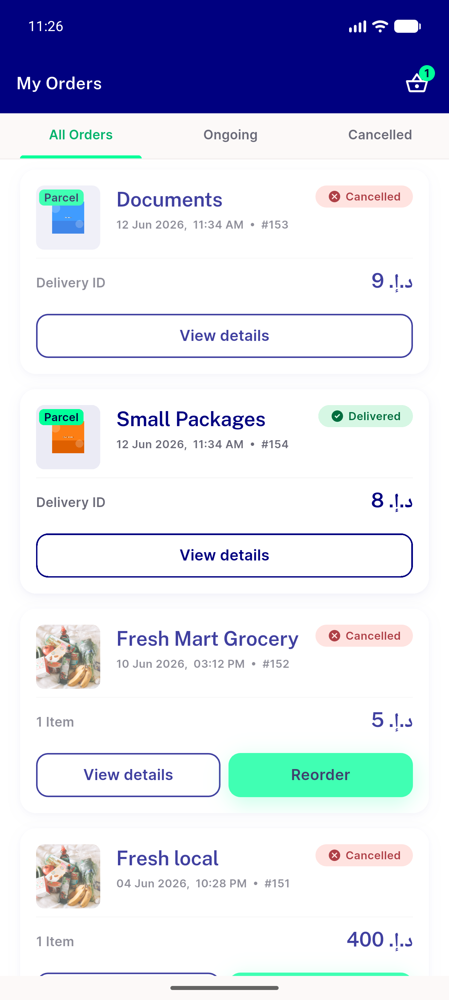

# QA Evidence — NEARS-528

**PASS — guest track-order removed; authed track survives flag rename; backend authed-only 401/200**

**12 screenshot(s).** Click any thumbnail for full resolution.

<table>
<tr>
<td align="center" width="33%"> home</td>
<td align="center" width="33%"> authed myorders list</td>
<td align="center" width="33%"> ongoing tab</td>
</tr>
<tr>
<td align="center" width="33%"> order158 details</td>
<td align="center" width="33%"> 04a track immediate</td>
<td align="center" width="33%"> 04b track loaded</td>
</tr>
<tr>
<td align="center" width="33%"> guest myorders notloggedin</td>
<td align="center" width="33%"> 05b guest track158 resolved</td>
<td align="center" width="33%"> guest myorders notloggedin</td>
</tr>
<tr>
<td align="center" width="33%"> login screen</td>
<td align="center" width="33%"> authed myorders relogin</td>
<td align="center" width="33%"> bug running order banner guest spinner</td>
</tr>
</table>

### Other artifacts
- [`backend-track-auth-gate.log`](backend-track-auth-gate.log)
- [`bug-running-order-banner-guest-spinner.log`](bug-running-order-banner-guest-spinner.log)
- [`progress.md`](progress.md)

---
*From `nears/docs/qa-evidence/NEARS-528/` · public-repo scrub policy (no live secrets; verified clean).*
