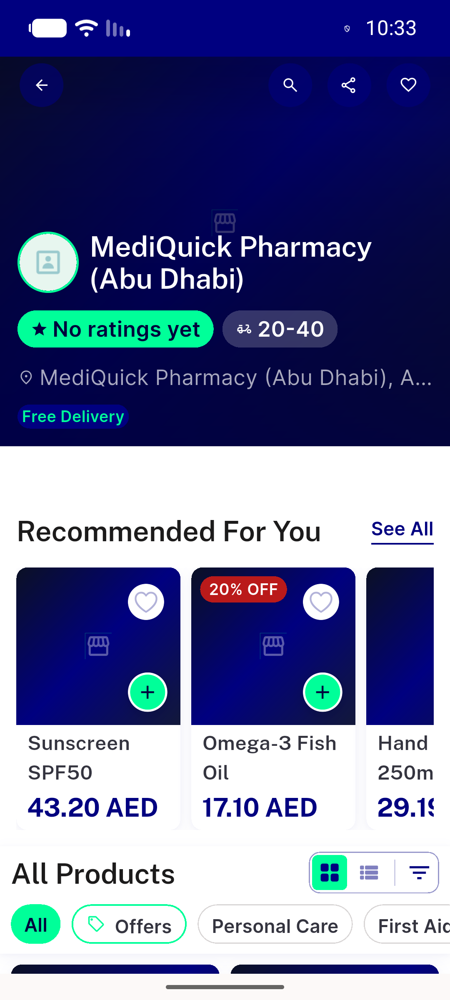
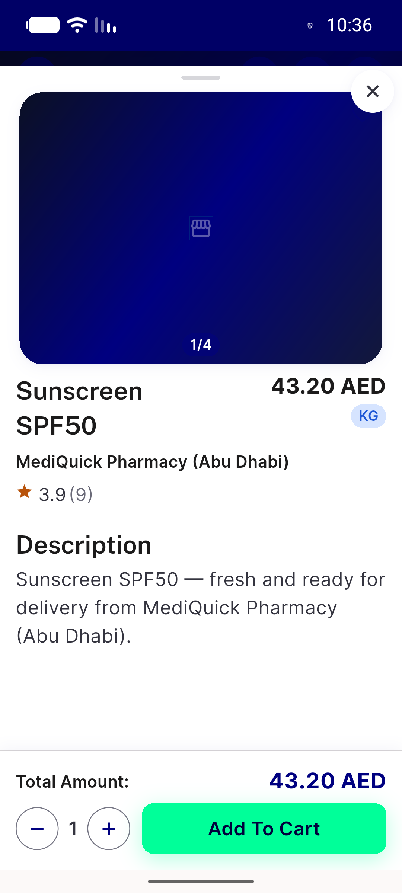
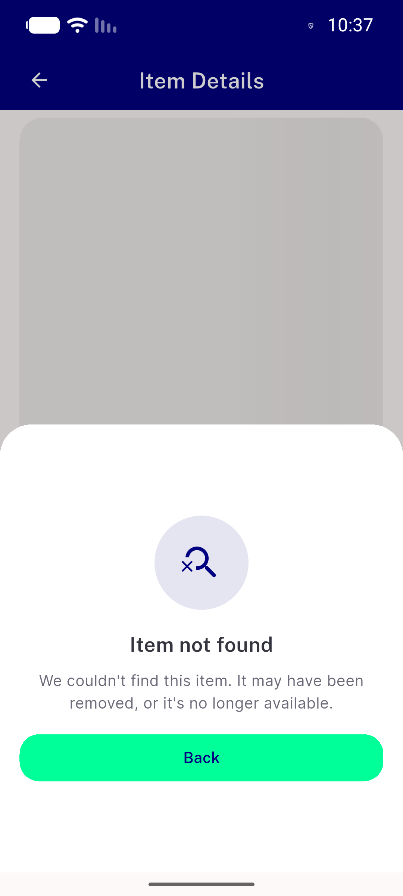
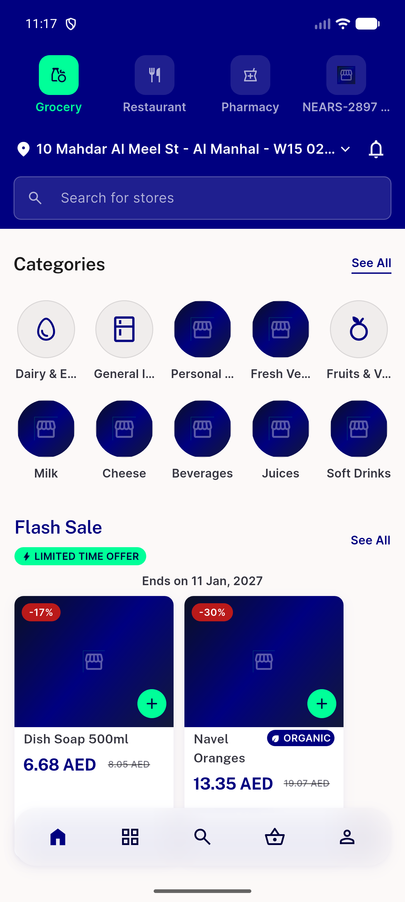
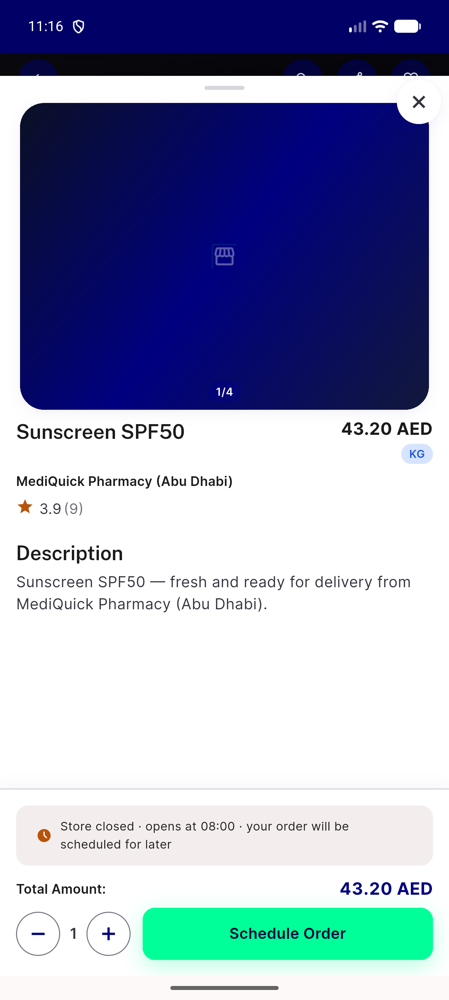
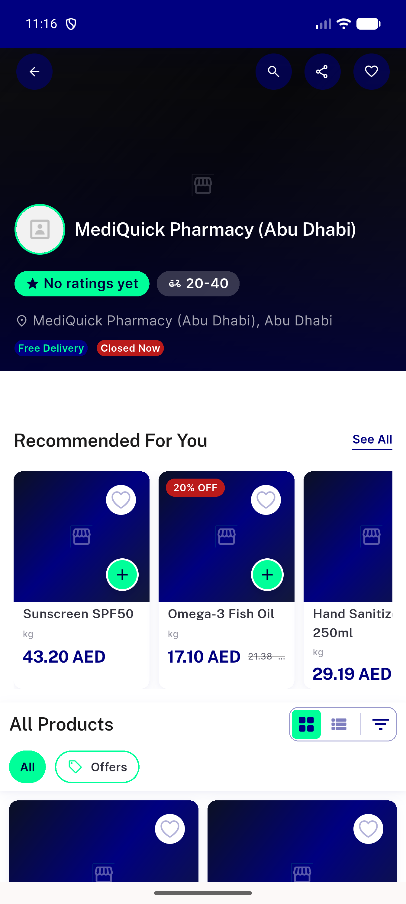
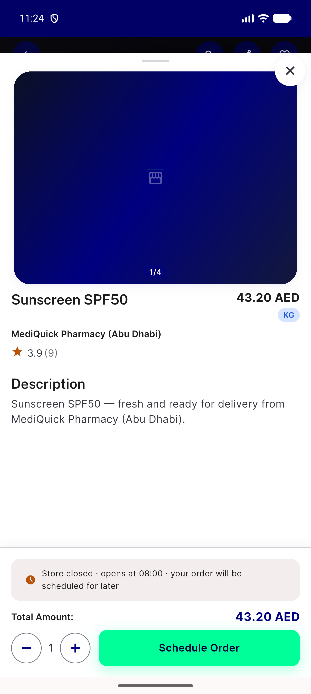
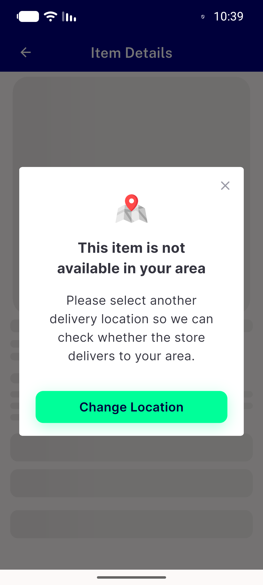

# QA Evidence — NEARS-530

**NEARS-530 [8] delta re-QA cycle 2 PASS @8f4fd7d55 - warm cross-module item link keeps active module (1->1), store+sheet render; AC2/coldstart/control regression clean; 36/36**

**11 screenshot(s).** Click any thumbnail for full resolution.

<table>
<tr>
<td align="center" width="33%"> ac1 crossmodule sheet open</td>
<td align="center" width="33%"> ac1 dismiss store profile</td>
<td align="center" width="33%"> ac2 samemodule slug sheet</td>
</tr>
<tr>
<td align="center" width="33%"> ac3 unknown id standalone notfound</td>
<td align="center" width="33%"> c2 ac1 back home grocery</td>
<td align="center" width="33%"> c2 ac1 crossmodule sheet open</td>
</tr>
<tr>
<td align="center" width="33%"> c2 ac1 dismiss store profile</td>
<td align="center" width="33%"> c2 ac2 samemodule slug sheet</td>
<td align="center" width="33%"> c2 reg coldstart sheet open</td>
</tr>
<tr>
<td align="center" width="33%"> reg coldstart sheet open</td>
<td align="center" width="33%"> reg outofzone zone warning</td>
</tr>
</table>

### Other artifacts
- [`bug-crossmodule-link-switches-active-module.log`](bug-crossmodule-link-switches-active-module.log)
- [`progress.md`](progress.md)

---
*From `nears/docs/qa-evidence/NEARS-530/` · public-repo scrub policy (no live secrets; verified clean).*
