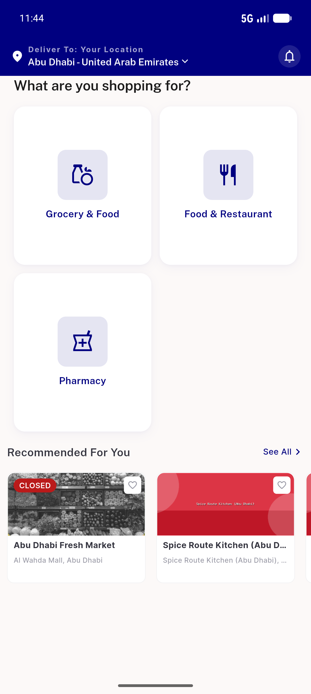
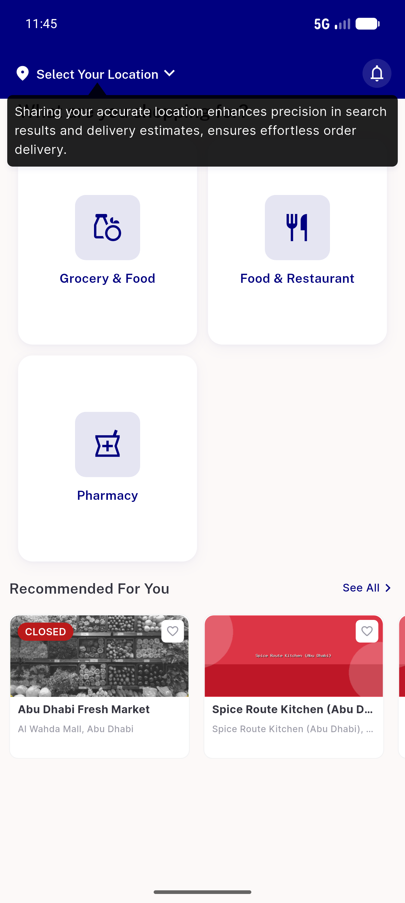
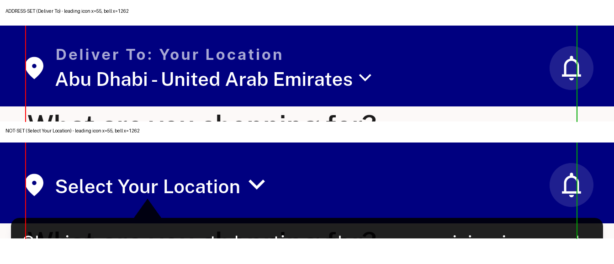
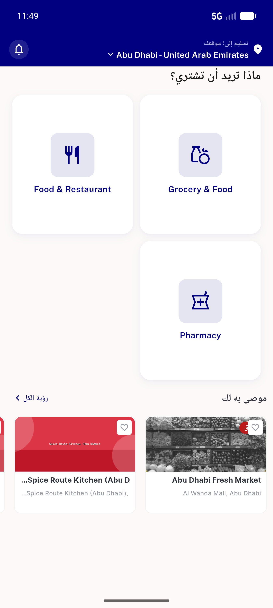
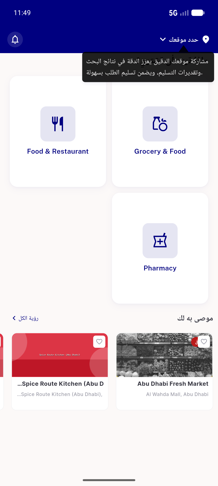
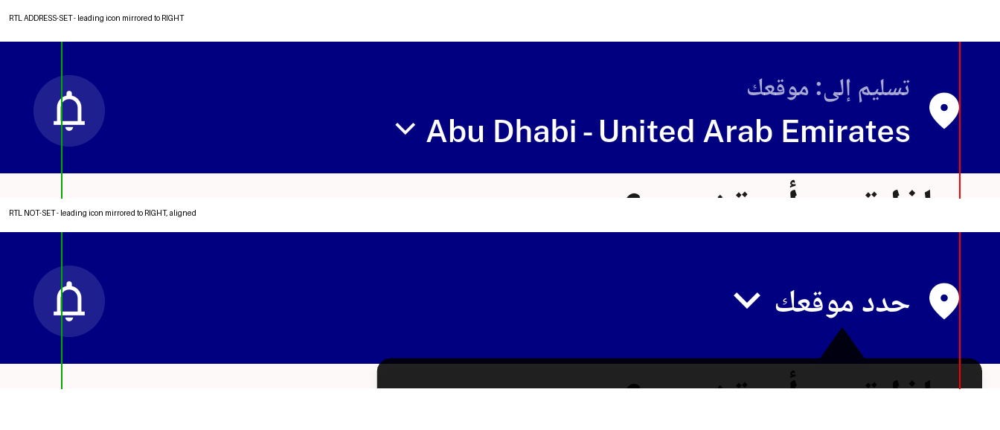

# QA Evidence — NEARS-531

**PASS — home appbar not-set/address-set leading-edge aligned (x=55 LTR, x=1288 RTL); bell + trailing arrow unmoved; light mode**

**7 screenshot(s).** Click any thumbnail for full resolution.

<table>
<tr>
<td align="center" width="33%"> address set home</td>
<td align="center" width="33%"> not set home</td>
<td align="center" width="33%"> leading edge comparison</td>
</tr>
<tr>
<td align="center" width="33%"> not set home rtl</td>
<td align="center" width="33%"> address set home rtl</td>
<td align="center" width="33%"> not set home rtl</td>
</tr>
<tr>
<td align="center" width="33%"> leading edge comparison rtl</td>
</tr>
</table>

### Other artifacts
- [`progress.md`](progress.md)

---
*From `nears/docs/qa-evidence/NEARS-531/` · public-repo scrub policy (no live secrets; verified clean).*
