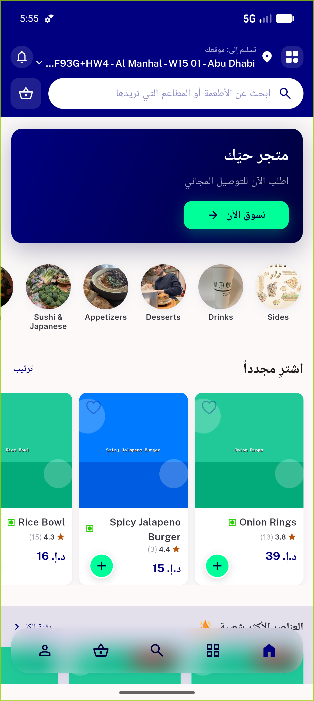
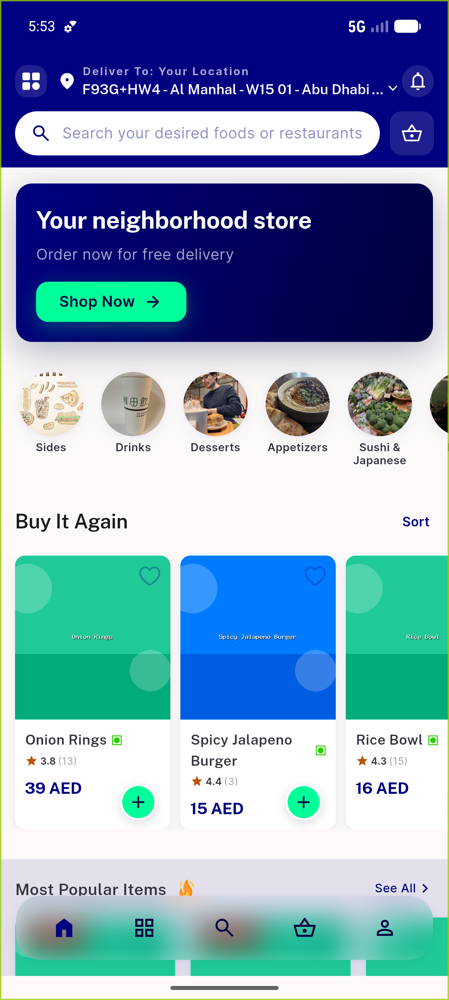
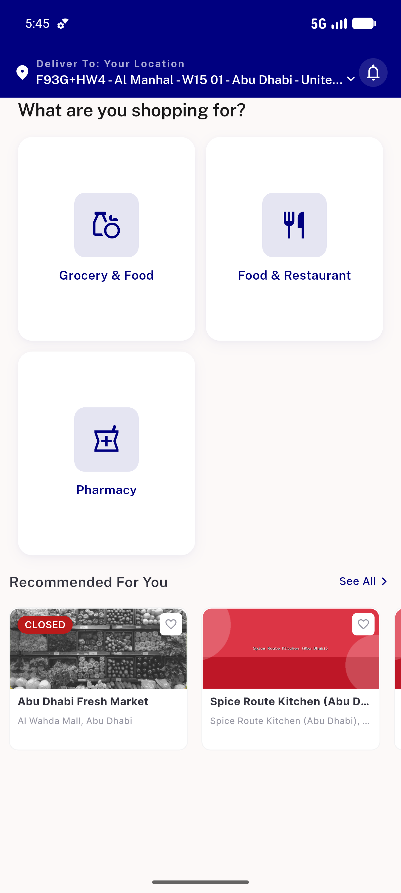

# QA Evidence — NEARS-532

**PASS — home 15dp gutter token rename renders byte-identical (LTR + RTL, both home states), 1659/0 tests**

**3 screenshot(s).** Click any thumbnail for full resolution.

<table>
<tr>
<td align="center" width="33%"> home foodmodule light ar rtl</td>
<td align="center" width="33%"> home foodmodule light en</td>
<td align="center" width="33%"> home multistore light en</td>
</tr>
</table>

---
*From `nears/docs/qa-evidence/NEARS-532/` · public-repo scrub policy (no live secrets; verified clean).*
