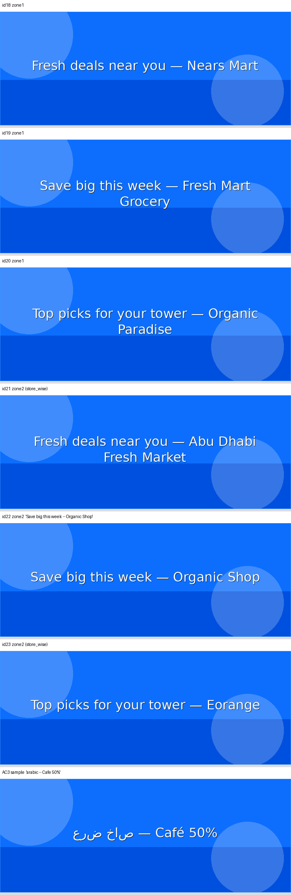
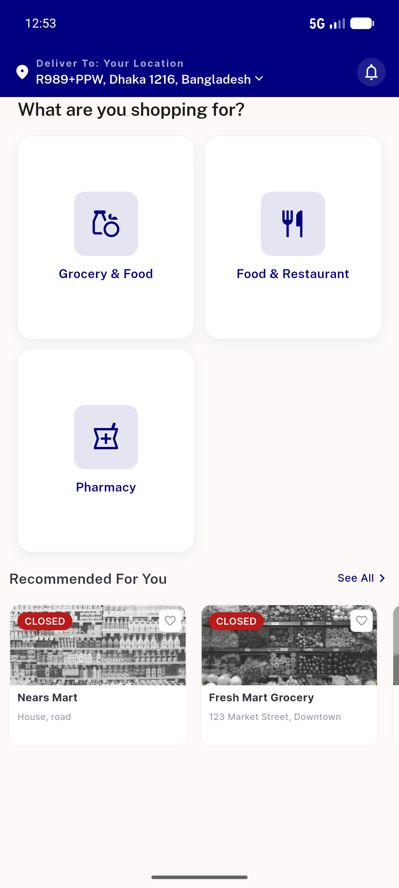
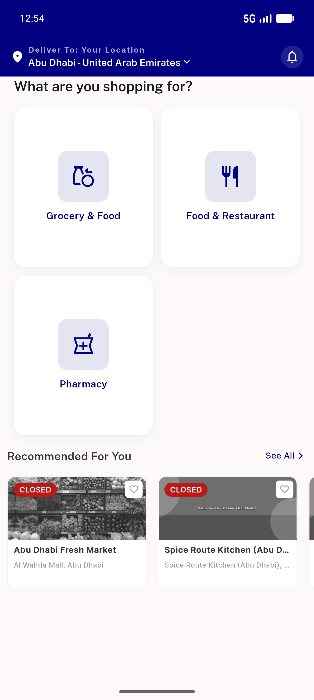

# QA Evidence — NEARS-533

**PASS — banner mojibake fixed; all 6 demo banners + AC3 sample render clean em-dashes (build dacc541b, emulator-5554)**

**10 screenshot(s).** Click any thumbnail for full resolution.

<table>
<tr>
<td align="center" width="33%"> ac banners montage</td>
<td align="center" width="33%"> ac3 generated sample</td>
<td align="center" width="33%"> home zone1 live</td>
</tr>
<tr>
<td align="center" width="33%"> home zone2 live</td>
<td align="center" width="33%"> served id18 zone1</td>
<td align="center" width="33%"> served id19 zone1</td>
</tr>
<tr>
<td align="center" width="33%"> served id20 zone1</td>
<td align="center" width="33%"> served id21 zone2</td>
<td align="center" width="33%"> served id22 zone2 primary repro</td>
</tr>
<tr>
<td align="center" width="33%"> served id23 zone2</td>
</tr>
</table>

### Other artifacts
- [`progress.md`](progress.md)

---
*From `nears/docs/qa-evidence/NEARS-533/` · public-repo scrub policy (no live secrets; verified clean).*
