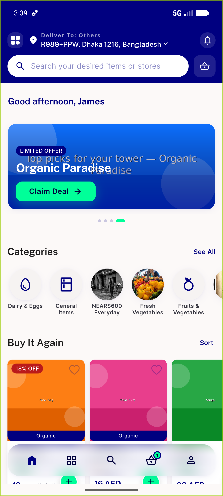
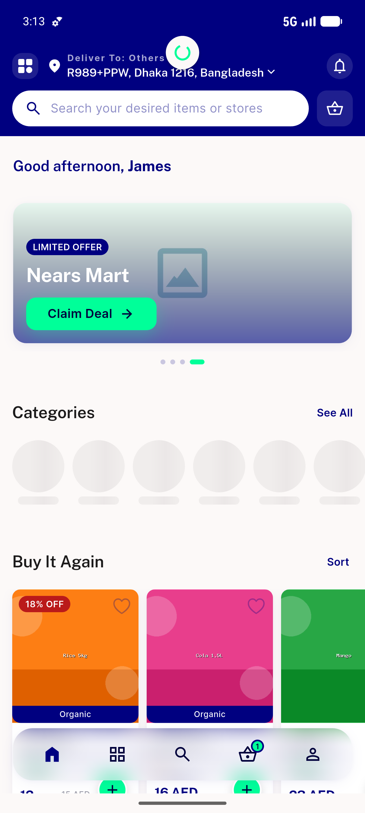
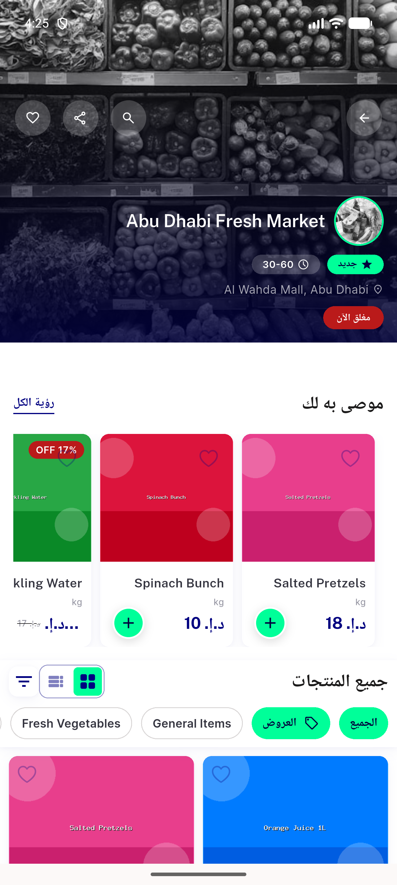
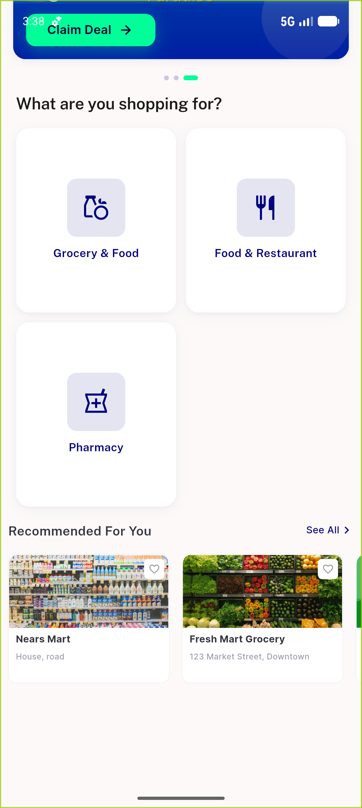
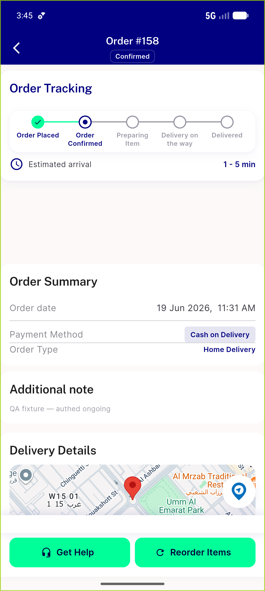

# QA Evidence — NEARS-536

**PASS (cycle 2): painted navy border renders on device; RGB (0,0,128) 16:1; golden +2**

**8 screenshot(s).** Click any thumbnail for full resolution.

<table>
<tr>
<td align="center" width="33%"> ac1 categories cleanbuild</td>
<td align="center" width="33%"> ac1 home seeall top</td>
<td align="center" width="33%"> ac1 store seeall border rtl</td>
</tr>
<tr>
<td align="center" width="33%"> bug seeall no underline</td>
<td align="center" width="33%"> home loggedin rebuild</td>
<td align="center" width="33%"> order track</td>
</tr>
<tr>
<td align="center" width="33%"> zoom seeall categories</td>
<td align="center" width="33%"> zoom10 seeall cleanbuild</td>
</tr>
</table>

### Other artifacts
- [`bug-seeall-no-underline.log`](bug-seeall-no-underline.log)
- [`progress.md`](progress.md)

---
*From `nears/docs/qa-evidence/NEARS-536/` · public-repo scrub policy (no live secrets; verified clean).*
