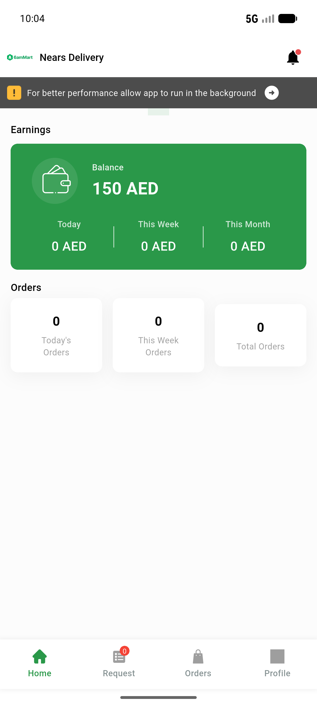
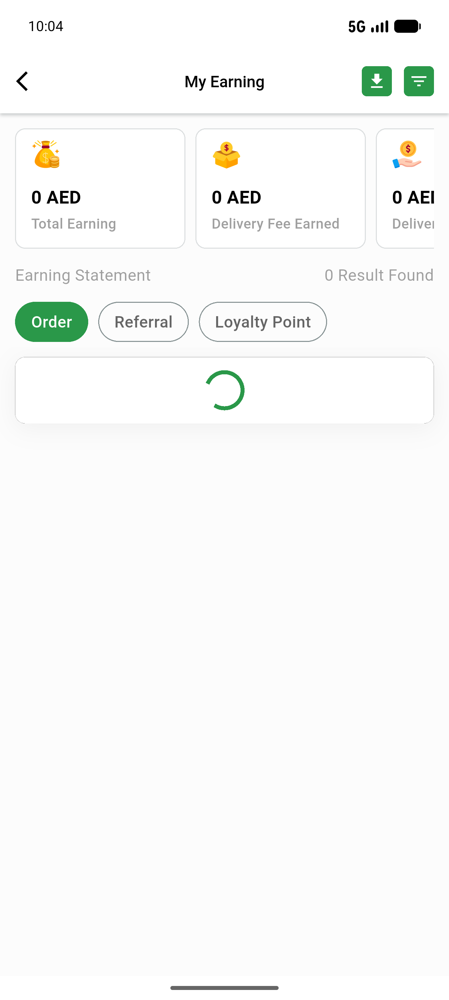
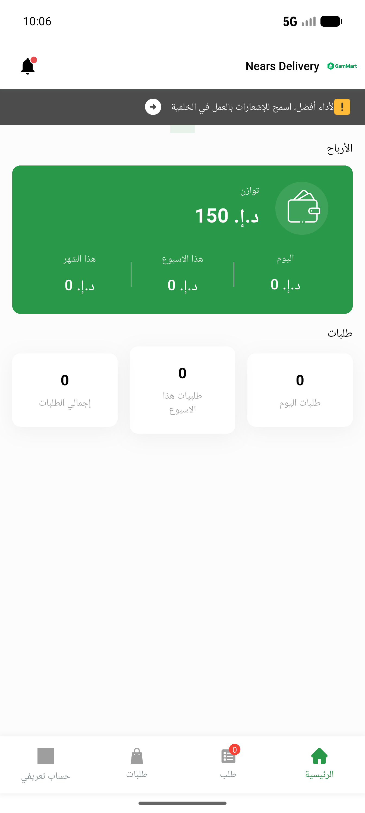
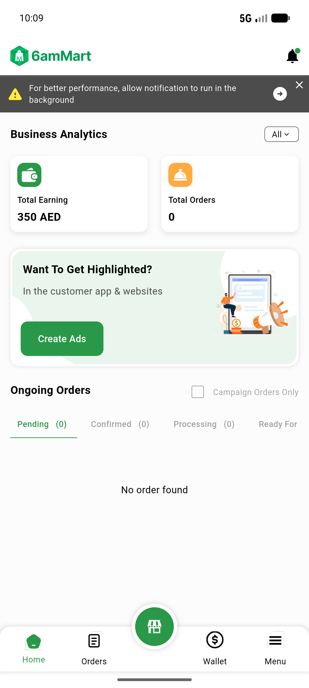
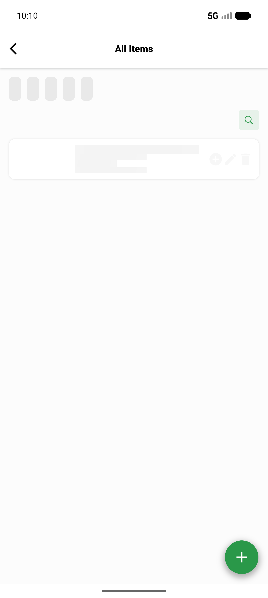
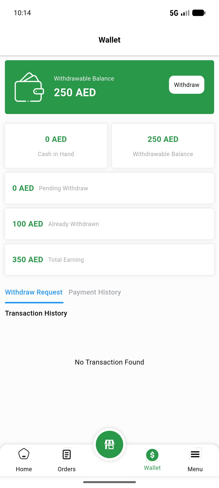
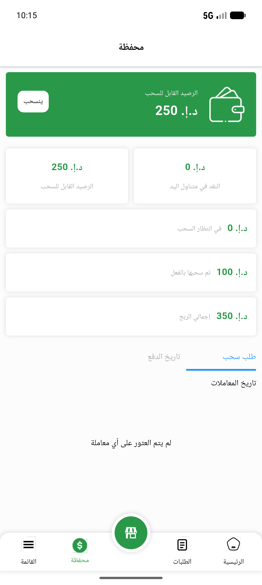
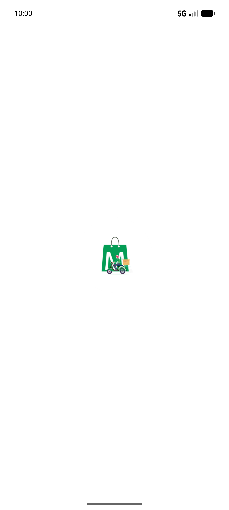

# QA Evidence — NEARS-540

**NEARS-540 PASS: locale-aware price rendering Delivery+Vendor (EN AED suffix / AR glyph) verified live on dashboard+wallet+earnings both apps both locales; item-card surfaces blocked by pre-existing ItemModel parse bug, unit-verified**

**8 screenshot(s).** Click any thumbnail for full resolution.

<table>
<tr>
<td align="center" width="33%"> ac1 delivery en dashboard</td>
<td align="center" width="33%"> ac1 delivery en earning</td>
<td align="center" width="33%"> ac2 delivery ar dashboard</td>
</tr>
<tr>
<td align="center" width="33%"> ac3 vendor en dashboard</td>
<td align="center" width="33%"> ac3 vendor en items</td>
<td align="center" width="33%"> ac3 vendor en wallet</td>
</tr>
<tr>
<td align="center" width="33%"> ac4 vendor ar wallet</td>
<td align="center" width="33%"> delivery splash</td>
</tr>
</table>

### Other artifacts
- [`bug-delivery-earning-report-parse.log`](bug-delivery-earning-report-parse.log)
- [`bug-vendor-itemlist-parse.log`](bug-vendor-itemlist-parse.log)
- [`progress.md`](progress.md)

---
*From `nears/docs/qa-evidence/NEARS-540/` · public-repo scrub policy (no live secrets; verified clean).*
