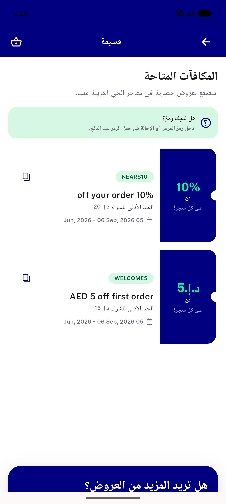
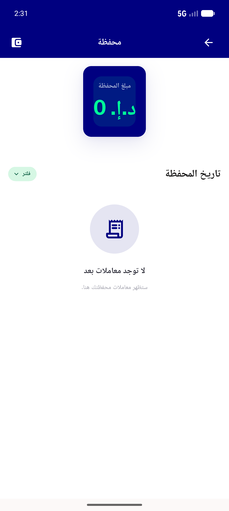
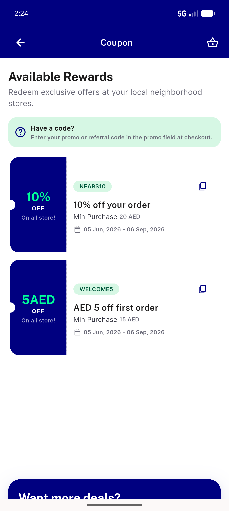
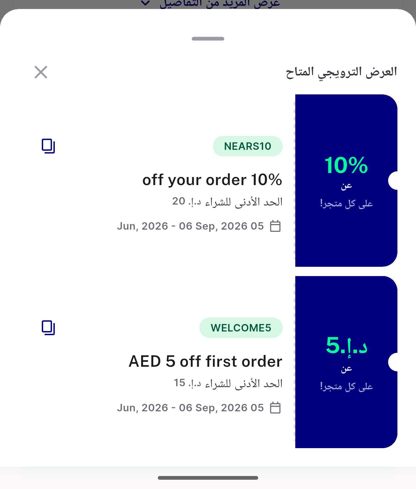

# QA Evidence — NEARS-541

**PASS — NEARS-541 i18n/RTL coupon-token + add-fund strip · emulator-5556 · UserApp @9741a3fc**

**4 screenshot(s).** Click any thumbnail for full resolution.

<table>
<tr>
<td align="center" width="33%"> ac1 ar coupon amount prefix</td>
<td align="center" width="33%"> ac2 wallet addfund gated</td>
<td align="center" width="33%"> ac4 en coupon amount suffix</td>
</tr>
<tr>
<td align="center" width="33%"> sweep ar checkout coupon bottomsheet</td>
</tr>
</table>

### Other artifacts
- [`bug-ac2-addfund-config-gated.log`](bug-ac2-addfund-config-gated.log)

---
*From `nears/docs/qa-evidence/NEARS-541/` · public-repo scrub policy (no live secrets; verified clean).*
