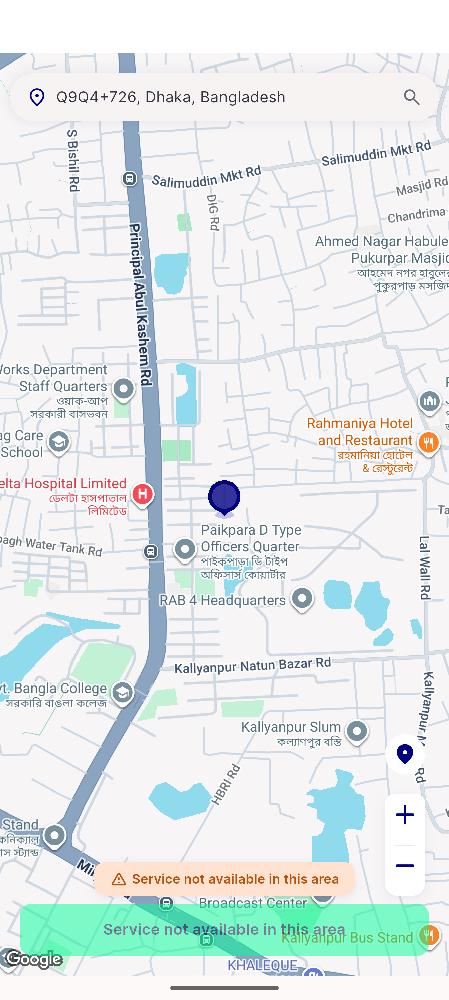
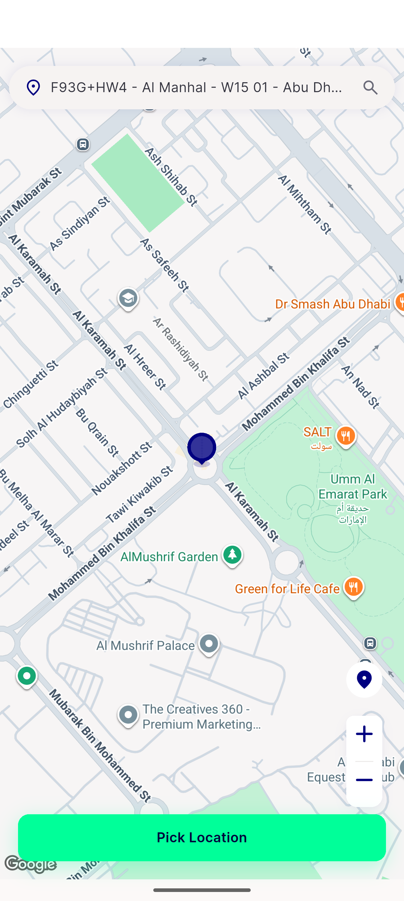

# QA Evidence — NEARS-543

**PASS (AC2/AC3/AC4) — AC1 deferred per Option A; geolocator LocationManager fix, no native crash on emulator-5556**

**4 screenshot(s).** Click any thumbnail for full resolution.

<table>
<tr>
<td align="center" width="33%"> ac2 use current location resolved</td>
<td align="center" width="33%"> ac3 no fix graceful fallback</td>
<td align="center" width="33%"> ac4 pickmap search</td>
</tr>
<tr>
<td align="center" width="33%"> ac4 store discovery abudhabi</td>
</tr>
</table>

### Other artifacts
- [`ac3-graceful-fallback-logs.log`](ac3-graceful-fallback-logs.log)
- [`bug-payment-failed-parse-typeerror.log`](bug-payment-failed-parse-typeerror.log)
- [`progress.md`](progress.md)

---
*From `nears/docs/qa-evidence/NEARS-543/` · public-repo scrub policy (no live secrets; verified clean).*
