# QA Evidence — NEARS-546

**PASS 6/6 ACs — NEARS10 percentage discount verified end-to-end (display==charge, order #162)**

**13 screenshot(s).** Click any thumbnail for full resolution.

<table>
<tr>
<td align="center" width="33%"><a href="AC1-nears10-applied-summary.png">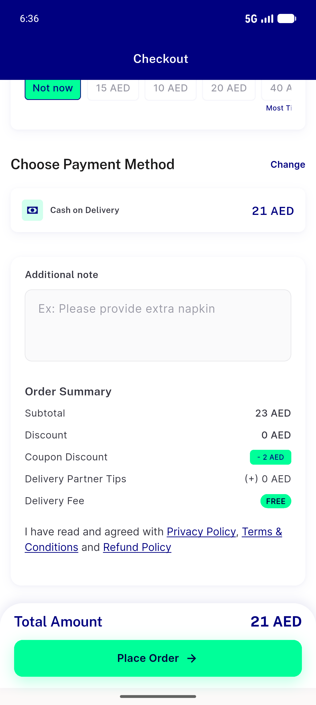</a> AC1 nears10 applied summary</td>
<td align="center" width="33%"><a href="AC1-nears10-percentage-23subtotal.png">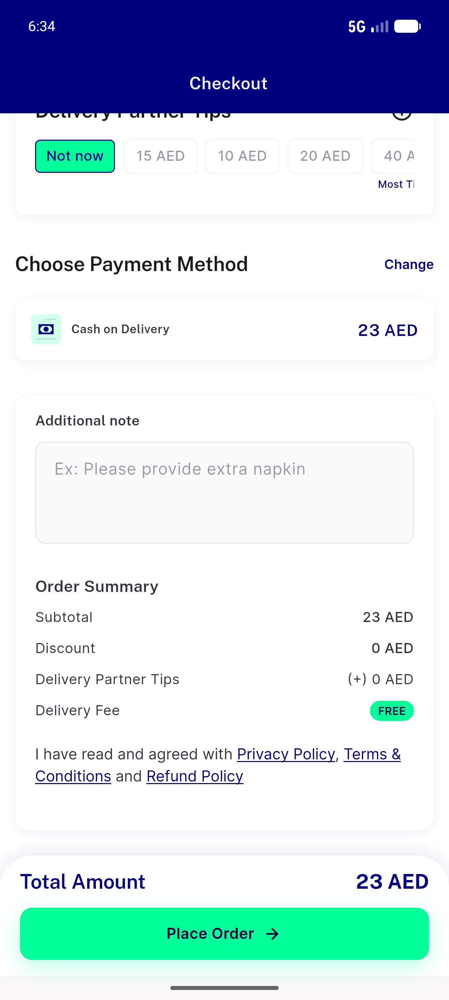</a> AC1 nears10 percentage 23subtotal</td>
<td align="center" width="33%"><a href="AC2-maxcap-200subtotal-15cap.png">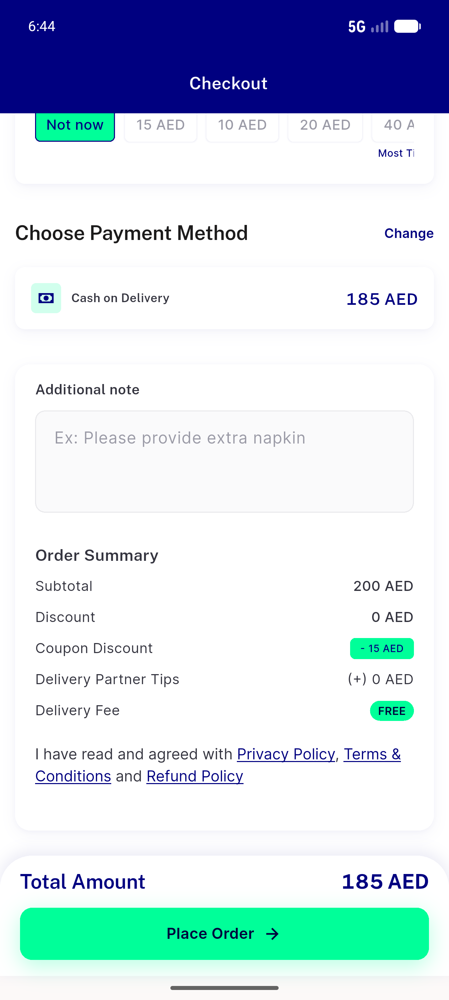</a> AC2 maxcap 200subtotal 15cap</td>
</tr>
<tr>
<td align="center" width="33%"><a href="AC3-minfloor-16subtotal-rejected.png">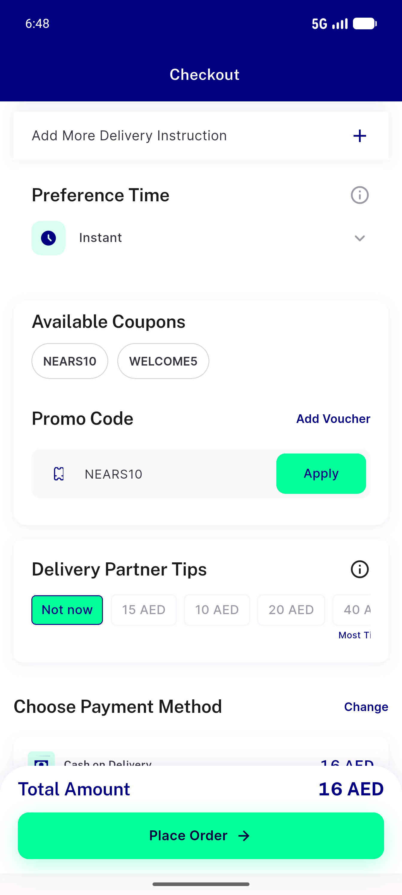</a> AC3 minfloor 16subtotal rejected</td>
<td align="center" width="33%"><a href="AC3-rejection-toast.png">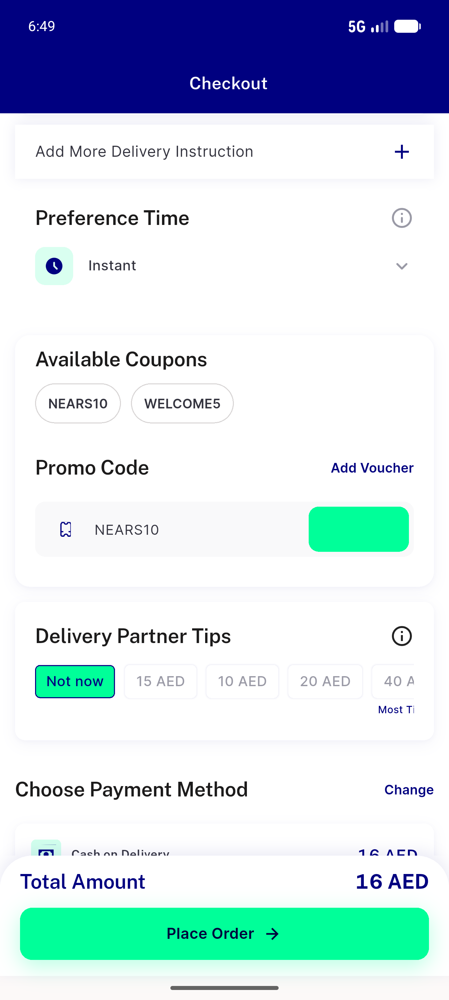</a> AC3 rejection toast</td>
<td align="center" width="33%"><a href="AC4-welcome5-coupondiscount-line.png">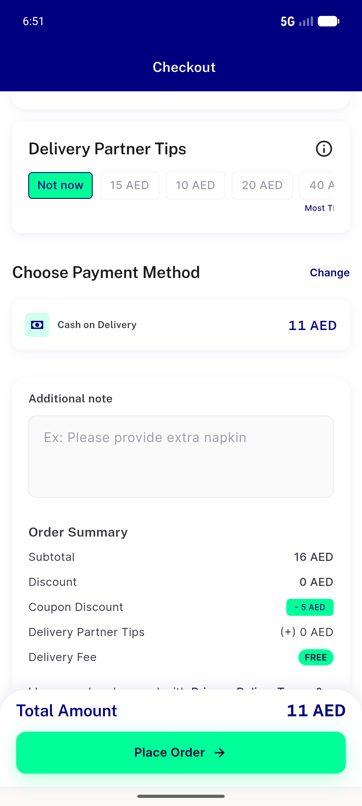</a> AC4 welcome5 coupondiscount line</td>
</tr>
<tr>
<td align="center" width="33%"><a href="AC4-welcome5-flat5-16subtotal.png">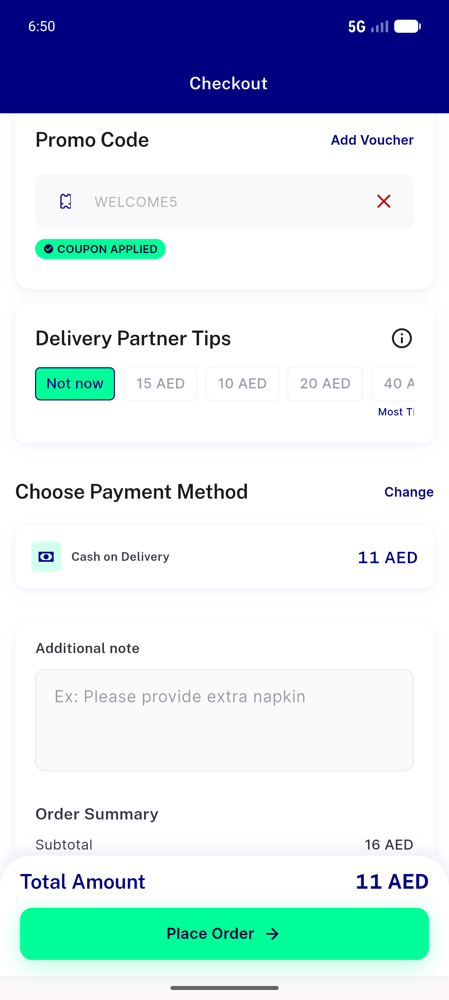</a> AC4 welcome5 flat5 16subtotal</td>
<td align="center" width="33%"><a href="AC5-coupon-badge-10pct-off.png">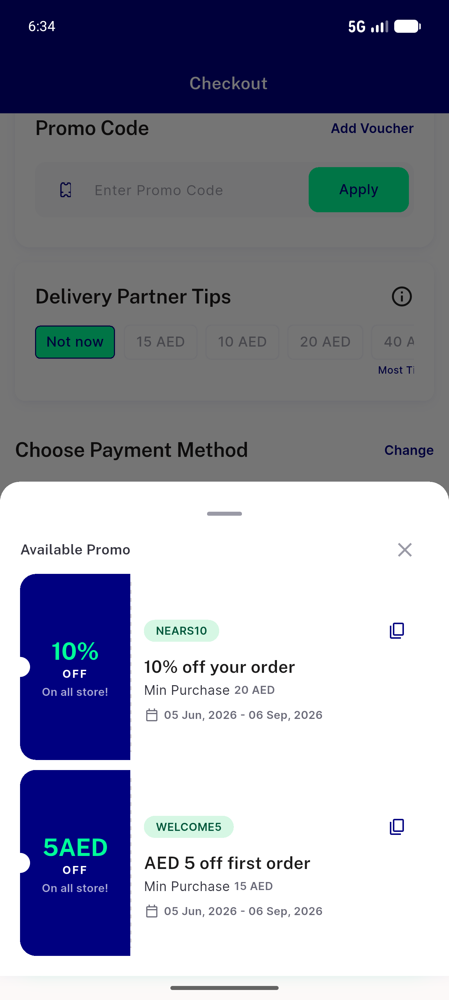</a> AC5 coupon badge 10pct off</td>
<td align="center" width="33%"><a href="AC6-order162-placed-confirmation.png">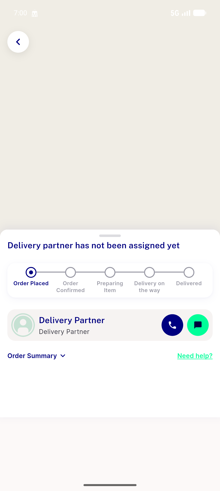</a> AC6 order162 placed confirmation</td>
</tr>
<tr>
<td align="center" width="33%"><a href="AC6-order162-pricebreakdown.png">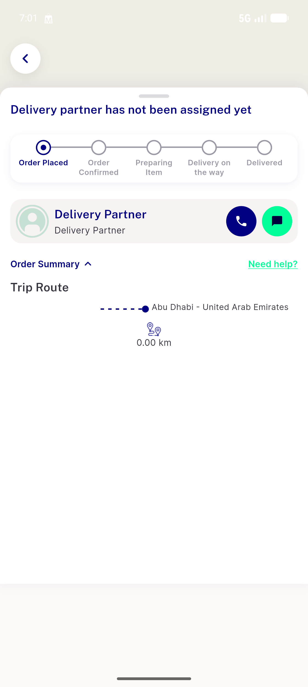</a> AC6 order162 pricebreakdown</td>
<td align="center" width="33%"><a href="AC6-order162-summary-coupon.png">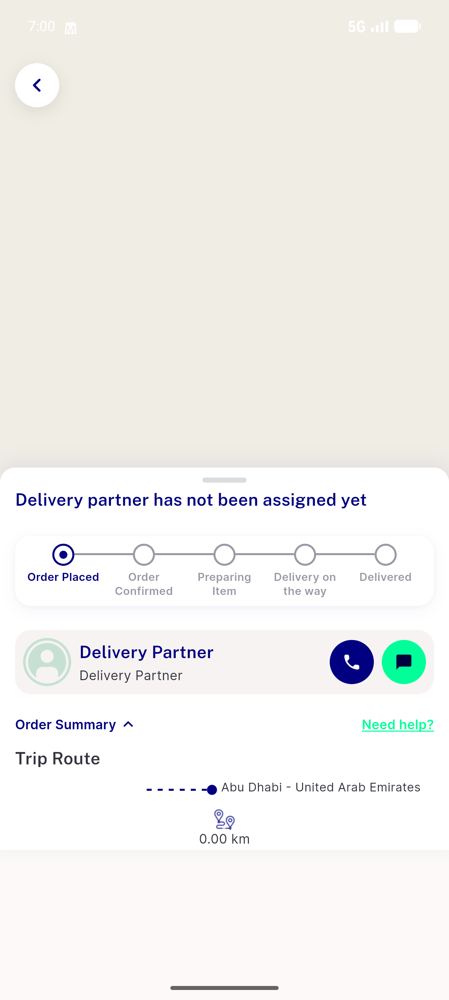</a> AC6 order162 summary coupon</td>
<td align="center" width="33%"><a href="REG-coupon-applied-before-remove.png">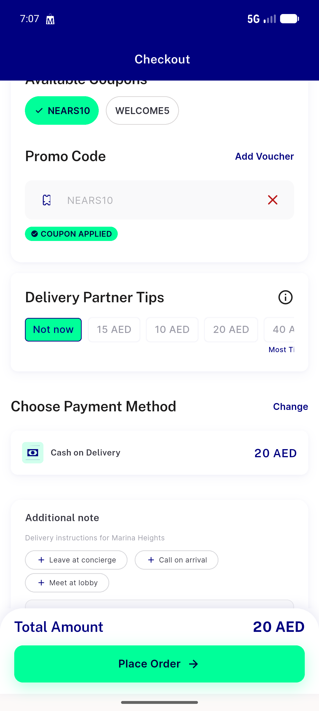</a> REG coupon applied before remove</td>
</tr>
<tr>
<td align="center" width="33%"><a href="REG-coupon-removed-total-restored.png">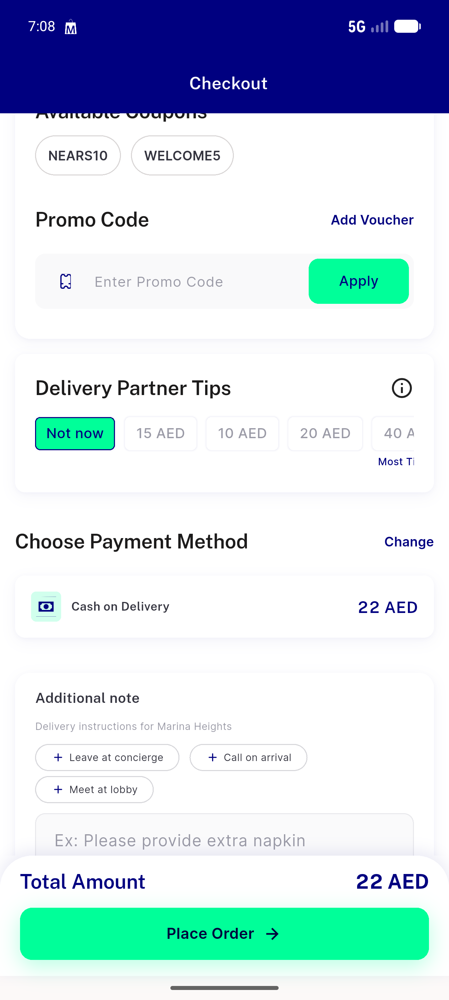</a> REG coupon removed total restored</td>
</tr>
</table>

### Other artifacts
- [`AC6-db-charge-crosscheck.log`](AC6-db-charge-crosscheck.log)
- [`bug-cart-count-overflow.log`](bug-cart-count-overflow.log)
- [`bug-pusher-ws-error.log`](bug-pusher-ws-error.log)
- [`progress.md`](progress.md)

---
*From `nears/docs/qa-evidence/NEARS-546/` · public-repo scrub policy (no live secrets; verified clean).*
