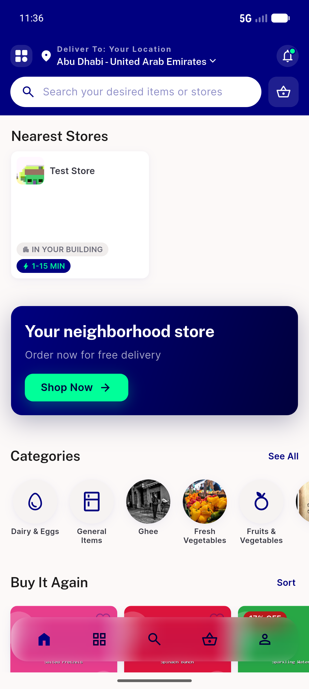
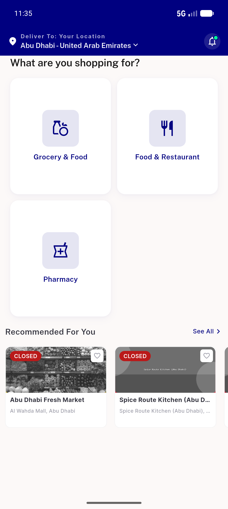
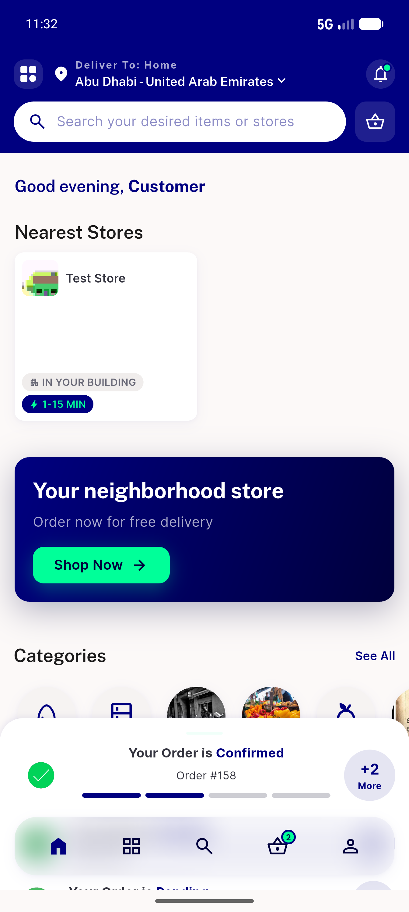
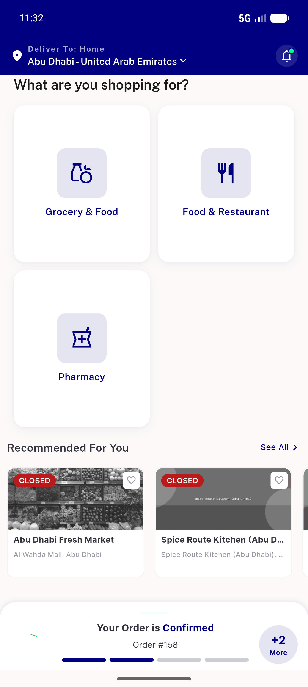

# QA Evidence — NEARS-550

**PASS — guest cashback []-hardening: guest home loads no 'Something went wrong' toast; authed cashback 200+[] no crash; 1658/1658 tests**

**4 screenshot(s).** Click any thumbnail for full resolution.

<table>
<tr>
<td align="center" width="33%"> ac1 guest grocery</td>
<td align="center" width="33%"> ac1 guest home</td>
<td align="center" width="33%"> ac4 authed grocery cashback200</td>
</tr>
<tr>
<td align="center" width="33%"> ac4 authed home</td>
</tr>
</table>

### Other artifacts
- [`ac3-guest-curl.log`](ac3-guest-curl.log)
- [`progress.md`](progress.md)

---
*From `nears/docs/qa-evidence/NEARS-550/` · public-repo scrub policy (no live secrets; verified clean).*
