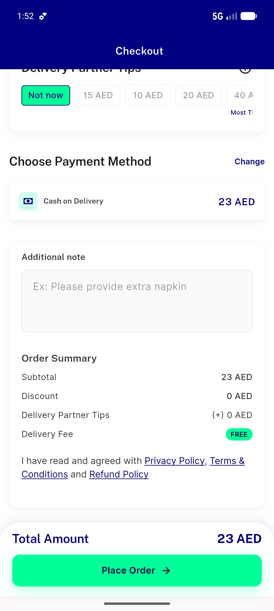
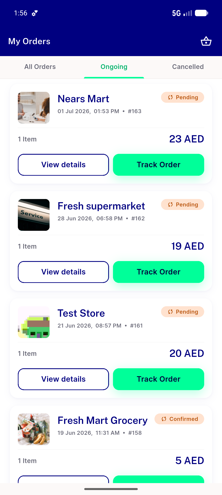
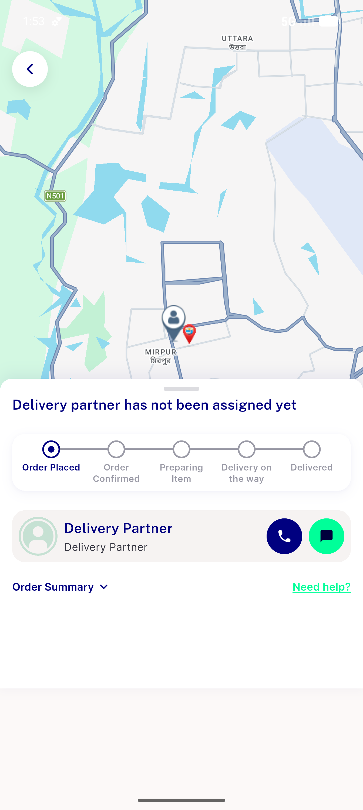

# QA Evidence — NEARS-552

**PASS — COD 23 AED Store-1 zone-1 order #163 placed, no COD-cap rejection (cap 500 >= min 20)**

**3 screenshot(s).** Click any thumbnail for full resolution.

<table>
<tr>
<td align="center" width="33%"> ac2 checkout cod 23aed</td>
<td align="center" width="33%"> ac2 myorders 163</td>
<td align="center" width="33%"> ac2 order placed 163</td>
</tr>
</table>

### Other artifacts
- [`bug-fcm-invalid-argument.log`](bug-fcm-invalid-argument.log)
- [`bug-pusher-empty-host-ws-retry.log`](bug-pusher-empty-host-ws-retry.log)

---
*From `nears/docs/qa-evidence/NEARS-552/` · public-repo scrub policy (no live secrets; verified clean).*
