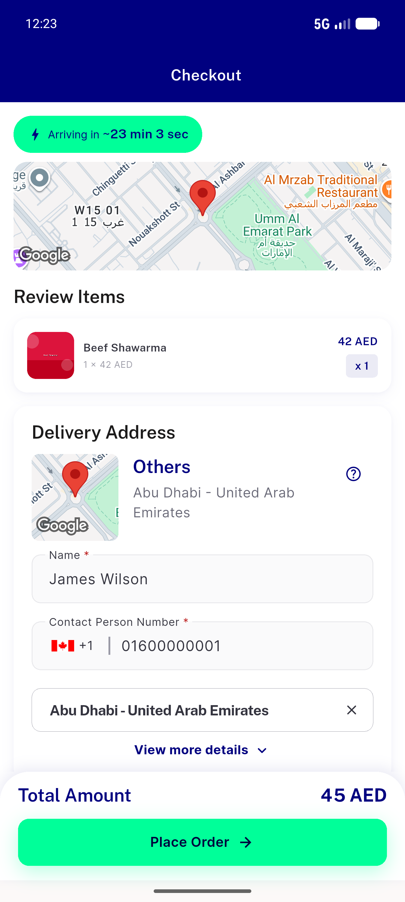
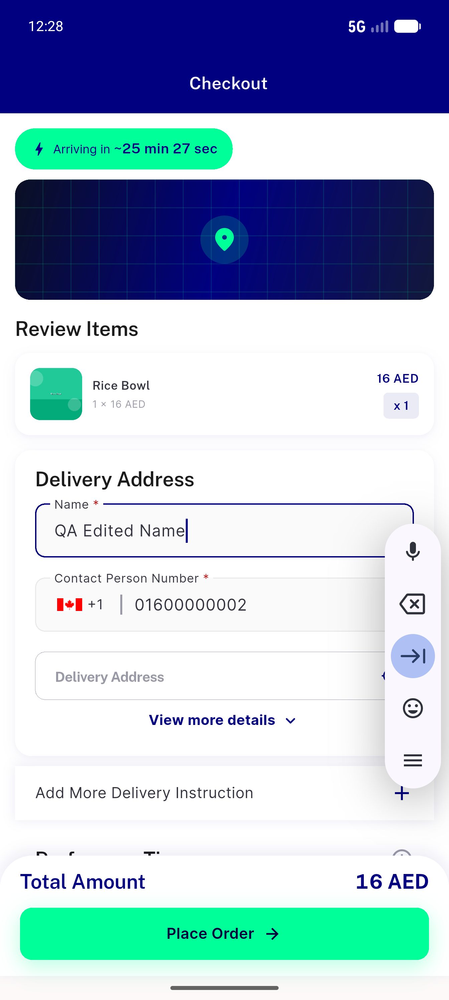
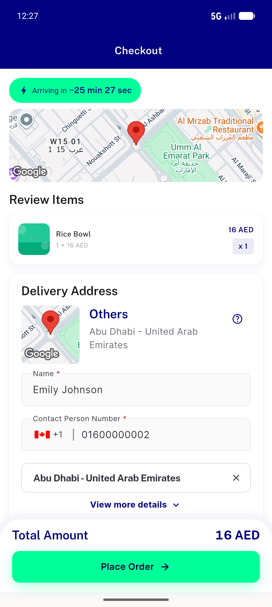
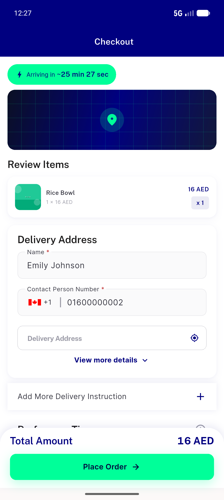
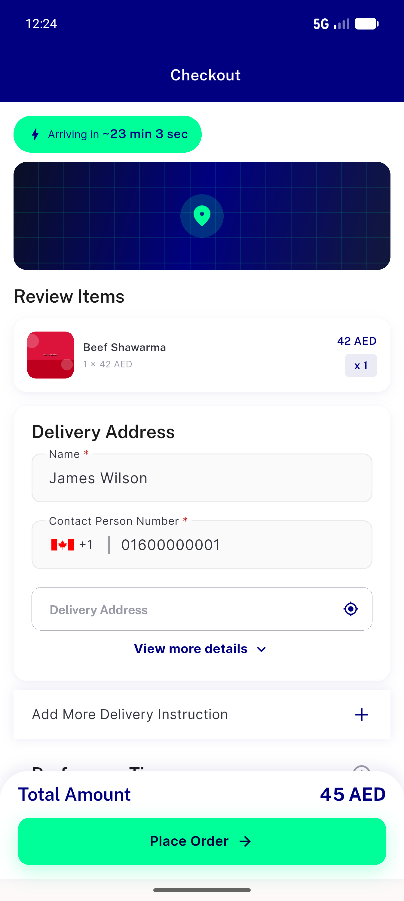
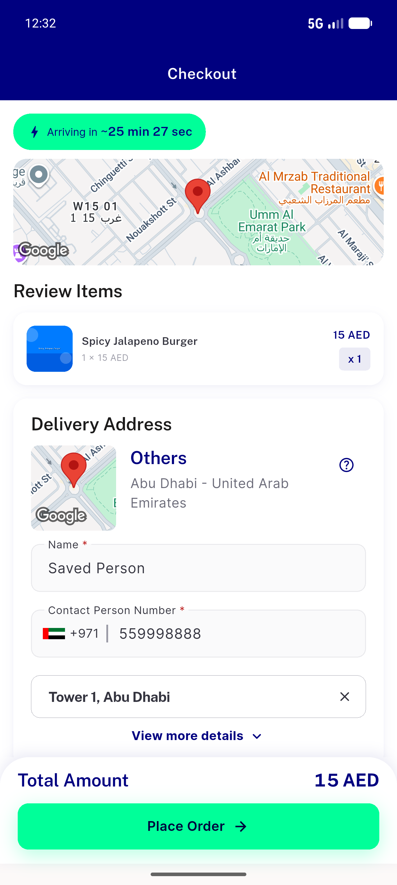

# QA Evidence — NEARS-553

**PASS — checkout inline-form contact seeds current user's profile, not stale prior-session value (AC1-AC5 verified live on emulator-5554)**

**6 screenshot(s).** Click any thumbnail for full resolution.

<table>
<tr>
<td align="center" width="33%"> ac1 ac2 james natural form</td>
<td align="center" width="33%"> ac3 name edited</td>
<td align="center" width="33%"> ac4 emily natural form</td>
</tr>
<tr>
<td align="center" width="33%"> ac4 emily stale injected shows own</td>
<td align="center" width="33%"> ac4 james stale injected shows own</td>
<td align="center" width="33%"> ac5 saved address contact wins</td>
</tr>
</table>

### Other artifacts
- [`bug-customtextfield-setstate-after-dispose.log`](bug-customtextfield-setstate-after-dispose.log)
- [`progress.md`](progress.md)

---
*From `nears/docs/qa-evidence/NEARS-553/` · public-repo scrub policy (no live secrets; verified clean).*
