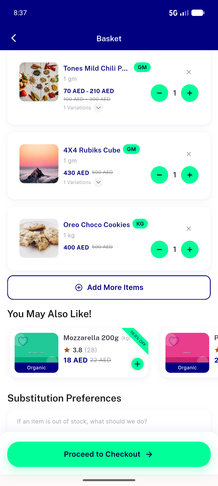
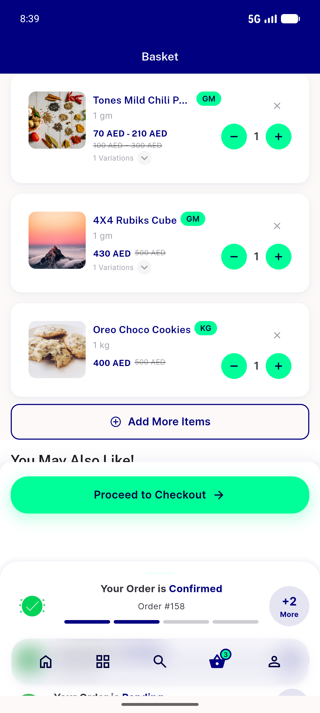
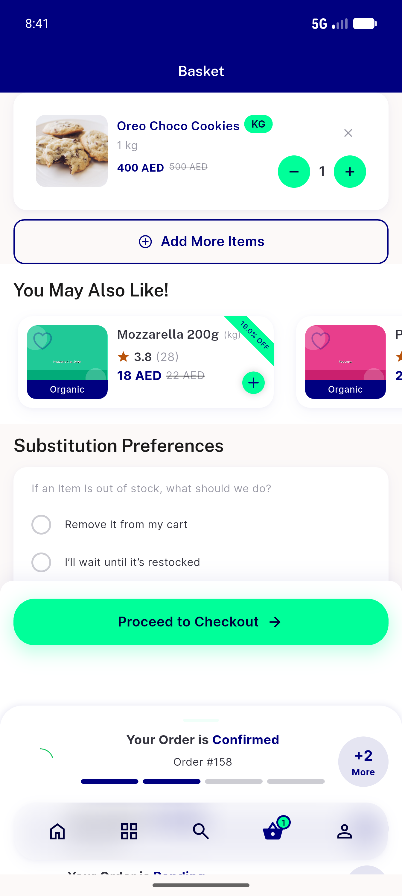
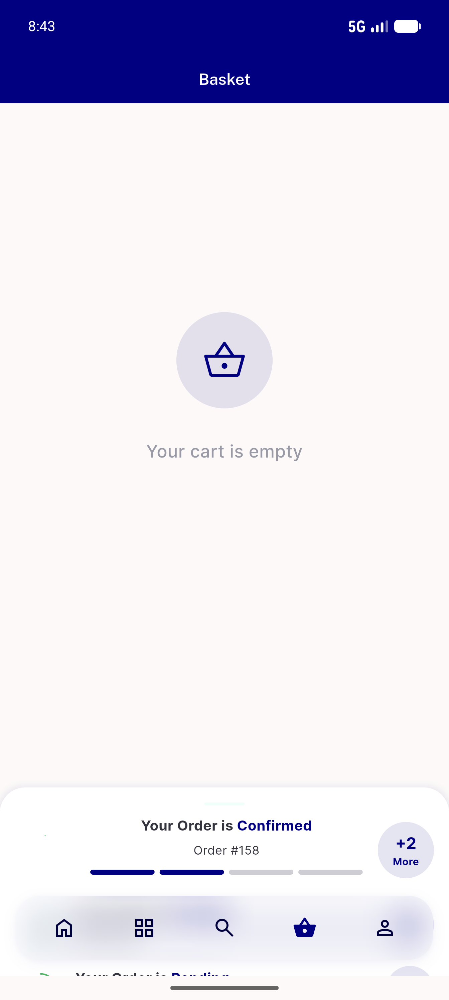

# QA Evidence — NEARS-555

**PASS — NPE crash-guard verified live on emulator-5556 (worktree build); 0 'Null check operator' across all remove gestures; AC1/AC2/AC3/AC4/AC5 demonstrated**

**6 screenshot(s).** Click any thumbnail for full resolution.

<table>
<tr>
<td align="center" width="33%"> launch state</td>
<td align="center" width="33%"> cart setup 3lines</td>
<td align="center" width="33%"> basket coldlaunch 3lines</td>
</tr>
<tr>
<td align="center" width="33%"> basket after 2variation removes</td>
<td align="center" width="33%"> cart empty after all removed</td>
<td align="center" width="33%"> bug debug build cold start anr</td>
</tr>
</table>

### Other artifacts
- [`05-removal-logs-no-npe.log`](05-removal-logs-no-npe.log)
- [`progress.md`](progress.md)

---
*From `nears/docs/qa-evidence/NEARS-555/` · public-repo scrub policy (no live secrets; verified clean).*
