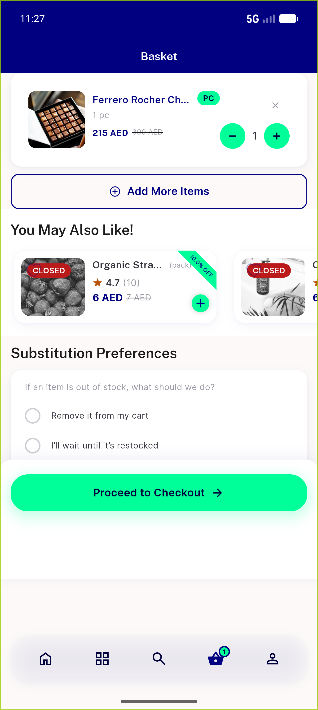
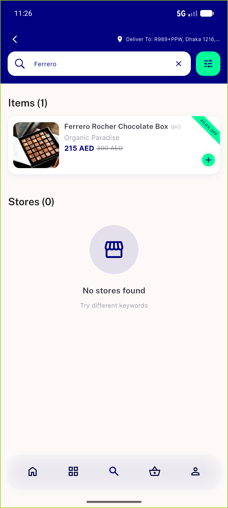
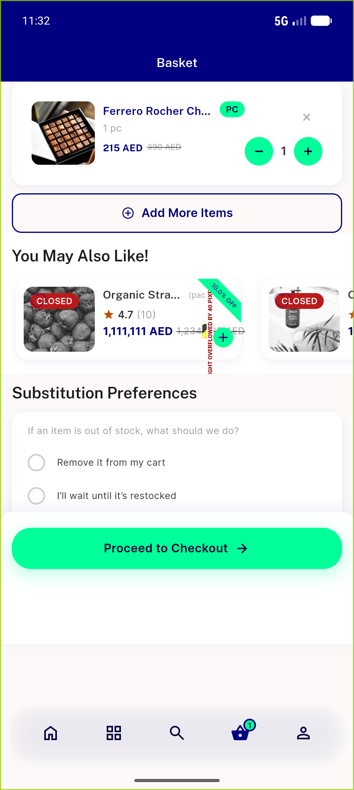

# QA Evidence — NEARS-556

**PASS — NEARS-556 price-row overflow fixed; +1 pre-existing grid truncation (non-blocking)**

**7 screenshot(s).** Click any thumbnail for full resolution.

<table>
<tr>
<td align="center" width="33%"> ac1 cart suggestion discounted</td>
<td align="center" width="33%"> ac3 grid home discounted</td>
<td align="center" width="33%"> ac3 search list card fullprice</td>
</tr>
<tr>
<td align="center" width="33%"> ac4 rtl cart suggestion</td>
<td align="center" width="33%"> after fixed ellipsis</td>
<td align="center" width="33%"> before buggy overflow stripe</td>
</tr>
<tr>
<td align="center" width="33%"> bug grid discounted price truncation</td>
</tr>
</table>

---
*From `nears/docs/qa-evidence/NEARS-556/` · public-repo scrub policy (no live secrets; verified clean).*
