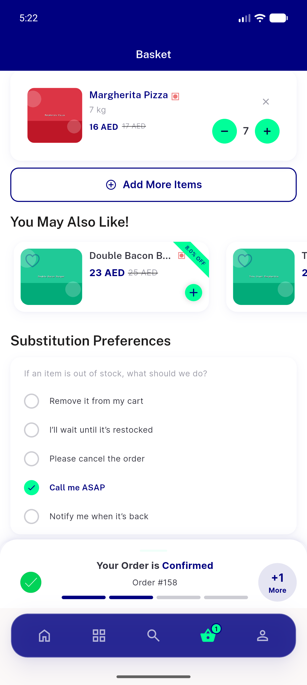
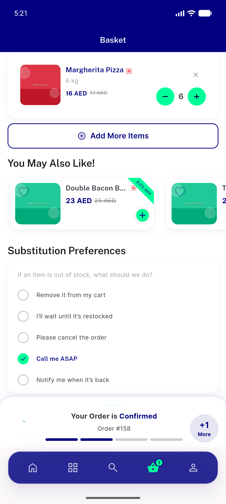

# QA Evidence — NEARS-568

**verify**

**2 screenshot(s).** Click any thumbnail for full resolution.

<table>
<tr>
<td align="center" width="33%"> cart stepper</td>
<td align="center" width="33%"> cart stepper state</td>
</tr>
</table>

### Other artifacts
- [`applogger-evidence.log`](applogger-evidence.log)
- [`bug-faillog-endpoint-keeps-query.log`](bug-faillog-endpoint-keeps-query.log)
- [`bug-guest-cartadd-403.log`](bug-guest-cartadd-403.log)

---
*From `nears/docs/qa-evidence/NEARS-568/` · public-repo scrub policy (no live secrets; verified clean).*
