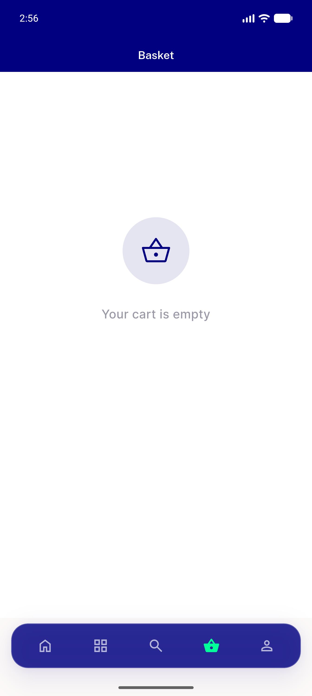
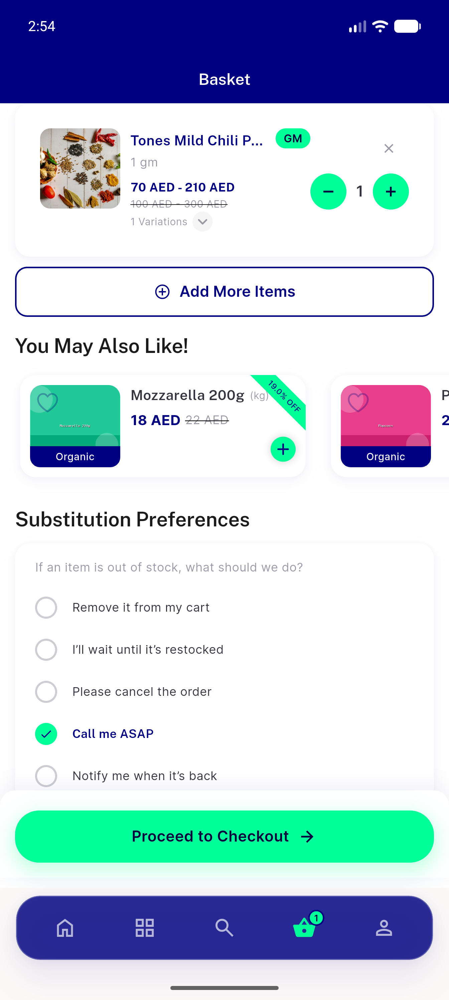

# QA Evidence — NEARS-570

**PASS — post-logout guest add-to-cart now sends non-empty guest_id & returns 200 (401 regression gone); AC1/AC2/AC3/AC5 + fresh-guest + no-leakage verified live on emulator-5554, build 0bf6f3ca**

**4 screenshot(s).** Click any thumbnail for full resolution.

<table>
<tr>
<td align="center" width="33%"> ac1 guest cart empty post logout</td>
<td align="center" width="33%"> ac2 ac3 guest add success</td>
<td align="center" width="33%"> ac5 authenticated cart</td>
</tr>
<tr>
<td align="center" width="33%"> step5 fresh guest add success</td>
</tr>
</table>

### Other artifacts
- [`progress.md`](progress.md)

---
*From `nears/docs/qa-evidence/NEARS-570/` · public-repo scrub policy (no live secrets; verified clean).*
