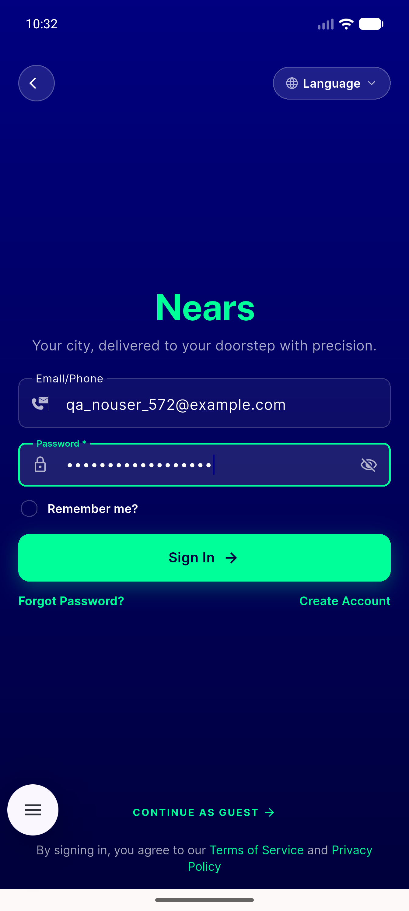
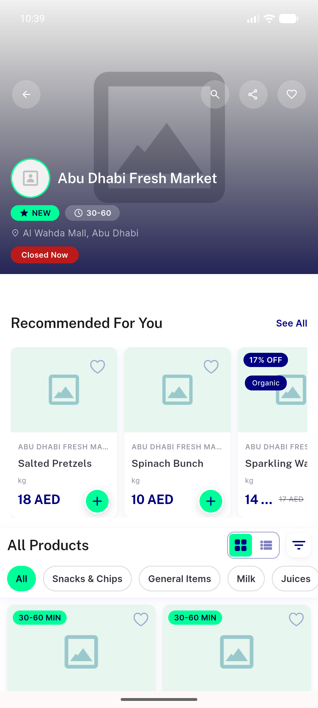
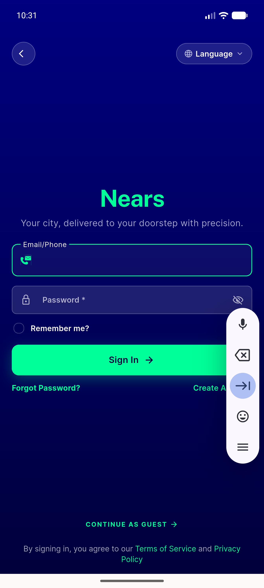

# QA Evidence — NEARS-572

**PASS — X-Request-Id correlation client mirror; live client<->server [FAIL] join on emulator-5554**

**3 screenshot(s).** Click any thumbnail for full resolution.

<table>
<tr>
<td align="center" width="33%"> login error state</td>
<td align="center" width="33%"> regression store details 200</td>
<td align="center" width="33%"> signin screen</td>
</tr>
</table>

### Other artifacts
- [`ac1-outbound-unique-v4.log`](ac1-outbound-unique-v4.log)
- [`ac2-backend-echo.log`](ac2-backend-echo.log)
- [`ac3-h1-transport-failure.log`](ac3-h1-transport-failure.log)
- [`ac3-handled-error-end-to-end-join.log`](ac3-handled-error-end-to-end-join.log)
- [`ac4-5-6-crashlytics-pii.log`](ac4-5-6-crashlytics-pii.log)
- [`ac7-full-test-suite.log`](ac7-full-test-suite.log)
- [`progress.md`](progress.md)
- [`regression-sweep.log`](regression-sweep.log)

---
*From `nears/docs/qa-evidence/NEARS-572/` · public-repo scrub policy (no live secrets; verified clean).*
