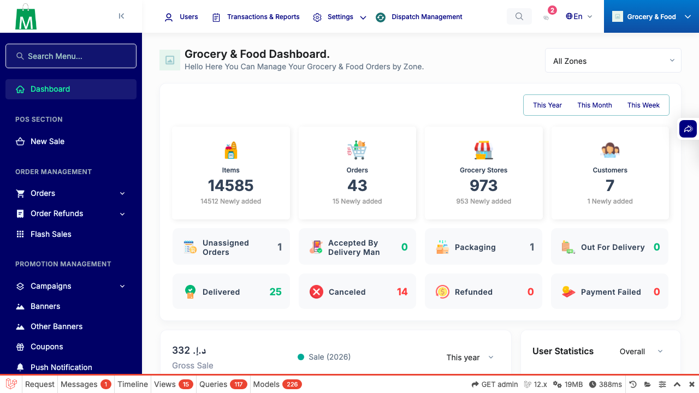
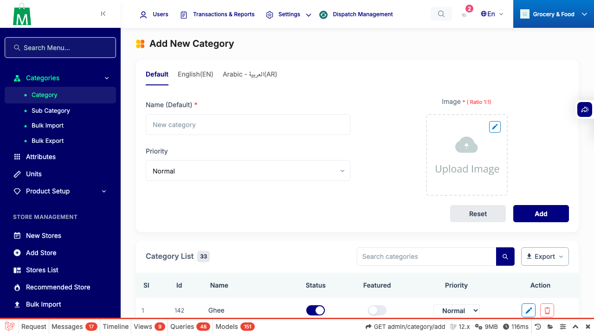
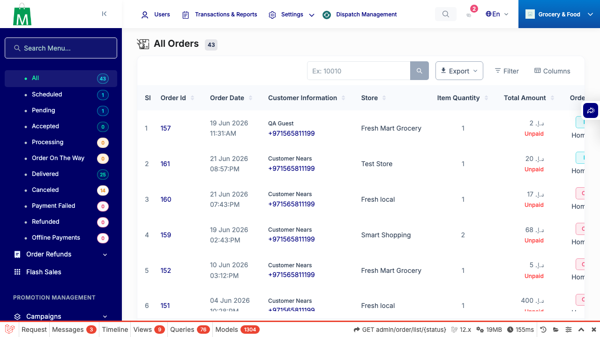
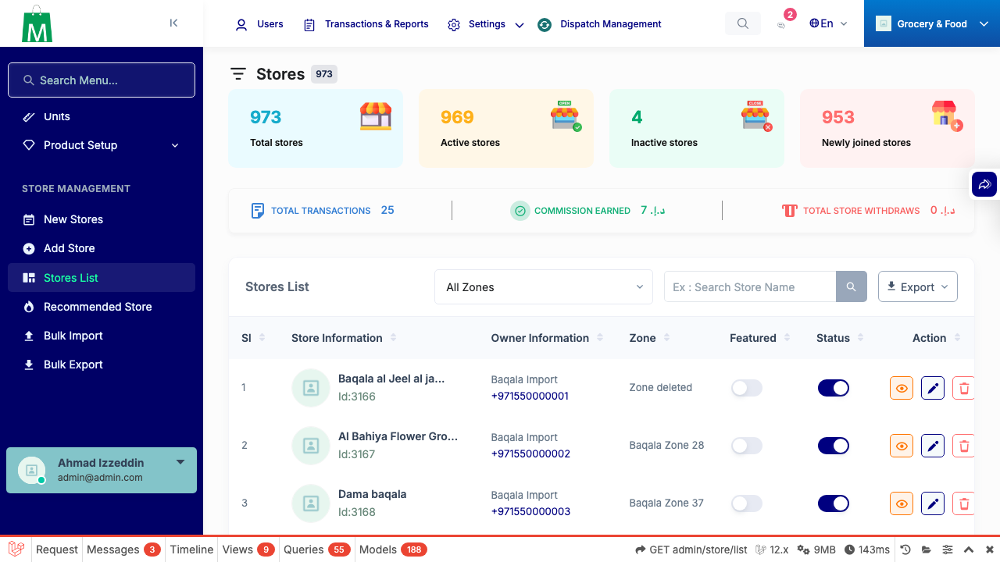
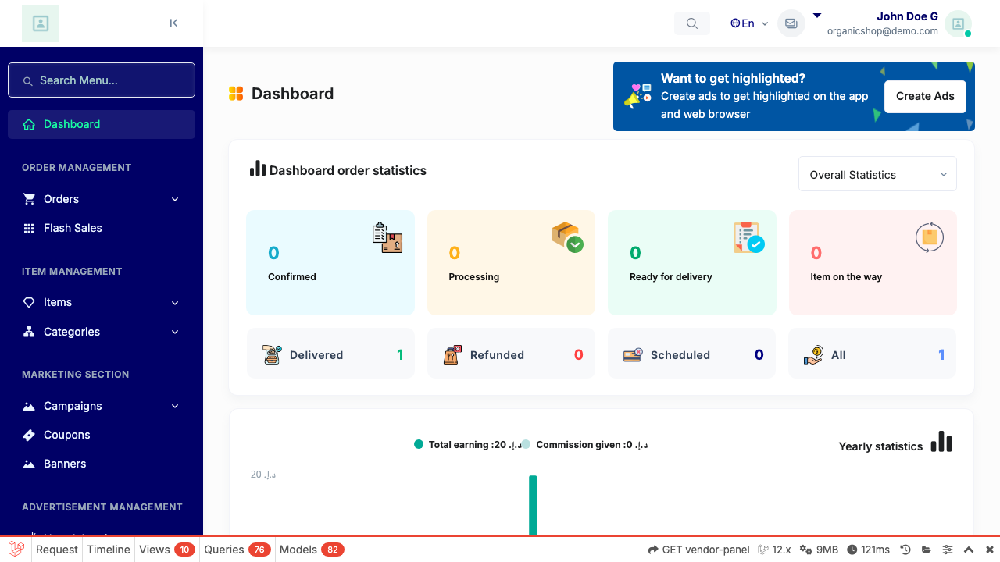
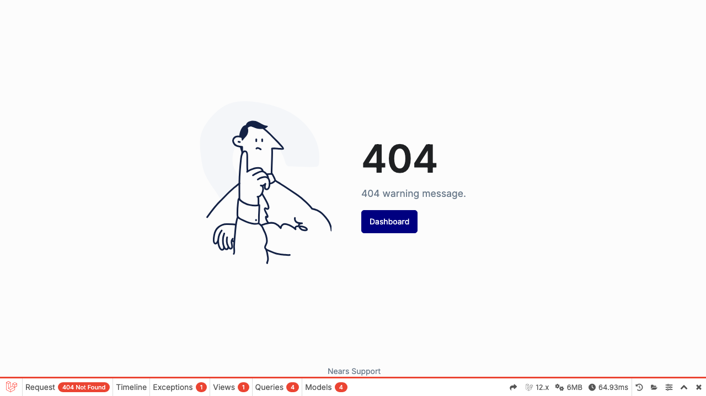
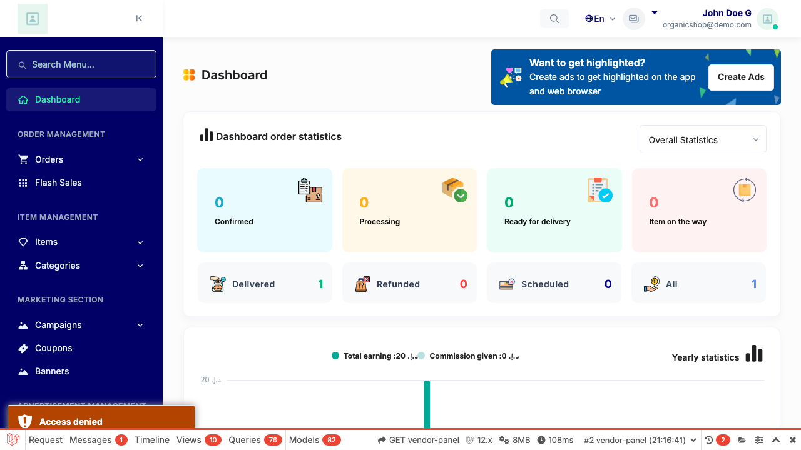
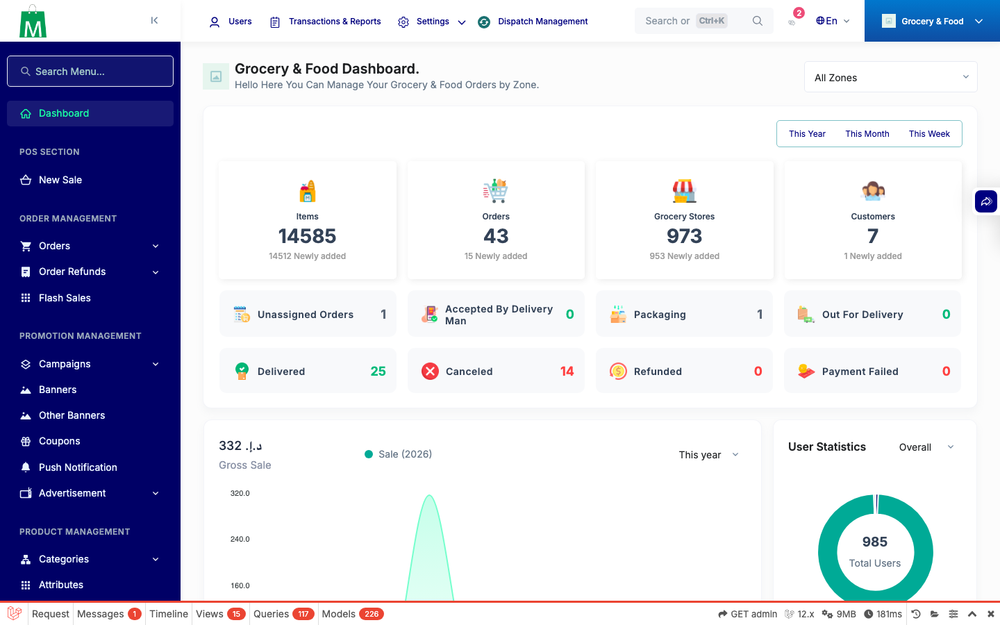

# QA Evidence — NEARS-573

**DELTA RE-QA PASS (fix cycle 1) — AC4 PII leak fixed: query stripped from source+stack over the wire; AC1/AC2/AC5 smoke clean**

**15 screenshot(s).** Click any thumbnail for full resolution.

<table>
<tr>
<td align="center" width="33%"> ac1 admin debug breadcrumb</td>
<td align="center" width="33%"> ac1 store panel dashboard</td>
<td align="center" width="33%"> ac2 default off no network</td>
</tr>
<tr>
<td align="center" width="33%"> ac2 enabled unreachable silent</td>
<td align="center" width="33%"> ac5 admin category add form</td>
<td align="center" width="33%"> ac5 admin dashboard</td>
</tr>
<tr>
<td align="center" width="33%"> ac5 admin order list</td>
<td align="center" width="33%"> ac5 admin store list</td>
<td align="center" width="33%"> ac5 store dashboard</td>
</tr>
<tr>
<td align="center" width="33%"> ac5 store orders</td>
<td align="center" width="33%"> ac5 store pos</td>
<td align="center" width="33%"> bug stack query leak</td>
</tr>
<tr>
<td align="center" width="33%"> redo ac1 admin capture</td>
<td align="center" width="33%"> redo ac2 default off silent</td>
<td align="center" width="33%"> redo ac5 admin render</td>
</tr>
</table>

### Other artifacts
- [`ac3-fail-structured-log.log`](ac3-fail-structured-log.log)
- [`bug-stack-query-leak-shipped-body.log`](bug-stack-query-leak-shipped-body.log)
- [`bug-stack-query-leak.log`](bug-stack-query-leak.log)
- [`progress.md`](progress.md)
- [`redo-ac4-pii-fixed-breadcrumb.log`](redo-ac4-pii-fixed-breadcrumb.log)
- [`redo-ac4-pii-fixed-shipped-bodies.log`](redo-ac4-pii-fixed-shipped-bodies.log)

---
*From `nears/docs/qa-evidence/NEARS-573/` · public-repo scrub policy (no live secrets; verified clean).*
