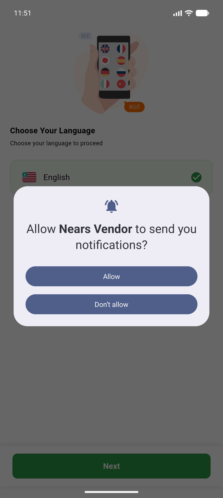
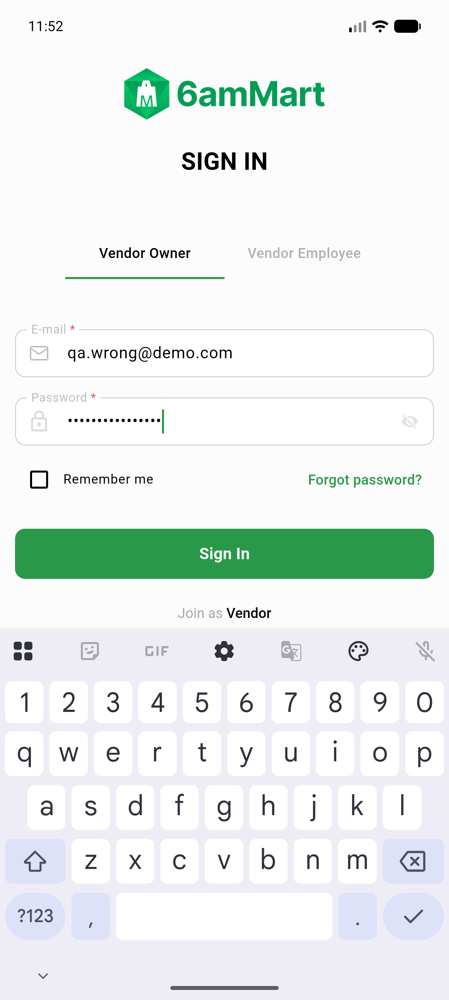
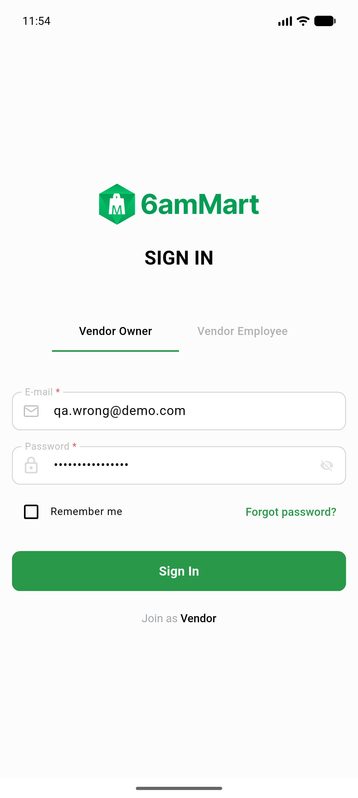
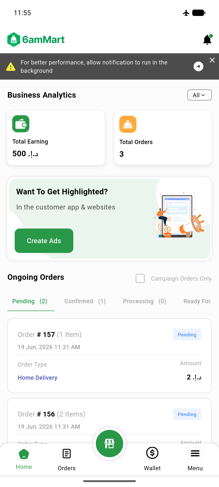
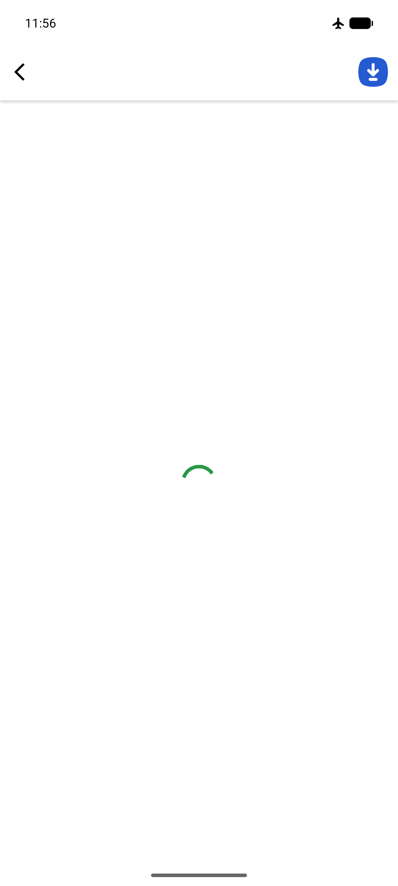
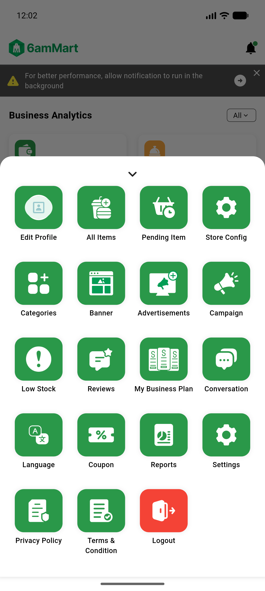
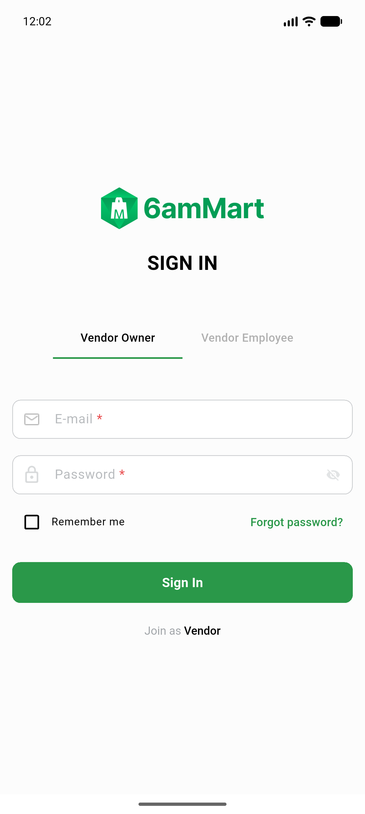

# QA Evidence — NEARS-576

**PASS — VendorApp centralized failure logging + X-Request-Id correlation: 9/9 ACs met live on emulator-5554 (debug); 1 Low non-blocking finding; 0 regressions**

**9 screenshot(s).** Click any thumbnail for full resolution.

<table>
<tr>
<td align="center" width="33%"> login screen</td>
<td align="center" width="33%"> login fields</td>
<td align="center" width="33%"> after signin tap</td>
</tr>
<tr>
<td align="center" width="33%"> login error snackbar</td>
<td align="center" width="33%"> vendor home dashboard</td>
<td align="center" width="33%"> offline state</td>
</tr>
<tr>
<td align="center" width="33%"> offline order</td>
<td align="center" width="33%"> menu tab</td>
<td align="center" width="33%"> after logout signin</td>
</tr>
</table>

### Other artifacts
- [`bug-transport-raw-exception-tostring.log`](bug-transport-raw-exception-tostring.log)
- [`offline-throw-fail.log`](offline-throw-fail.log)
- [`progress.md`](progress.md)

---
*From `nears/docs/qa-evidence/NEARS-576/` · public-repo scrub policy (no live secrets; verified clean).*
