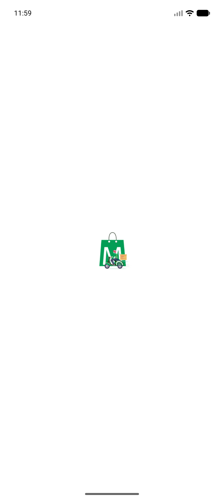
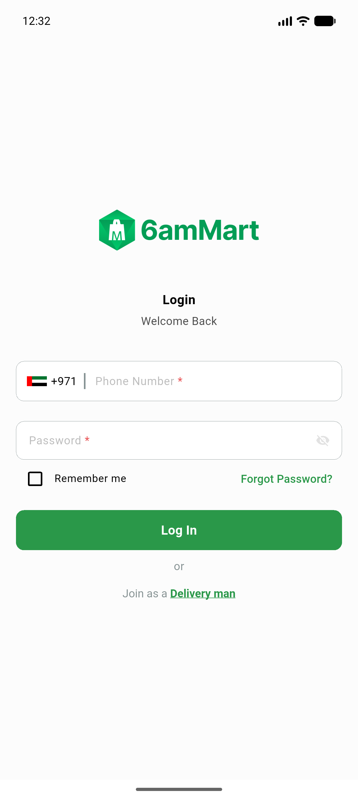
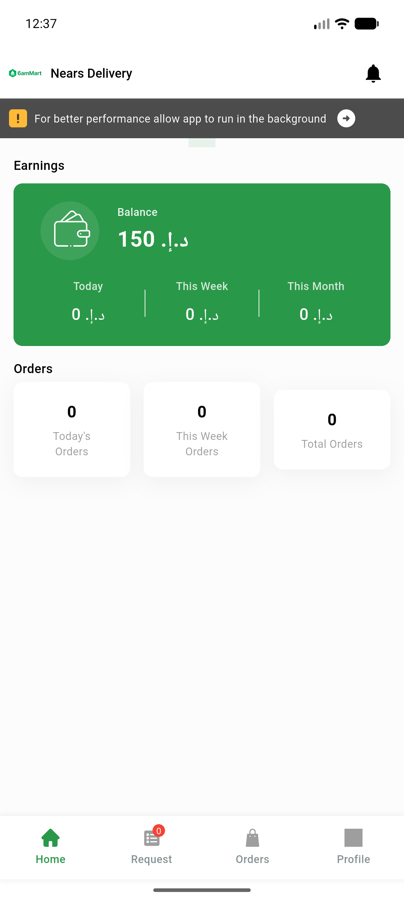
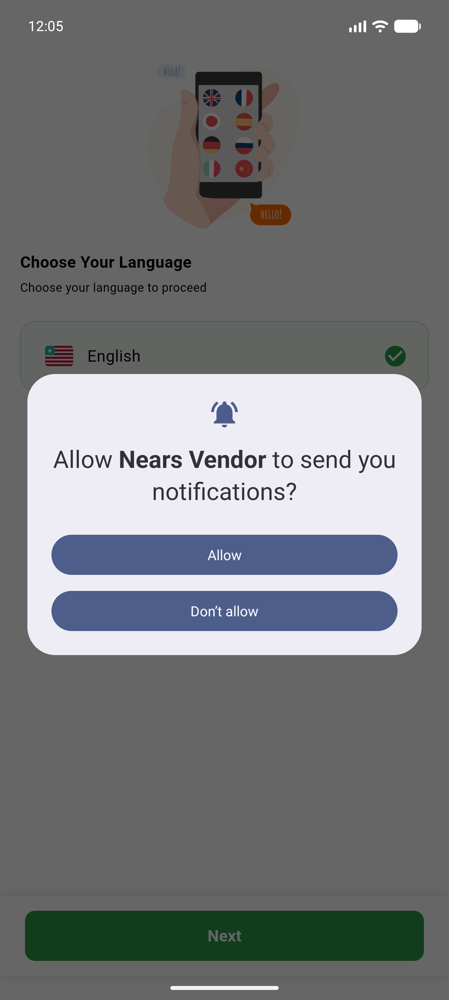
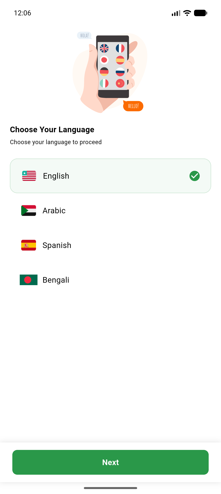
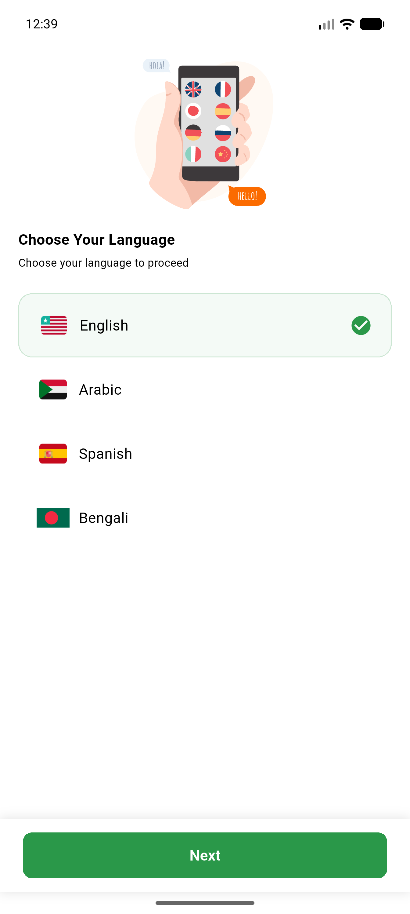
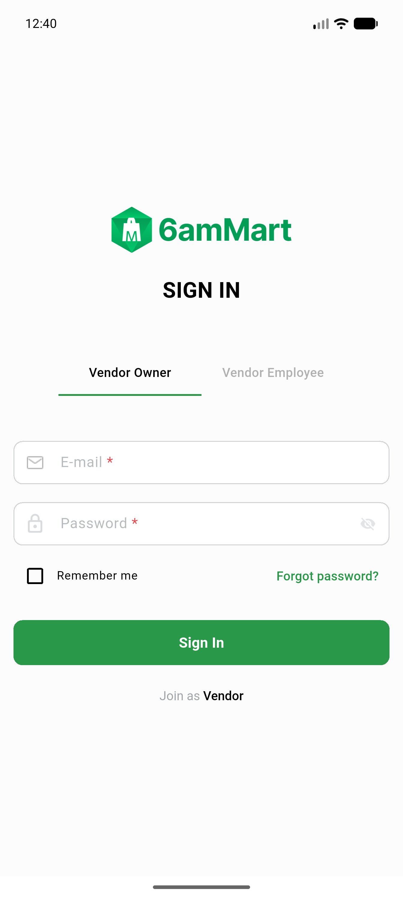
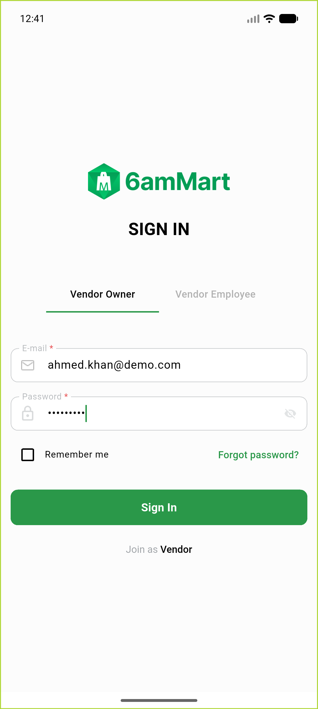
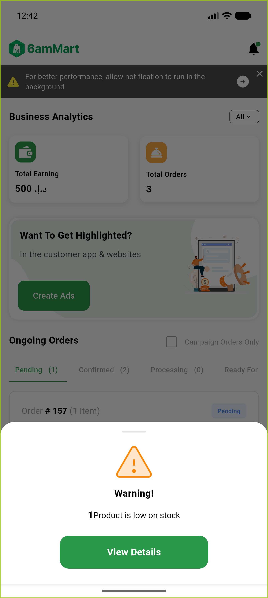

# QA Evidence — NEARS-580-581

**PARITY-DELTA PASS — DeliveryApp(580)+VendorApp(581): firebase-perf gradle plugin builds+launches both apps on emulator-5554, PerfHttp-wrapped api_client non-regressed (login POSTs + ?token= GETs all 200), PII sanitized, 58/58 tests each**

**10 screenshot(s).** Click any thumbnail for full resolution.

<table>
<tr>
<td align="center" width="33%"> delivery 01 firstscreen</td>
<td align="center" width="33%"> delivery 04 signin</td>
<td align="center" width="33%"> delivery delta 01 firstscreen</td>
</tr>
<tr>
<td align="center" width="33%"> delivery delta 03 home loggedin</td>
<td align="center" width="33%"> vendor 01 firstscreen</td>
<td align="center" width="33%"> vendor 02 language</td>
</tr>
<tr>
<td align="center" width="33%"> vendor delta 01 firstscreen</td>
<td align="center" width="33%"> vendor delta 02 after language</td>
<td align="center" width="33%"> vendor delta 03 login filled</td>
</tr>
<tr>
<td align="center" width="33%"> vendor delta 04 loggedin</td>
</tr>
</table>

### Other artifacts
- [`delivery-build-perf-plugin.log`](delivery-build-perf-plugin.log)
- [`delivery-delta-api-success.log`](delivery-delta-api-success.log)
- [`delivery-startup.log`](delivery-startup.log)
- [`progress.md`](progress.md)
- [`vendor-build-perf-plugin.log`](vendor-build-perf-plugin.log)
- [`vendor-delta-api-success.log`](vendor-delta-api-success.log)
- [`vendor-startup.log`](vendor-startup.log)

---
*From `nears/docs/qa-evidence/NEARS-580-581/` · public-repo scrub policy (no live secrets; verified clean).*
