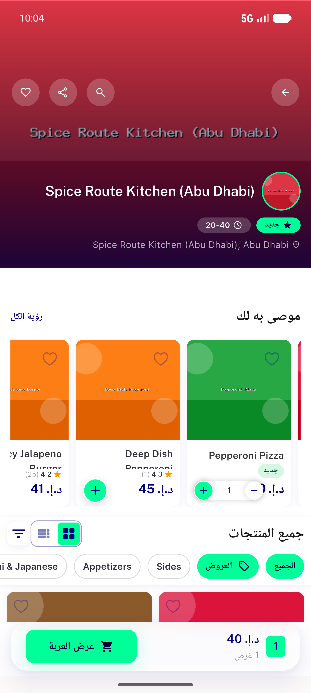
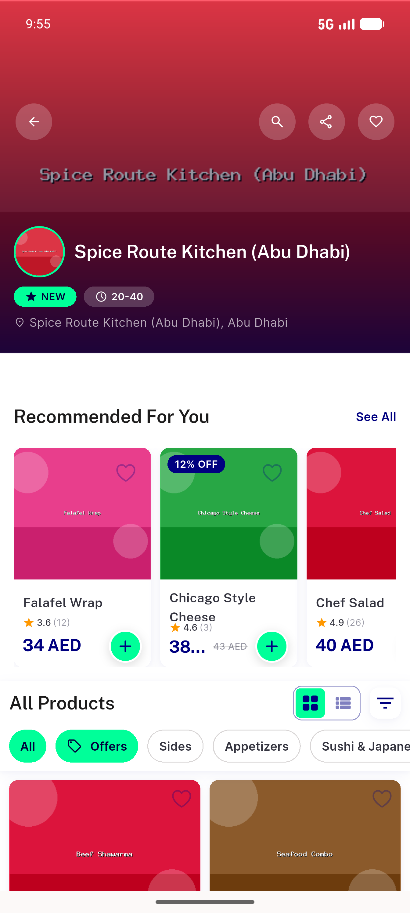
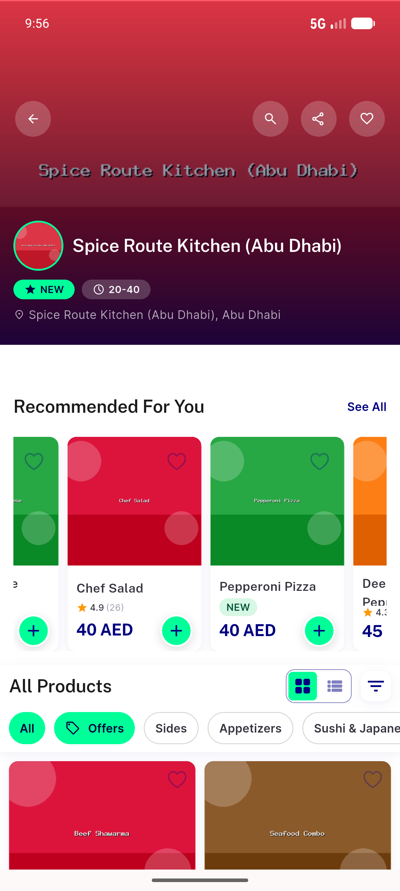
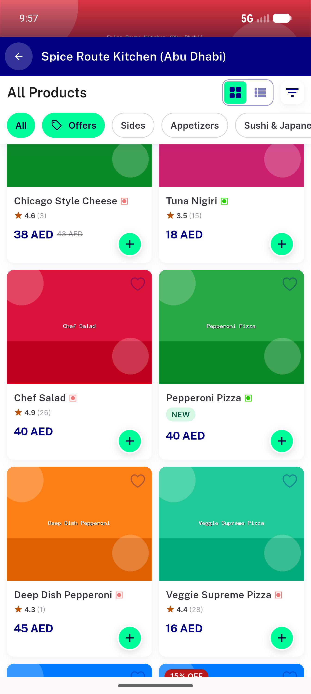
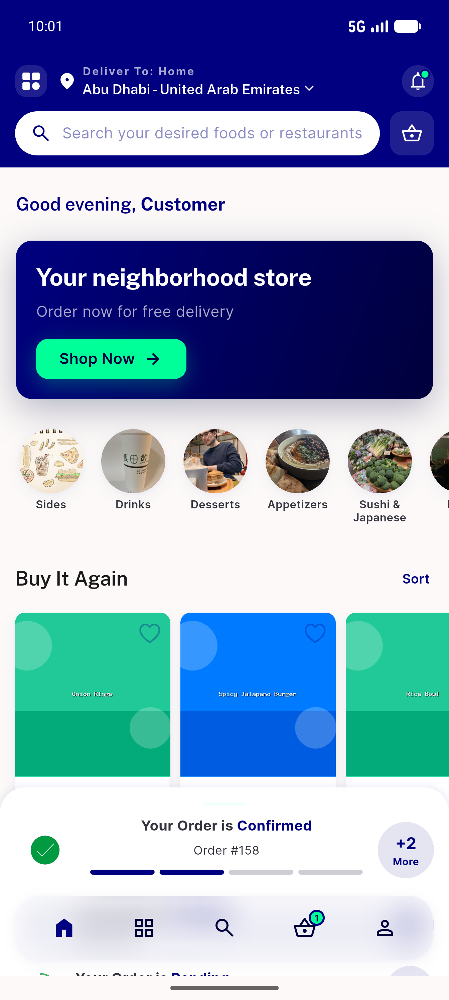
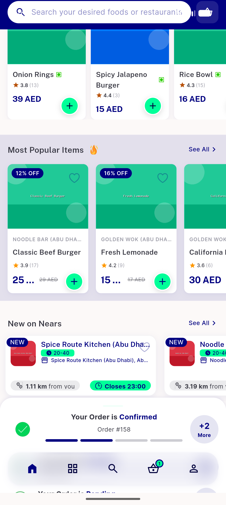

# QA Evidence — NEARS-585

**PASS — store recommended-rail ItemCard reskin (inStore flag) on emulator-5556**

**6 screenshot(s).** Click any thumbnail for full resolution.

<table>
<tr>
<td align="center" width="33%"> ac rtl new pill jadeed</td>
<td align="center" width="33%"> ac1 store screen top</td>
<td align="center" width="33%"> ac3 new pill and rating rail</td>
</tr>
<tr>
<td align="center" width="33%"> ac4 main grid itemwidget</td>
<td align="center" width="33%"> ac5 home most popular rail</td>
<td align="center" width="33%"> ac5 most popular brandline</td>
</tr>
</table>

### Other artifacts
- [`progress.md`](progress.md)

---
*From `nears/docs/qa-evidence/NEARS-585/` · public-repo scrub policy (no live secrets; verified clean).*
