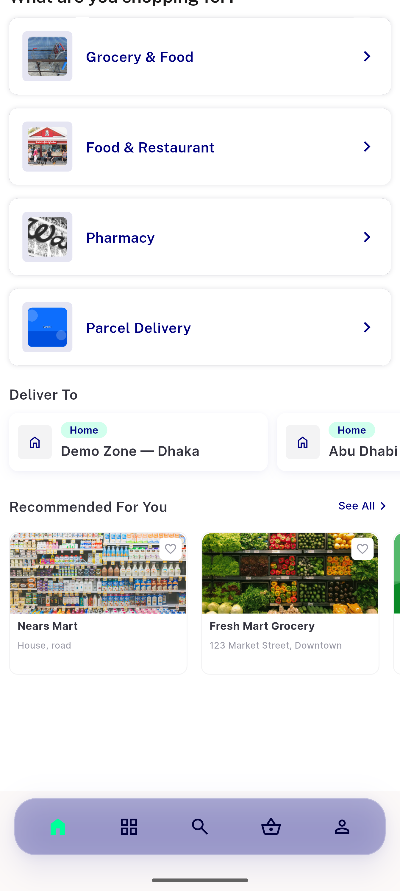
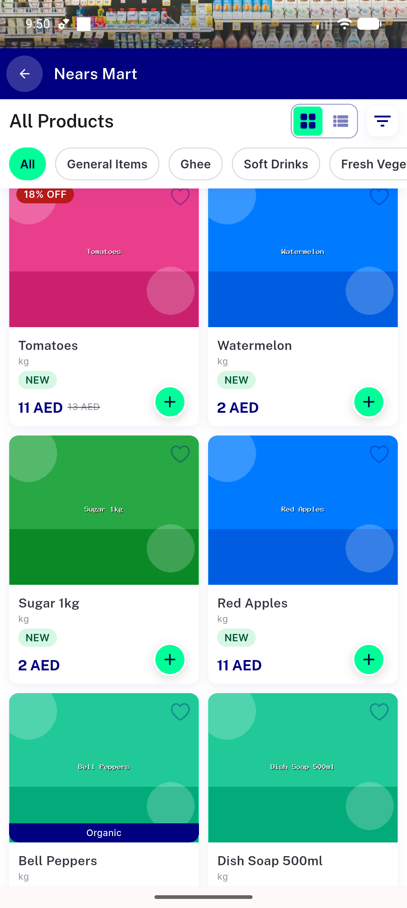
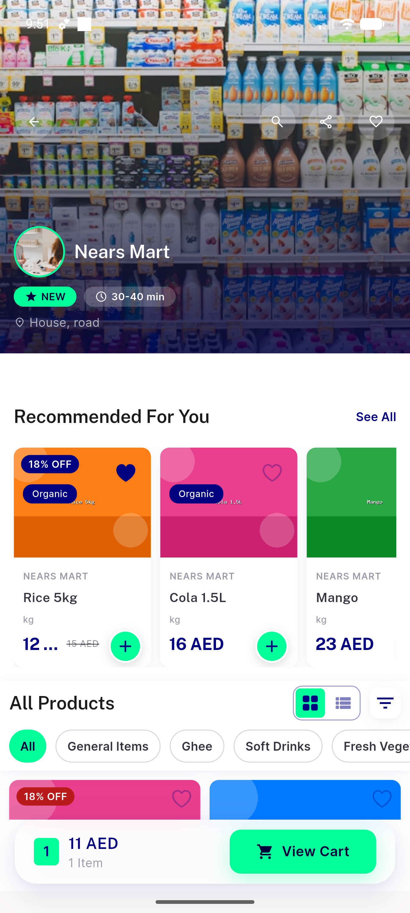
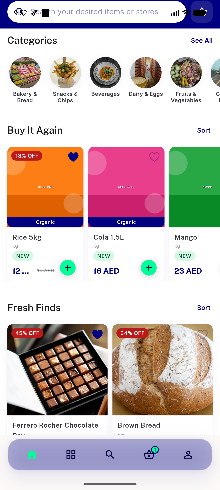
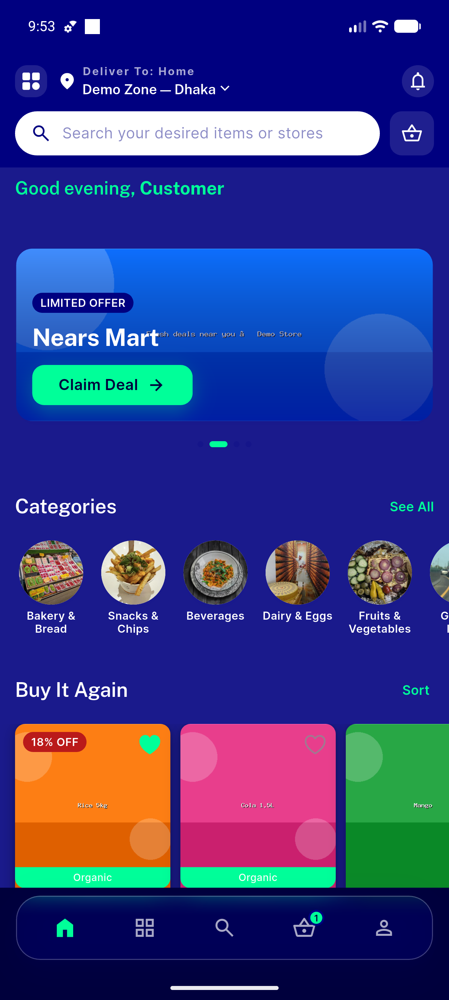
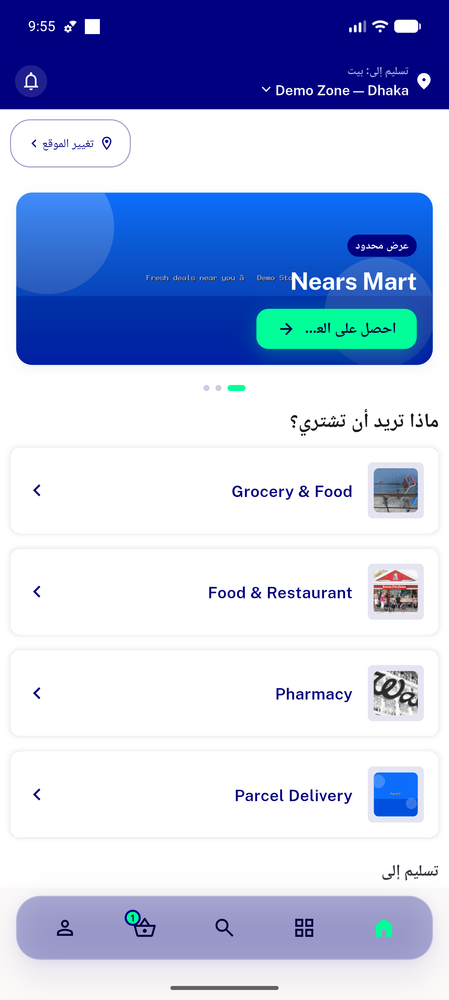
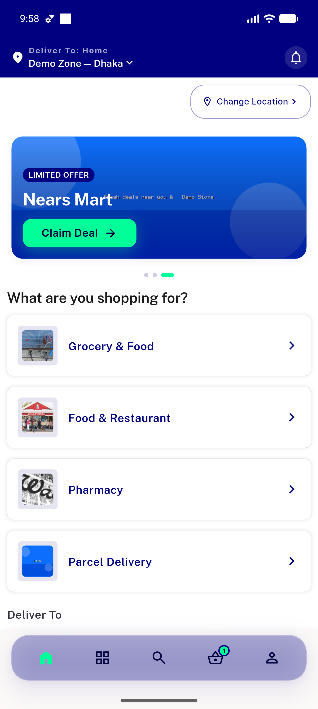

# QA Evidence — NEARS-586

**QA cycle 1 PASS — glass-opacity bottom nav (AC1-AC8 demonstrated light+dark+RTL; 1 unrelated regression: cart-count overflow)**

**10 screenshot(s).** Click any thumbnail for full resolution.

<table>
<tr>
<td align="center" width="33%"> light home offwhite top</td>
<td align="center" width="33%"> light home white cards</td>
<td align="center" width="33%"> light store image content</td>
</tr>
<tr>
<td align="center" width="33%"> light store bar over images badge</td>
<td align="center" width="33%"> light home badge</td>
<td align="center" width="33%"> dark check</td>
</tr>
<tr>
<td align="center" width="33%"> dark home bar</td>
<td align="center" width="33%"> rtl arabic home bar</td>
<td align="center" width="33%"> nears340 banner check</td>
</tr>
<tr>
<td align="center" width="33%"> light home buyitagain images</td>
</tr>
</table>

### Other artifacts
- [`bug-cart-count-overflow.log`](bug-cart-count-overflow.log)
- [`progress.md`](progress.md)

---
*From `nears/docs/qa-evidence/NEARS-586/` · public-repo scrub policy (no live secrets; verified clean).*
