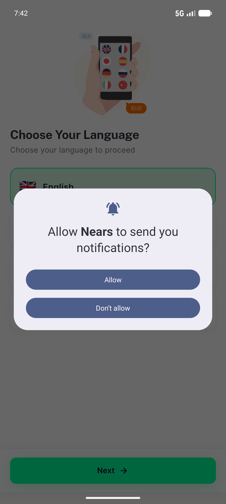
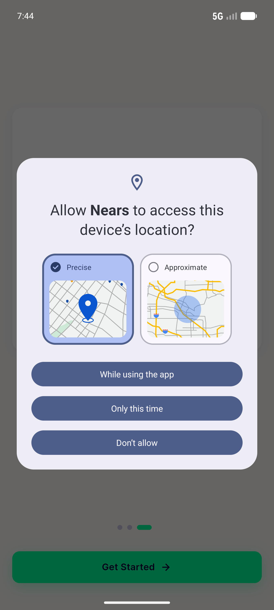
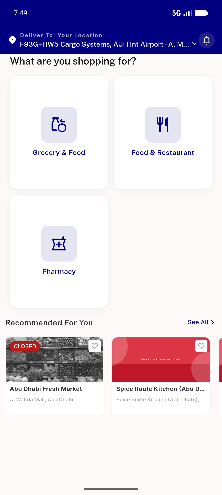
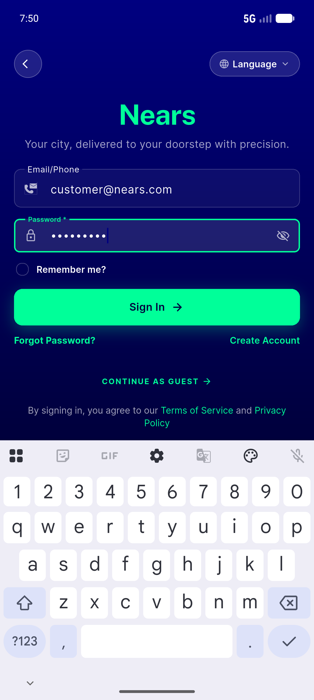

# QA Evidence — NEARS-589

**PASS — payment-failed parse fix: WARN-free authenticated boot, 4 unit pins green, AC4 pass-by-proxy (no seed data)**

**6 screenshot(s).** Click any thumbnail for full resolution.

<table>
<tr>
<td align="center" width="33%"> current state</td>
<td align="center" width="33%"> after skip</td>
<td align="center" width="33%"> after loc</td>
</tr>
<tr>
<td align="center" width="33%"> guest home</td>
<td align="center" width="33%"> signin filled</td>
<td align="center" width="33%"> auth home no sheet</td>
</tr>
</table>

### Other artifacts
- [`ac3-console-warn-absent.log`](ac3-console-warn-absent.log)
- [`regression-cached-location-typeerror.log`](regression-cached-location-typeerror.log)

---
*From `nears/docs/qa-evidence/NEARS-589/` · public-repo scrub policy (no live secrets; verified clean).*
